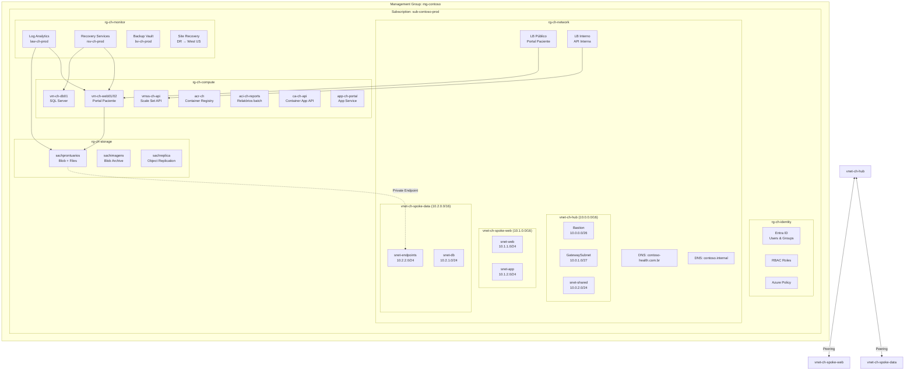
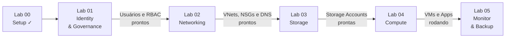

# Lab 00 — Cenário, Convenções e Setup do Ambiente

## O Cenário: Contoso Healthcare

Você foi contratado como **Administrador Azure** da **Contoso Healthcare**, uma rede de clínicas médicas em expansão no Brasil. A empresa decidiu migrar toda a infraestrutura para o Azure e você é responsável por:

1. **Identidade & Governança** — Criar a estrutura de usuários, grupos, permissões e políticas
2. **Rede** — Projetar e implementar a topologia hub-spoke com segurança
3. **Armazenamento** — Configurar storage para prontuários, imagens médicas e documentos
4. **Computação** — Implantar o portal do paciente (App Service), a API interna (containers), e VMs para sistemas legados
5. **Monitoramento & Backup** — Garantir compliance LGPD, backup de dados críticos e disaster recovery

### Arquitetura Alvo



### Departamentos da Contoso Healthcare

| Departamento | Usuários | Função no Azure |
|-------------|----------|-----------------|
| **TI** | Admin (você), Diego (DevOps), Elena (DBA) | Owner/Contributor dos recursos |
| **Clínico** | Dr. Ana (médica-chefe), Enf. Bruno (enfermeiro) | Acesso a prontuários e portal |
| **Financeiro** | Carla (gerente), Fernando (analista) | Acesso a relatórios e custos |
| **RH** | Gabriela (gerente) | Apenas leitura em recursos gerais |
| **Externo** | Dr. Paulo (consultor) | Guest, acesso limitado |

---

## Convenção de Nomenclatura

Todos os labs seguem esta convenção **fixa** (sem sufixos aleatórios):

| Tipo | Padrão | Exemplo |
|------|--------|---------|
| Resource Group | `rg-ch-{função}` | `rg-ch-network` |
| VNet | `vnet-ch-{topologia}` | `vnet-ch-hub` |
| Subnet | `snet-{função}` | `snet-web` |
| NSG | `nsg-ch-{função}` | `nsg-ch-web` |
| Public IP | `pip-ch-{recurso}` | `pip-ch-bastion` |
| Load Balancer | `lb-ch-{tipo}` | `lb-ch-web-pub` |
| Storage Account | `sach{função}` | `sachprontuarios` |
| VM | `vm-ch-{role}{nn}` | `vm-ch-web01` |
| Scale Set | `vmss-ch-{role}` | `vmss-ch-api` |
| Container Registry | `acrch{suffix}` | `acrchprod` |
| Container Instance | `aci-ch-{função}` | `aci-ch-reports` |
| Container App | `ca-ch-{função}` | `ca-ch-api` |
| App Service | `app-ch-{função}` | `app-ch-portal` |
| Key Vault | `kv-ch-{função}` | `kv-ch-encryption` |
| Log Analytics | `law-ch-{env}` | `law-ch-prod` |
| Recovery Vault | `rsv-ch-{env}` | `rsv-ch-prod` |
| Backup Vault | `bv-ch-{env}` | `bv-ch-prod` |

> **Importante:** Na prova e no mundo real, storage account names devem ser globalmente únicos. Se `sachprontuarios` estiver em uso, adicione um sufixo numérico: `sachprontuarios01`.

---

## Variáveis Compartilhadas

Todas as sessões de terminal devem começar carregando estas variáveis:

### Bash (Azure CLI)

```bash
# ======================================================
# VARIÁVEIS DO PROJETO CONTOSO HEALTHCARE
# Copie e cole no início de cada sessão de terminal
# ======================================================

# Subscription
SUB_ID=$(az account show --query id -o tsv)

# Localização
LOCATION="eastus"
LOCATION_DR="westus"     # Região de DR

# Resource Groups
RG_IDENTITY="rg-ch-identity"
RG_NETWORK="rg-ch-network"
RG_STORAGE="rg-ch-storage"
RG_COMPUTE="rg-ch-compute"
RG_MONITOR="rg-ch-monitor"

# Rede
VNET_HUB="vnet-ch-hub"
VNET_SPOKE_WEB="vnet-ch-spoke-web"
VNET_SPOKE_DATA="vnet-ch-spoke-data"

# Storage (ajuste o sufixo se o nome estiver ocupado)
SA_PRONTUARIOS="sachprontuarios"
SA_IMAGENS="sachimagens"
SA_REPLICA="sachreplica"

# Compute
VM_WEB01="vm-ch-web01"
VM_WEB02="vm-ch-web02"
VM_DB01="vm-ch-db01"

# Credenciais (use valores diferentes em produção!)
ADMIN_USER="azureadmin"
ADMIN_PASS='C0ntos0Health#2026!'

# Domínio Entra ID
DOMAIN=$(az ad signed-in-user show --query userPrincipalName -o tsv | cut -d '@' -f 2)
echo "Domínio: $DOMAIN"
echo "Subscription: $SUB_ID"
echo "Variáveis carregadas com sucesso!"
```

### PowerShell

```powershell
# ======================================================
# VARIÁVEIS DO PROJETO CONTOSO HEALTHCARE (PowerShell)
# Copie e cole no início de cada sessão
# ======================================================

$SubId = (Get-AzContext).Subscription.Id
$Location = "eastus"
$LocationDR = "westus"

$RgIdentity  = "rg-ch-identity"
$RgNetwork   = "rg-ch-network"
$RgStorage   = "rg-ch-storage"
$RgCompute   = "rg-ch-compute"
$RgMonitor   = "rg-ch-monitor"

$VnetHub      = "vnet-ch-hub"
$VnetSpokeWeb = "vnet-ch-spoke-web"
$VnetSpokeData = "vnet-ch-spoke-data"

$SaProntuarios = "sachprontuarios"
$SaImagens     = "sachimagens"
$SaReplica     = "sachreplica"

$VmWeb01 = "vm-ch-web01"
$VmWeb02 = "vm-ch-web02"
$VmDb01  = "vm-ch-db01"

$AdminUser = "azureadmin"
$AdminPass = ConvertTo-SecureString "C0ntos0Health#2026!" -AsPlainText -Force
$Credential = New-Object System.Management.Automation.PSCredential($AdminUser, $AdminPass)

$Domain = (Get-AzADUser -SignedIn).UserPrincipalName.Split('@')[1]
Write-Host "Domínio: $Domain | Subscription: $SubId"
```

---

## Tarefa 0.1 — Validar Ferramentas

### Método: CLI

```bash
# Verificar Azure CLI
az --version
# O que faz: mostra a versão do CLI e de todas as extensões instaladas.
# Precisa: >= 2.50

# Login
az login
# O que faz: abre o browser para autenticação OAuth2 com sua conta Microsoft.
# Após login, armazena token em ~/.azure/ para uso futuro.

# Verificar subscription ativa
az account show --query "{Name:name, ID:id, State:state}" -o table
# --query: filtra o JSON de saída usando JMESPath (linguagem de query)
# -o table: formata como tabela legível (outras opções: json, tsv, yaml)
```

### Método: PowerShell

```powershell
# Verificar módulo Az
Get-Module -Name Az -ListAvailable
# O que faz: lista todas as versões do módulo Az instaladas.
# Get-Module = cmdlet que consulta módulos do PowerShell
# -ListAvailable = mostra mesmo os não importados na sessão atual

# Login
Connect-AzAccount
# O que faz: igual ao az login — abre browser para autenticação.
# Salva contexto em ~/.Azure/ (diferente do CLI)

# Verificar contexto
Get-AzContext | Select-Object Name, Subscription, Tenant
# Get-AzContext = retorna a subscription/tenant ativos
# Select-Object = escolhe quais propriedades exibir (como SELECT no SQL)
# "|" (pipe) = passa a saída de um cmdlet como entrada do próximo
```

> **Conceito:** CLI e PowerShell são ferramentas **independentes** com tokens separados. Fazer `az login` NÃO autentica o PowerShell e vice-versa. Na prova, preste atenção se a questão pede CLI ou PowerShell — os comandos são completamente diferentes.

---

## Tarefa 0.2 — Criar Resource Groups

> **Conceito:** Resource Group é um contêiner lógico que agrupa recursos Azure relacionados. Não tem custo. Cada recurso deve pertencer a exatamente 1 RG. A região do RG é apenas metadados — recursos dentro dele podem estar em qualquer região. Deletar um RG deleta **todos** os recursos dentro.

### Método: Portal

```
Portal Azure > Resource Groups > + Create
- Subscription: [sua subscription]
- Resource Group: rg-ch-network
- Region: East US
> Review + Create > Create

Repetir para: rg-ch-identity, rg-ch-storage, rg-ch-compute, rg-ch-monitor
```

### Método: CLI

```bash
# Criar todos os RGs de uma vez
for RG in $RG_IDENTITY $RG_NETWORK $RG_STORAGE $RG_COMPUTE $RG_MONITOR; do
  az group create --name $RG --location $LOCATION --tags Projeto=ContosoHealth Ambiente=Lab
  echo "Criado: $RG"
done
# for ... do ... done: loop que itera sobre a lista de RGs
# az group create: cria resource group
# --name: nome do RG
# --location: região (eastus)
# --tags: pares chave=valor para organização e billing

# Verificar
az group list --query "[?starts_with(name,'rg-ch')].{Nome:name, Regiao:location}" -o table
# starts_with(): função JMESPath que filtra nomes começando com 'rg-ch'
```

### Método: PowerShell

```powershell
# Criar RGs via PowerShell
$Tags = @{ Projeto = "ContosoHealth"; Ambiente = "Lab" }
# @{} = hashtable (dicionário chave/valor) no PowerShell

foreach ($RG in @($RgIdentity, $RgNetwork, $RgStorage, $RgCompute, $RgMonitor)) {
    New-AzResourceGroup -Name $RG -Location $Location -Tag $Tags
    Write-Host "Criado: $RG" -ForegroundColor Green
}
# foreach: loop sobre array de nomes
# New-AzResourceGroup: cmdlet que cria RG
# -Tag: recebe hashtable com tags
# Write-Host: imprime no console com cor

# Verificar
Get-AzResourceGroup | Where-Object { $_.ResourceGroupName -like "rg-ch-*" } |
    Select-Object ResourceGroupName, Location | Format-Table
# Where-Object: filtra objetos (como WHERE no SQL)
# -like: operador de comparação com wildcard (*)
# Format-Table: formata saída como tabela
```

### Método: Bicep

```bash
# Criar arquivo Bicep
cat > /Users/fabricio/studies/az-104/lab_novo/templates/resource-groups.bicep << 'EOF'
// Bicep - Deploy no nível da Subscription (targetScope = 'subscription')
// Permite criar Resource Groups
targetScope = 'subscription'

@description('Região principal dos recursos')
param location string = 'eastus'

@description('Tags aplicadas a todos os RGs')
param tags object = {
  Projeto: 'ContosoHealth'
  Ambiente: 'Lab'
}

// Cada "resource" define um recurso Azure
// Sintaxe: resource <nome-simbólico> '<tipo>@<api-version>' = { ... }
resource rgIdentity 'Microsoft.Resources/resourceGroups@2024-03-01' = {
  name: 'rg-ch-identity'
  location: location
  tags: tags
}

resource rgNetwork 'Microsoft.Resources/resourceGroups@2024-03-01' = {
  name: 'rg-ch-network'
  location: location
  tags: tags
}

resource rgStorage 'Microsoft.Resources/resourceGroups@2024-03-01' = {
  name: 'rg-ch-storage'
  location: location
  tags: tags
}

resource rgCompute 'Microsoft.Resources/resourceGroups@2024-03-01' = {
  name: 'rg-ch-compute'
  location: location
  tags: tags
}

resource rgMonitor 'Microsoft.Resources/resourceGroups@2024-03-01' = {
  name: 'rg-ch-monitor'
  location: location
  tags: tags
}
EOF

# Deploy no nível da subscription (não do RG!)
az deployment sub create \
  --location $LOCATION \
  --template-file /Users/fabricio/studies/az-104/lab_novo/templates/resource-groups.bicep \
  --name "deploy-rgs"
# az deployment sub create: deploy no escopo da SUBSCRIPTION
# Diferente de "az deployment group create" que é no escopo do RG
# targetScope = 'subscription' no Bicep deve corresponder ao comando usado
```

### Método: ARM Template

```bash
cat > /Users/fabricio/studies/az-104/lab_novo/templates/resource-groups.json << 'ARMEOF'
{
  "$schema": "https://schema.management.azure.com/schemas/2018-05-01/subscriptionDeploymentTemplate.json#",
  "contentVersion": "1.0.0.0",
  "parameters": {
    "location": {
      "type": "string",
      "defaultValue": "eastus"
    }
  },
  "variables": {
    "tags": {
      "Projeto": "ContosoHealth",
      "Ambiente": "Lab"
    },
    "resourceGroups": [
      "rg-ch-identity",
      "rg-ch-network",
      "rg-ch-storage",
      "rg-ch-compute",
      "rg-ch-monitor"
    ]
  },
  "resources": [
    {
      "type": "Microsoft.Resources/resourceGroups",
      "apiVersion": "2024-03-01",
      "name": "[variables('resourceGroups')[copyIndex()]]",
      "location": "[parameters('location')]",
      "tags": "[variables('tags')]",
      "copy": {
        "name": "rgCopy",
        "count": "[length(variables('resourceGroups'))]"
      }
    }
  ]
}
ARMEOF

# Deploy ARM no nível da subscription
az deployment sub create \
  --location $LOCATION \
  --template-file /Users/fabricio/studies/az-104/lab_novo/templates/resource-groups.json \
  --name "deploy-rgs-arm"
```

> **Comparação ARM vs Bicep:**
> | | ARM JSON | Bicep |
> |---|---|---|
> | Formato | JSON verboso | DSL concisa |
> | Loop | `copy` com `copyIndex()` | `for` nativo |
> | Referências | `[reference()]`, `[variables()]` | Acesso direto por nome |
> | Modules | Nested/linked templates | `module` keyword |
> | Validação | Runtime | Compile-time |
> | Conversão | `az bicep decompile` | `az bicep build` |

---

## Tarefa 0.3 — Aplicar Tags Padrão

```bash
# Adicionar tags de custo/responsável
for RG in $RG_IDENTITY $RG_NETWORK $RG_STORAGE $RG_COMPUTE $RG_MONITOR; do
  az group update --name $RG \
    --tags Projeto=ContosoHealth Ambiente=Lab Owner=TI CostCenter=CC-INFRA CreatedDate=$(date +%Y-%m-%d)
done
# az group update: atualiza propriedades de um RG existente
# NOTA: --tags SUBSTITUI todas as tags — não faz merge!
```

> **Dica de Prova:** Tags NÃO são herdadas automaticamente. Para herdar, use Azure Policy com efeito `Modify`. Máximo **50 tags** por recurso. O role **Tag Contributor** pode gerenciar tags mas NÃO criar/modificar os recursos em si.

---

## Tarefa 0.4 — Registrar Providers

```bash
# Registrar providers necessários para os labs
az provider register --namespace Microsoft.ContainerInstance  # ACI
az provider register --namespace Microsoft.ContainerService   # AKS
az provider register --namespace Microsoft.App                # Container Apps
az provider register --namespace Microsoft.Web                # App Service
az provider register --namespace Microsoft.RecoveryServices   # Backup/ASR
az provider register --namespace Microsoft.Insights           # Monitor
az provider register --namespace Microsoft.Network            # já registrado, mas garante

# Verificar status
az provider list --query "[?registrationState=='Registered' && starts_with(namespace,'Microsoft.Container')].{NS:namespace, State:registrationState}" -o table
```

> **Conceito:** Resource Providers habilitam tipos de recursos na subscription. Se tentar criar um recurso cujo provider não está registrado, receberá erro. O registro é por subscription e é gratuito.

---

## Ordem de Execução dos Labs



**Dependências entre labs:**
- Lab 01 cria os **usuários e RBAC** que serão testados nos labs seguintes
- Lab 02 cria a **rede** (VNets, Subnets, NSGs) onde todos os recursos viverão
- Lab 03 cria as **Storage Accounts** que VMs usam para discos, logs e arquivos
- Lab 04 cria **VMs, containers e apps** dentro da rede e conectados ao storage
- Lab 05 configura **monitoramento e backup** de todos os recursos anteriores

---

## Limpeza Final (SOMENTE após todos os labs)

```bash
# ATENÇÃO: destrói TUDO — execute apenas quando terminar todos os labs
echo "DELETANDO TODOS OS RECURSOS DOS LABS..."
for RG in $RG_COMPUTE $RG_STORAGE $RG_NETWORK $RG_MONITOR $RG_IDENTITY; do
  echo "Deletando $RG..."
  az group delete --name $RG --yes --no-wait
done
```

---

## Checklist — Lab 00

- [ ] CLI e PowerShell validados
- [ ] Login feito em ambas as ferramentas
- [ ] Variáveis carregadas (CLI e PowerShell)
- [ ] 5 Resource Groups criados (Portal + CLI + PowerShell + Bicep + ARM)
- [ ] Tags aplicadas em todos os RGs
- [ ] Providers registrados
