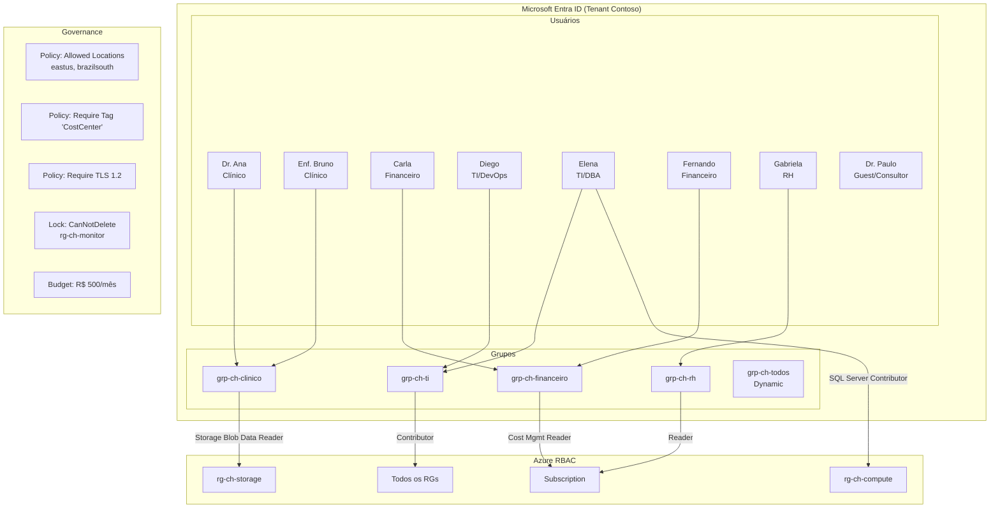
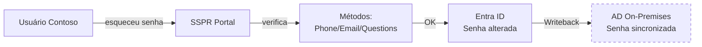
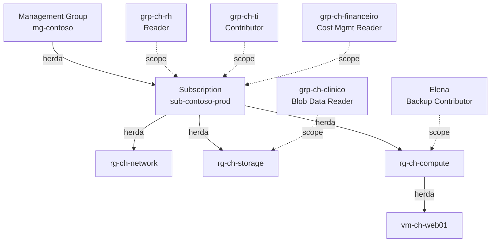

# Lab 01 — Identidade e Governança (20-25% do exame)

> **Pré-requisito:** Lab 00 concluído (RGs criados, variáveis carregadas).
> **Contexto:** A Contoso Healthcare precisa criar a estrutura de identidade: usuários para cada departamento, grupos para simplificar permissões, RBAC para controle de acesso, e políticas de governança para compliance LGPD.



---

## Parte 1 — Criar Usuários do Microsoft Entra

> **Conceito:** Usuários no Entra ID podem ser **Member** (funcionários — autenticam no tenant da organização) ou **Guest** (convidados via B2B — autenticam no tenant de origem). Cada usuário tem um UPN (User Principal Name) no formato `usuario@dominio`. Propriedades como `usageLocation` e `department` afetam licenciamento e dynamic groups.

### Tarefa 1.1 — Criar Equipe de TI via Portal (exercício 1/3)

```
Portal Azure > Microsoft Entra ID > Users > + New user > Create new user

Usuário 1 — Diego (DevOps):
  - User principal name: diego.devops@{seu-domínio}
  - Display name: Diego Silva - DevOps
  - Password: Auto-generate
  - ✅ Require password change on first sign-in
  Properties (aba):
  - Job title: DevOps Engineer
  - Department: TI
  - Usage location: Brazil
  > Review + Create

Usuário 2 — Elena (DBA):
  - User principal name: elena.dba@{seu-domínio}
  - Display name: Elena Costa - DBA
  - Job title: Database Administrator
  - Department: TI
  - Usage location: Brazil
```

### Tarefa 1.2 — Criar Equipe Clínica via CLI (exercício 2/3)

```bash
# Criar Dr. Ana (médica-chefe)
az ad user create \
  --display-name "Dr. Ana Martins - Médica Chefe" \
  --user-principal-name "ana.martins@${DOMAIN}" \
  --password "Temp#Pass2026!" \
  --force-change-password-next-sign-in true \
  --department "Clínico" \
  --job-title "Médica Chefe"
# az ad user create: cria usuário no Entra ID (antigo Azure AD)
# --user-principal-name: UPN — identificador único do usuário (formato email)
# --force-change-password-next-sign-in: obriga trocar senha no 1º login
# --department: propriedade usada por dynamic groups e relatórios

# Definir usageLocation (OBRIGATÓRIO para licenças)
ANA_ID=$(az ad user show --id "ana.martins@${DOMAIN}" --query id -o tsv)
az ad user update --id $ANA_ID --usage-location "BR"
# --usage-location: código ISO do país — obrigatório para atribuir licenças
# Sem isso, licenciamento falha com erro

# Criar Enf. Bruno (enfermeiro)
az ad user create \
  --display-name "Bruno Oliveira - Enfermeiro" \
  --user-principal-name "bruno.oliveira@${DOMAIN}" \
  --password "Temp#Pass2026!" \
  --force-change-password-next-sign-in true \
  --department "Clínico" \
  --job-title "Enfermeiro Chefe"

BRUNO_ID=$(az ad user show --id "bruno.oliveira@${DOMAIN}" --query id -o tsv)
az ad user update --id $BRUNO_ID --usage-location "BR"

# Verificar usuários criados
az ad user list \
  --query "[?department=='Clínico'].{Nome:displayName, UPN:userPrincipalName, Depto:department}" -o table
# --query com filtro: [?campo=='valor'] é JMESPath filter
# .{Alias:campo}: projeta campos específicos com aliases
```

### Tarefa 1.3 — Criar Equipes Financeiro, RH e Guest via PowerShell (exercício 3/3)

```powershell
# --- Equipe Financeiro ---
$PasswordProfile = @{ Password = "Temp#Pass2026!"; ForceChangePasswordNextSignIn = $true }
# @{}: hashtable — estrutura chave/valor usada como parâmetro

New-AzADUser `
    -DisplayName "Carla Mendes - Gerente Financeiro" `
    -UserPrincipalName "carla.mendes@$Domain" `
    -PasswordProfile $PasswordProfile `
    -MailNickname "carla.mendes" `
    -Department "Financeiro" `
    -JobTitle "Gerente Financeiro"
# New-AzADUser: cmdlet que cria usuário no Entra ID
# -PasswordProfile: hashtable com senha e configurações
# -MailNickname: parte do email antes do @ (obrigatório no PowerShell)
# O backtick (`) é continuação de linha no PowerShell

New-AzADUser `
    -DisplayName "Fernando Rocha - Analista Financeiro" `
    -UserPrincipalName "fernando.rocha@$Domain" `
    -PasswordProfile $PasswordProfile `
    -MailNickname "fernando.rocha" `
    -Department "Financeiro" `
    -JobTitle "Analista Financeiro"

# --- RH ---
New-AzADUser `
    -DisplayName "Gabriela Lima - Gerente RH" `
    -UserPrincipalName "gabriela.lima@$Domain" `
    -PasswordProfile $PasswordProfile `
    -MailNickname "gabriela.lima" `
    -Department "RH" `
    -JobTitle "Gerente RH"

# --- Definir usageLocation para todos ---
$Users = Get-AzADUser | Where-Object { $_.Department -in @("Financeiro","RH") }
foreach ($User in $Users) {
    Update-AzADUser -ObjectId $User.Id -UsageLocation "BR"
    Write-Host "UsageLocation BR definido para: $($User.DisplayName)"
}
# Where-Object: filtra objetos no pipeline
# -in: operador que verifica se valor está em um array
# Update-AzADUser: atualiza propriedades do usuário

# --- Guest (consultor externo) ---
# Convidar Dr. Paulo como Guest via B2B
New-AzADUser `
    -DisplayName "Dr. Paulo Santos - Consultor" `
    -UserPrincipalName "paulo.santos_outlook.com#EXT#@$Domain" `
    -PasswordProfile $PasswordProfile `
    -MailNickname "paulo.santos" `
    -Department "Externo" `
    -JobTitle "Médico Consultor"
# Guests têm UPN no formato: email_dominio.com#EXT#@tenant
# Na prova, reconheça esse formato como indicativo de Guest user

# Listar todos os usuários
Get-AzADUser | Where-Object { $_.Department -ne $null } |
    Select-Object DisplayName, UserPrincipalName, Department, JobTitle |
    Format-Table -AutoSize
# Format-Table -AutoSize: ajusta largura das colunas automaticamente
```

> **Dica de Prova:**
> - `usageLocation` é **obrigatório** antes de atribuir licenças
> - Guests NÃO podem usar SSPR no tenant host
> - O role **Guest Inviter** permite convidar guests sem ser admin
> - UPN de guest: `email_dominio#EXT#@tenant`

---

## Parte 2 — Criar e Gerenciar Grupos

> **Conceito:** Grupos simplificam atribuição de permissões e licenças. Tipos: **Security** (para RBAC/licenças) e **Microsoft 365** (para colaboração). Membership: **Assigned** (manual), **Dynamic User** (regra automática — requer P1), **Dynamic Device** (regra para dispositivos).

### Tarefa 2.1 — Criar Grupos Assigned via Portal (exercício 1/3)

```
Portal > Entra ID > Groups > + New group

Grupo 1:
  - Group type: Security
  - Group name: grp-ch-ti
  - Group description: Equipe de TI - Contoso Healthcare
  - Membership type: Assigned
  > Members > + Add members > Diego, Elena
  > Create

Repetir para:
  - grp-ch-clinico (Ana, Bruno)
  - grp-ch-financeiro (Carla, Fernando)
  - grp-ch-rh (Gabriela)
```

### Tarefa 2.2 — Criar Grupos via CLI e adicionar membros (exercício 2/3)

```bash
# Criar grupo de segurança
az ad group create \
  --display-name "grp-ch-ti" \
  --mail-nickname "grp-ch-ti" \
  --description "Equipe de TI - Contoso Healthcare"
# az ad group create: cria grupo de segurança no Entra ID
# --mail-nickname: identificador de email (obrigatório)

az ad group create \
  --display-name "grp-ch-clinico" \
  --mail-nickname "grp-ch-clinico" \
  --description "Equipe Clínica - Contoso Healthcare"

az ad group create \
  --display-name "grp-ch-financeiro" \
  --mail-nickname "grp-ch-financeiro" \
  --description "Equipe Financeira - Contoso Healthcare"

az ad group create \
  --display-name "grp-ch-rh" \
  --mail-nickname "grp-ch-rh" \
  --description "Equipe RH - Contoso Healthcare"

# Adicionar membros ao grupo TI
DIEGO_ID=$(az ad user list --filter "startswith(userPrincipalName,'diego')" --query "[0].id" -o tsv)
ELENA_ID=$(az ad user list --filter "startswith(userPrincipalName,'elena')" --query "[0].id" -o tsv)
GRP_TI_ID=$(az ad group show --group "grp-ch-ti" --query id -o tsv)

az ad group member add --group $GRP_TI_ID --member-id $DIEGO_ID
az ad group member add --group $GRP_TI_ID --member-id $ELENA_ID
# az ad group member add: adiciona membro a um grupo
# --group: ID do grupo
# --member-id: Object ID do usuário

# Adicionar membros ao grupo Clínico
GRP_CLINICO_ID=$(az ad group show --group "grp-ch-clinico" --query id -o tsv)
az ad group member add --group $GRP_CLINICO_ID --member-id $ANA_ID
az ad group member add --group $GRP_CLINICO_ID --member-id $BRUNO_ID

# Verificar membros
az ad group member list --group "grp-ch-ti" --query "[].{Nome:displayName, Cargo:jobTitle}" -o table
```

### Tarefa 2.3 — Grupo Dinâmico + Gerenciamento via PowerShell (exercício 3/3)

```powershell
# Criar grupo via PowerShell
New-AzADGroup `
    -DisplayName "grp-ch-financeiro" `
    -MailNickname "grp-ch-financeiro" `
    -Description "Equipe Financeira - Contoso Healthcare"

# Adicionar membros
$Carla = Get-AzADUser -Filter "startswith(userPrincipalName,'carla')"
$Fernando = Get-AzADUser -Filter "startswith(userPrincipalName,'fernando')"
$GrpFin = Get-AzADGroup -DisplayName "grp-ch-financeiro"

Add-AzADGroupMember -TargetGroupObjectId $GrpFin.Id -MemberObjectId $Carla.Id
Add-AzADGroupMember -TargetGroupObjectId $GrpFin.Id -MemberObjectId $Fernando.Id
# Add-AzADGroupMember: adiciona membro ao grupo
# -TargetGroupObjectId: ID do grupo destino
# -MemberObjectId: ID do usuário a adicionar

# Listar membros de todos os grupos
foreach ($GrpName in @("grp-ch-ti","grp-ch-clinico","grp-ch-financeiro","grp-ch-rh")) {
    Write-Host "`n=== $GrpName ===" -ForegroundColor Cyan
    $Grp = Get-AzADGroup -DisplayName $GrpName
    Get-AzADGroupMember -GroupObjectId $Grp.Id |
        Select-Object DisplayName, UserPrincipalName | Format-Table
}
# `n = caractere de nova linha no PowerShell
# foreach com array: itera sobre nomes dos grupos

# --- Dynamic Group (conceitual - requer P1) ---
# Via Portal: Entra ID > Groups > New Group
# Membership type: Dynamic User
# Dynamic query: user.department -eq "Clínico" -or user.department -eq "TI"
# Isso adicionaria automaticamente todos do depto Clínico e TI

# Remover e re-adicionar membro (prática de gerenciamento)
Remove-AzADGroupMember -GroupObjectId $GrpFin.Id -MemberObjectId $Fernando.Id
# Remove-AzADGroupMember: remove membro do grupo

Get-AzADGroupMember -GroupObjectId $GrpFin.Id | Select-Object DisplayName
# Verificar que Fernando foi removido

Add-AzADGroupMember -TargetGroupObjectId $GrpFin.Id -MemberObjectId $Fernando.Id
# Re-adicionar para próximos labs
```

> **Dica de Prova:**
> - Dynamic groups: regra `user.department -eq "TI"` — operadores: `-eq`, `-ne`, `-contains`, `-match`
> - Dynamic groups NÃO permitem adicionar/remover membros manualmente
> - Um grupo pode ser owner de outro grupo
> - Para minimizar administração ao atribuir licenças → **group-based licensing**

---

## Parte 3 — Gerenciar Licenças

### Tarefa 3.1 — Verificar e atribuir licenças (exercício 1/2)

```bash
# Listar SKUs disponíveis no tenant
az rest --method get --url "https://graph.microsoft.com/v1.0/subscribedSkus" \
  --query "value[].{SKU:skuPartNumber, Total:prepaidUnits.enabled, Usado:consumedUnits}" -o table
# az rest: faz chamadas REST diretas para a Microsoft Graph API
# subscribedSkus: retorna licenças disponíveis no tenant
```

### Tarefa 3.2 — Licenças via PowerShell (exercício 2/2)

```powershell
# Listar licenças
Get-MgSubscribedSku | Select-Object SkuPartNumber,
    @{N="Total";E={$_.PrepaidUnits.Enabled}},
    ConsumedUnits | Format-Table
# Get-MgSubscribedSku: cmdlet do Microsoft Graph (módulo Microsoft.Graph)
# @{N=;E=}: propriedade calculada — N=nome, E=expressão

# NOTA: Em tenant de teste, pode não ter licenças
# Exercício conceitual: via Portal > Entra ID > Users > [user] > Licenses
```

---

## Parte 4 — Configurar SSPR

> **Conceito:** SSPR (Self-Service Password Reset) permite redefinir senhas sem helpdesk. Pode ser habilitado para **All**, **Selected** (grupo), ou **None**. Requer métodos de autenticação (email, phone, app, security questions). **Guests NÃO podem usar SSPR.** Password Writeback sincroniza com AD on-premises (requer Entra Connect + P1).

### Tarefa 4.1 — Configurar SSPR via Portal (exercício 1/2)

```
Portal > Entra ID > Password Reset

1. Properties:
   - Self-service password reset enabled: Selected
   - Select group: grp-ch-ti (apenas TI primeiro, depois expandir)

2. Authentication Methods:
   - Number of methods required: 1
   - Methods: ✅ Mobile phone, ✅ Email, ✅ Security questions
   - Security questions to register: 3
   - Security questions to reset: 3

3. Registration:
   - Require users to register when signing in: Yes
   - Days before users are asked to re-confirm: 180

4. Notifications:
   - Notify users on password resets: Yes
   - Notify all admins when other admins reset: Yes
```

### Tarefa 4.2 — SSPR com Writeback (exercício 2/2 — conceitual)



```
Pré-requisitos para Writeback (cenário híbrido):
1. Entra Connect instalado e sincronizando
2. Entra ID P1 ou P2
3. Portal > Entra ID > Password Reset > On-premises integration
   - Write back passwords: Yes
   - Allow users to unlock without resetting: Yes

SEM writeback: usuários híbridos (sync'd) NÃO podem usar SSPR
```

> **Dica de Prova CRÍTICA:**
> - Guests **NÃO** podem usar SSPR no tenant host
> - SSPR com writeback requer **Entra Connect + P1/P2**
> - Métodos de auth: phone, email, authenticator app, security questions, office phone
> - O admin pode precisar de **2 métodos** mesmo que a policy exija só 1

---

## Parte 5 — RBAC (Role-Based Access Control)

> **Conceito:** RBAC controla o que cada pessoa pode fazer. Três elementos: **Who** (security principal — user, group, SP, MI), **What** (role definition — ações permitidas/negadas), **Where** (scope — MG > Sub > RG > Resource). Roles atribuídos em um scope superior são **herdados** por scopes inferiores.



### Tarefa 5.1 — Atribuir RBAC via Portal (exercício 1/3)

```
Portal > Subscriptions > [sua sub] > Access control (IAM)

Cenário: grp-ch-rh precisa de leitura em toda a subscription
1. + Add > Add role assignment
2. Role: Reader
3. Members: + Select members > grp-ch-rh
4. Review + assign

Portal > rg-ch-storage > Access control (IAM)
Cenário: grp-ch-clinico precisa ler prontuários (blobs)
1. + Add > Add role assignment
2. Role: Storage Blob Data Reader
3. Members: grp-ch-clinico
4. Review + assign
```

### Tarefa 5.2 — Atribuir RBAC via CLI (exercício 2/3)

```bash
# grp-ch-ti como Contributor na Subscription (acesso amplo)
GRP_TI_ID=$(az ad group show --group "grp-ch-ti" --query id -o tsv)

az role assignment create \
  --assignee-object-id $GRP_TI_ID \
  --assignee-principal-type Group \
  --role "Contributor" \
  --scope "/subscriptions/${SUB_ID}"
# az role assignment create: atribui role a um principal em um scope
# --assignee-object-id: Object ID de quem recebe o role
# --assignee-principal-type: tipo do principal (User, Group, ServicePrincipal)
# --role: nome ou ID do role
# --scope: onde se aplica (Sub, RG, ou Resource)

# grp-ch-clinico como Storage Blob Data Reader no RG storage
GRP_CLINICO_ID=$(az ad group show --group "grp-ch-clinico" --query id -o tsv)

az role assignment create \
  --assignee-object-id $GRP_CLINICO_ID \
  --assignee-principal-type Group \
  --role "Storage Blob Data Reader" \
  --scope "/subscriptions/${SUB_ID}/resourceGroups/${RG_STORAGE}"

# grp-ch-financeiro como Cost Management Reader na Subscription
GRP_FIN_ID=$(az ad group show --group "grp-ch-financeiro" --query id -o tsv)

az role assignment create \
  --assignee-object-id $GRP_FIN_ID \
  --assignee-principal-type Group \
  --role "Cost Management Reader" \
  --scope "/subscriptions/${SUB_ID}"

# Elena como Backup Contributor no RG monitor (ela gerencia backups)
ELENA_ID=$(az ad user list --filter "startswith(userPrincipalName,'elena')" --query "[0].id" -o tsv)

az role assignment create \
  --assignee-object-id $ELENA_ID \
  --assignee-principal-type User \
  --role "Backup Contributor" \
  --scope "/subscriptions/${SUB_ID}/resourceGroups/${RG_MONITOR}"
```

### Tarefa 5.3 — Interpretar RBAC via PowerShell (exercício 3/3)

```powershell
# Listar TODAS as atribuições no RG storage
Get-AzRoleAssignment -ResourceGroupName $RgStorage |
    Select-Object DisplayName, RoleDefinitionName, Scope |
    Format-Table -AutoSize
# Get-AzRoleAssignment: lista atribuições de role
# -ResourceGroupName: filtra por RG
# Mostra roles herdados da subscription também!

# Listar atribuições de um usuário específico (inclui herdadas)
Get-AzRoleAssignment -ObjectId $Elena.Id |
    Select-Object RoleDefinitionName, Scope | Format-Table
# Sem -ResourceGroupName: mostra TODOS os scopes onde Elena tem roles

# Ver definição de um role (quais Actions tem)
Get-AzRoleDefinition -Name "Storage Blob Data Contributor" |
    Select-Object Name, @{N="Actions";E={$_.Actions -join "`n"}},
    @{N="DataActions";E={$_.DataActions -join "`n"}} | Format-List
# -join: concatena array em string com separador
# Actions = management plane (criar/deletar recursos)
# DataActions = data plane (ler/escrever dados dentro do recurso)
```

> **Tabela de Roles Essenciais para a Prova:**
>
> | Role | Pode fazer | NÃO pode fazer |
> |------|-----------|----------------|
> | **Owner** | Tudo | — |
> | **Contributor** | Tudo de recursos | Gerenciar RBAC |
> | **Reader** | Leitura | Qualquer escrita |
> | **User Access Administrator** | Gerenciar RBAC | Criar/modificar recursos |
> | **Storage Blob Data Contributor** | Ler/escrever blobs | Gerenciar a storage account |
> | **Tag Contributor** | Gerenciar tags | Criar/modificar recursos |
> | **Cost Management Contributor** | Gerenciar custos/budgets | Criar recursos |
> | **Backup Contributor** | Gerenciar backups | Criar vault |
>
> **ATENÇÃO:** `Contributor` no RG **NÃO** dá acesso ao data plane do Storage. Para ler blobs, precisa de `Storage Blob Data *`.

---

## Parte 6 — Azure Policy

> **Conceito:** Azure Policy avalia recursos e aplica regras. Efeitos: **Deny** (impede criação), **Audit** (registra não-conformidade), **Modify** (altera recurso — requer Managed Identity), **DeployIfNotExists** (cria recurso se não existir), **Append** (adiciona campo), **Disabled**. Uma **Initiative** agrupa policies para atribuição conjunta.

### Tarefa 6.1 — Policy "Allowed Locations" via Portal (exercício 1/3)

> **Cenário Contoso:** Por compliance LGPD, dados devem ficar apenas em East US e Brazil South.

```
Portal > Policy > Definitions > buscar "Allowed locations"

1. Assignments > + Assign policy
2. Scope: Subscription inteira
3. Policy: Allowed locations
4. Parameters:
   - Allowed locations: East US, Brazil South
5. Non-compliance messages: "Contoso Health: recursos só podem ser criados em East US ou Brazil South"
6. Review + Create
```

### Tarefa 6.2 — Policy "Require Tag" via CLI (exercício 2/3)

```bash
# Atribuir policy: Require a tag on resources (CostCenter obrigatório)
az policy assignment create \
  --name "require-costcenter-tag" \
  --display-name "Contoso: Require CostCenter Tag" \
  --policy "871b6d14-10aa-478d-b466-cc659e4a0842" \
  --scope "/subscriptions/${SUB_ID}" \
  --params '{"tagName": {"value": "CostCenter"}}'
# az policy assignment create: atribui uma policy definition a um scope
# --policy: ID da policy built-in (este é o ID de "Require a tag on resources")
# --params: parâmetros da policy em JSON
# Efeito padrão desta policy: Deny (impede criar recurso sem a tag)

# Atribuir policy: Inherit tag from RG (Modify - herda tag automaticamente)
az policy assignment create \
  --name "inherit-costcenter-from-rg" \
  --display-name "Contoso: Inherit CostCenter from RG" \
  --policy "cd3aa116-8754-49c9-a813-ad46512ece54" \
  --scope "/subscriptions/${SUB_ID}/resourceGroups/${RG_STORAGE}" \
  --params '{"tagName": {"value": "CostCenter"}}' \
  --mi-system-assigned \
  --location $LOCATION
# --mi-system-assigned: cria Managed Identity para a policy
# Policies com Modify/DeployIfNotExists PRECISAM de MI para fazer alterações
# --location: região da MI (obrigatório quando usa MI)

# Verificar compliance (pode levar alguns minutos)
az policy state summarize --query "value[0].results" -o json
```

### Tarefa 6.3 — Policy "Require TLS 1.2" via PowerShell (exercício 3/3)

```powershell
# Listar policies built-in relacionadas a TLS
Get-AzPolicyDefinition |
    Where-Object { $_.Properties.DisplayName -match "TLS" -and $_.Properties.PolicyType -eq "BuiltIn" } |
    Select-Object @{N="Name";E={$_.Properties.DisplayName}}, Name | Format-Table
# -match: operador regex no PowerShell
# -eq: igualdade

# Atribuir policy de TLS mínimo para Storage
$PolicyDef = Get-AzPolicyDefinition -Name "fe83a0eb-a853-422d-abc7-b8e6d09b0587"
# Este é o ID de "Storage accounts should have the specified minimum TLS version"

New-AzPolicyAssignment `
    -Name "require-tls12-storage" `
    -DisplayName "Contoso: Require TLS 1.2 on Storage" `
    -PolicyDefinition $PolicyDef `
    -Scope "/subscriptions/$SubId/resourceGroups/$RgStorage" `
    -PolicyParameterObject @{ minimumTlsVersion = @{ value = "TLS1_2" } }
# New-AzPolicyAssignment: atribui policy
# -PolicyParameterObject: hashtable com parâmetros

# Verificar estado de compliance
Get-AzPolicyState -SubscriptionId $SubId |
    Where-Object { $_.ComplianceState -eq "NonCompliant" } |
    Select-Object ResourceId, PolicyDefinitionName | Format-Table
```

> **Dica de Prova:**
> - **Remediation task** é necessário para corrigir recursos **já existentes** com Modify/DINE
> - Policy com **Modify** precisa de **Managed Identity** na atribuição
> - **Initiative** = grupo de policies (ex: "LGPD Compliance" com 10 rules)
> - **Exclusion** permite excluir RGs/recursos específicos de uma policy assignment

---

## Parte 7 — Resource Locks

> **Conceito:** Locks impedem exclusão ou modificação acidental. **CanNotDelete** (pode modificar, não pode deletar) e **ReadOnly** (nenhuma modificação). Locks afetam **todos os usuários**, inclusive Owners. Para o cenário: proteger rg-ch-monitor (backups são críticos).

### Tarefa 7.1 — Locks via Portal e CLI (exercício 1/2)

```
Portal > rg-ch-monitor > Settings > Locks > + Add
  - Lock name: lock-protect-backups
  - Lock type: CanNotDelete
  - Notes: Protege recursos de backup contra exclusão acidental - LGPD
```

```bash
# Lock CanNotDelete no RG monitor (backups são críticos)
az lock create \
  --name "lock-protect-backups" \
  --resource-group $RG_MONITOR \
  --lock-type CanNotDelete \
  --notes "Protege recursos de backup - compliance LGPD"
# az lock create: cria lock no scope especificado
# --lock-type: CanNotDelete ou ReadOnly
# Locks são herdados: lock no RG afeta TODOS os recursos dentro

# Testar: tentar deletar o RG (DEVE FALHAR)
az group delete --name $RG_MONITOR --yes 2>&1 | head -5
echo "^^^ Esperado: erro de lock"

# Lock ReadOnly no RG storage (protege configurações)
az lock create \
  --name "lock-readonly-storage" \
  --resource-group $RG_STORAGE \
  --lock-type ReadOnly \
  --notes "Protege configurações de storage"

# CUIDADO: ReadOnly no Storage impede listKeys!
# Remover para não bloquear os próximos labs
az lock delete --name "lock-readonly-storage" --resource-group $RG_STORAGE

# Listar locks
az lock list --resource-group $RG_MONITOR -o table
```

### Tarefa 7.2 — Locks via PowerShell (exercício 2/2)

```powershell
# Criar lock
New-AzResourceLock `
    -LockName "lock-protect-network" `
    -LockLevel CanNotDelete `
    -ResourceGroupName $RgNetwork `
    -LockNotes "Protege infraestrutura de rede"
# New-AzResourceLock: cria lock
# -LockLevel: CanNotDelete ou ReadOnly

# Verificar
Get-AzResourceLock -ResourceGroupName $RgNetwork |
    Select-Object Name, @{N="Level";E={$_.Properties.Level}} | Format-Table

# Remover lock (para manutenção)
$Lock = Get-AzResourceLock -LockName "lock-protect-network" -ResourceGroupName $RgNetwork
Remove-AzResourceLock -LockId $Lock.LockId -Force
# -Force: não pede confirmação
```

> **Dica de Prova:**
> - Lock **ReadOnly** em Storage Account impede `listKeys` (pois é operação de escrita!)
> - Lock no **RG** impede deletar qualquer recurso dentro E o próprio RG
> - Locks se aplicam a **todos os roles**, inclusive Owner
> - Para gerenciar locks: precisa de `Microsoft.Authorization/locks/*` (Owner ou User Access Admin)

---

## Parte 8 — Tags, Custos e Management Groups

### Tarefa 8.1 — Gerenciar Tags (exercício 1/2)

```bash
# Aplicar tags detalhadas por departamento
az group update --name $RG_STORAGE --tags \
  Projeto=ContosoHealth Ambiente=Lab CostCenter=CC-CLINICO \
  Owner=TI Departamento=Clinico Compliance=LGPD

az group update --name $RG_COMPUTE --tags \
  Projeto=ContosoHealth Ambiente=Lab CostCenter=CC-TI \
  Owner=TI Departamento=TI

# Listar recursos por tag
az resource list --tag CostCenter=CC-CLINICO \
  --query "[].{Nome:name, Tipo:type, RG:resourceGroup}" -o table

# Listar todas as tags usadas na subscription
az tag list --query "[].{Tag:tagName, Valores:values[].tagValue}" -o json
```

### Tarefa 8.2 — Custos e Management Groups (exercício 2/2)

```bash
# Criar budget (cenário: R$ 500/mês para infra Contoso)
az consumption budget create \
  --budget-name "budget-contoso-lab" \
  --amount 100 \
  --time-grain Monthly \
  --start-date "2026-03-01" \
  --end-date "2026-12-31" \
  --category Cost
# az consumption budget create: cria budget com limite de gastos
# --amount: valor em USD/BRL (depende da subscription)
# --time-grain: período de avaliação (Monthly/Quarterly/Annually)

# Management Group (exercício rápido)
az account management-group create \
  --name "mg-contoso" \
  --display-name "Contoso Healthcare MG"

# Verificar
az account management-group list -o table

# Limpar (não precisamos do MG para os próximos labs)
az account management-group delete --name "mg-contoso"
```

> **Dica de Prova:**
> - Management Groups: máx **6 níveis** (excluindo root)
> - Root MG NÃO pode ser movido/deletado
> - Policies em MG afetam TODAS as subscriptions dentro
> - **Cost Management Contributor** pode gerenciar budgets sem acesso a recursos

---

## Checklist — Lab 01

- [ ] 7 usuários criados (Portal + CLI + PowerShell)
- [ ] 1 guest convidado
- [ ] 4+ grupos criados com membros
- [ ] Dynamic group entendido (conceitual)
- [ ] usageLocation definido para todos
- [ ] SSPR configurado para grp-ch-ti
- [ ] RBAC atribuído: TI=Contributor, Clínico=BlobReader, Fin=CostReader, RH=Reader
- [ ] Elena com Backup Contributor no rg-ch-monitor
- [ ] 3 Azure Policies atribuídas (Locations, Tag, TLS)
- [ ] Resource Locks criados e testados (CanNotDelete + ReadOnly)
- [ ] Tags aplicadas com CostCenter por departamento
- [ ] Budget criado
- [ ] Management Group exercitado

**Próximo:** Lab 02 — Networking (criar a infraestrutura de rede onde todos os recursos viverão)
