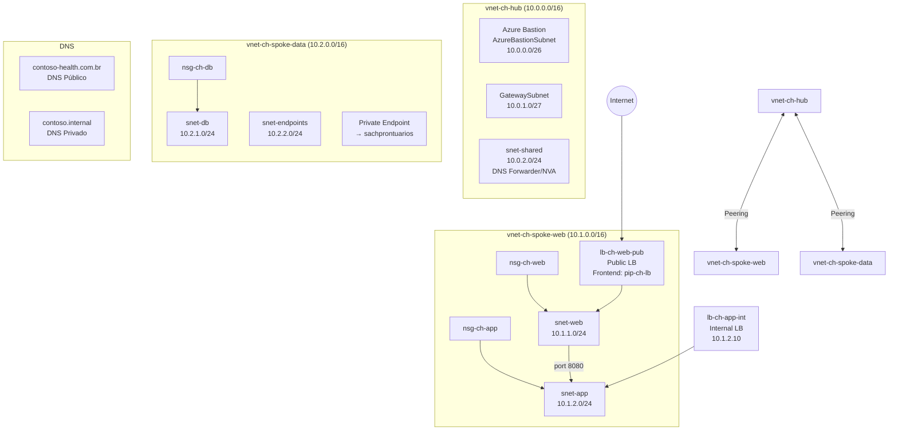

# Lab 02 — Configurar e Gerenciar Redes Virtuais (15-20% do exame)

> **Pré-requisito:** Lab 01 concluído, com usuários, grupos e RBAC já configurados.
> **Contexto:** Este lab trata da configuração e do gerenciamento de redes virtuais no Azure por meio de uma topologia **hub-spoke**, com segmentação por sub-redes, peering, grupos de segurança de rede (NSGs), rotas definidas pelo usuário (UDRs), DNS e balanceamento de carga.



---

## Parte 1 — Criar redes virtuais e sub-redes

> **Conceito:** A rede virtual (**VNet**) é o bloco fundamental de rede privada no Azure. Redes virtuais ficam isoladas por padrão e não se comunicam entre si sem peering ou VPN. Os endereços devem estar em faixas RFC 1918. O Azure reserva **5 IPs** por sub-rede: `.0` para a rede, `.1` como gateway padrão, `.2` e `.3` para DNS do Azure, e o último endereço para broadcast. Uma sub-rede `/24` fica com 251 IPs utilizáveis.

### Tarefa 1.1 — Criar VNet Hub via Portal (exercício 1/3)

```
Portal > Virtual Networks > + Create

Basics:
  - Resource group: rg-ch-network
  - Name: vnet-ch-hub
  - Region: East US

IP Addresses:
  - Address space: 10.0.0.0/16
  - + Add subnet:
    - Name: AzureBastionSubnet   | Range: 10.0.0.0/26  (64 IPs, mín para Bastion)
    - Name: GatewaySubnet        | Range: 10.0.1.0/27  (32 IPs, mín para VPN GW)
    - Name: snet-shared          | Range: 10.0.2.0/24  (251 IPs)

Security: deixar padrão
Tags: Projeto=ContosoHealth, Ambiente=Lab
> Review + Create
```

> **ALERTA para prova:** `AzureBastionSubnet` e `GatewaySubnet` são nomes **exatos** e obrigatórios. Qualquer outro nome causa erro. `GatewaySubnet` **não** deve ter grupo de segurança de rede (NSG) associado.

### Tarefa 1.2 — Criar VNet Spoke Web via CLI (exercício 2/3)

```bash
# Criar VNet spoke-web com subnet inicial
az network vnet create \
  --name $VNET_SPOKE_WEB \
  --resource-group $RG_NETWORK \
  --location $LOCATION \
  --address-prefix "10.1.0.0/16" \
  --subnet-name "snet-web" \
  --subnet-prefix "10.1.1.0/24" \
  --tags Projeto=ContosoHealth CostCenter=CC-TI
# az network vnet create: cria VNet com uma subnet inicial
# --address-prefix: espaço de endereçamento da VNet (CIDR notation)
# --subnet-name/prefix: primeira subnet criada junto com a VNet
# CIDR /16 = 65536 IPs, /24 = 256 IPs (251 usáveis)

# Adicionar subnet de aplicação
az network vnet subnet create \
  --name "snet-app" \
  --resource-group $RG_NETWORK \
  --vnet-name $VNET_SPOKE_WEB \
  --address-prefix "10.1.2.0/24"
# az network vnet subnet create: adiciona subnet a VNet existente
# Subnets dentro da mesma VNet NÃO podem ter address spaces sobrepostos

# Verificar
az network vnet show --name $VNET_SPOKE_WEB -g $RG_NETWORK \
  --query "{Name:name, Address:addressSpace.addressPrefixes, Subnets:subnets[].{Name:name,Prefix:addressPrefix}}" -o json
```

### Tarefa 1.3 — Criar VNet Spoke Data via PowerShell (exercício 3/3)

```powershell
# Criar configs de subnet primeiro
$SubnetDB = New-AzVirtualNetworkSubnetConfig `
    -Name "snet-db" `
    -AddressPrefix "10.2.1.0/24"
# New-AzVirtualNetworkSubnetConfig: cria CONFIGURAÇÃO de subnet (em memória)
# Ainda não cria no Azure — é um objeto que será passado ao New-AzVirtualNetwork

$SubnetPE = New-AzVirtualNetworkSubnetConfig `
    -Name "snet-endpoints" `
    -AddressPrefix "10.2.2.0/24"

# Criar VNet com ambas as subnets
New-AzVirtualNetwork `
    -Name $VnetSpokeData `
    -ResourceGroupName $RgNetwork `
    -Location $Location `
    -AddressPrefix "10.2.0.0/16" `
    -Subnet $SubnetDB, $SubnetPE `
    -Tag @{ Projeto = "ContosoHealth"; CostCenter = "CC-TI" }
# New-AzVirtualNetwork: cria VNet no Azure
# -Subnet: aceita ARRAY de SubnetConfig — cria todas de uma vez

# Verificar
Get-AzVirtualNetwork -ResourceGroupName $RgNetwork |
    Select-Object Name, @{N="AddressSpace";E={$_.AddressSpace.AddressPrefixes -join ", "}},
    @{N="Subnets";E={($_.Subnets | ForEach-Object { "$($_.Name): $($_.AddressPrefix)" }) -join ", "}} |
    Format-Table -AutoSize
# ForEach-Object: itera sobre cada subnet no pipeline
# "$($var)": string interpolation no PowerShell
```

### Tarefa 1.4 — Criar VNet Hub via Bicep (exercício adicional)

```bash
cat > /Users/fabricio/studies/az-104/lab_novo/templates/vnet-hub.bicep << 'EOF'
@description('VNet Hub da Contoso Healthcare')
param location string = resourceGroup().location

// Recurso VNet com subnets aninhadas
resource vnetHub 'Microsoft.Network/virtualNetworks@2024-01-01' = {
  name: 'vnet-ch-hub'
  location: location
  tags: {
    Projeto: 'ContosoHealth'
    CostCenter: 'CC-TI'
  }
  properties: {
    addressSpace: {
      addressPrefixes: ['10.0.0.0/16']
    }
    // subnets é um array de objetos dentro de properties
    subnets: [
      {
        name: 'AzureBastionSubnet'
        properties: { addressPrefix: '10.0.0.0/26' }
      }
      {
        name: 'GatewaySubnet'
        properties: { addressPrefix: '10.0.1.0/27' }
      }
      {
        name: 'snet-shared'
        properties: { addressPrefix: '10.0.2.0/24' }
      }
    ]
  }
}

// output expõe valores para uso em outros templates/scripts
output vnetId string = vnetHub.id
output bastionSubnetId string = vnetHub.properties.subnets[0].id
EOF

# Deploy
az deployment group create \
  --resource-group $RG_NETWORK \
  --template-file /Users/fabricio/studies/az-104/lab_novo/templates/vnet-hub.bicep \
  --name "deploy-vnet-hub"
```

### Tarefa 1.5 — IPs Públicos

```bash
# IP público para Load Balancer web (Standard, estático, zone-redundant)
az network public-ip create \
  --name "pip-ch-lb" \
  --resource-group $RG_NETWORK \
  --location $LOCATION \
  --sku Standard \
  --allocation-method Static \
  --zone 1 2 3
# --sku Standard: obrigatório para LB Standard e zone-redundancy
# --zone 1 2 3: distribui em todas as zonas de disponibilidade
# Standard é SEMPRE estático (não pode ser dinâmico)

# IP público para Bastion
az network public-ip create \
  --name "pip-ch-bastion" \
  --resource-group $RG_NETWORK \
  --location $LOCATION \
  --sku Standard \
  --allocation-method Static

# Via PowerShell: IP para uso futuro
New-AzPublicIpAddress `
    -Name "pip-ch-web01" `
    -ResourceGroupName $RgNetwork `
    -Location $Location `
    -Sku "Standard" `
    -AllocationMethod "Static" `
    -Zone @(1,2,3)
# -Zone @(1,2,3): array de zonas — distribui IP em 3 zonas

# Listar IPs
az network public-ip list -g $RG_NETWORK \
  --query "[].{Nome:name, IP:ipAddress, SKU:sku.name, Metodo:publicIpAllocationMethod}" -o table
```

---

## Parte 2 — Peering entre redes virtuais

> **Conceito:** VNet Peering conecta duas redes virtuais pelo backbone da Microsoft, sem usar a internet. **Não é transitivo**: Hub↔Spoke1 e Hub↔Spoke2 **não** implicam Spoke1↔Spoke2. O peering precisa ser configurado em **ambos os lados**, e os espaços de endereçamento **não** podem se sobrepor. O global peering permite conectar redes virtuais em regiões diferentes.

### Tarefa 2.1 — Peering Hub ↔ Spoke Web via Portal (exercício 1/3)

```
Portal > vnet-ch-hub > Peerings > + Add

Lado Hub → Spoke Web:
  - Peering link name: hub-to-spoke-web
  - Traffic to remote VNet: Allow
  - Traffic forwarded from remote: Allow
  - Virtual network gateway or Route Server: None (sem gateway ainda)
  Remote VNet:
  - Peering link name: spoke-web-to-hub
  - Virtual network: vnet-ch-spoke-web
  - Traffic to remote: Allow
  - Traffic forwarded: Allow
  > Add
```

### Tarefa 2.2 — Peering Hub ↔ Spoke Data via CLI (exercício 2/3)

```bash
# Obter IDs
HUB_ID=$(az network vnet show -g $RG_NETWORK -n $VNET_HUB --query id -o tsv)
SPOKE_DATA_ID=$(az network vnet show -g $RG_NETWORK -n $VNET_SPOKE_DATA --query id -o tsv)

# Hub → Spoke Data
az network vnet peering create \
  --name "hub-to-spoke-data" \
  --resource-group $RG_NETWORK \
  --vnet-name $VNET_HUB \
  --remote-vnet $SPOKE_DATA_ID \
  --allow-vnet-access \
  --allow-forwarded-traffic
# --allow-vnet-access: permite tráfego entre as VNets
# --allow-forwarded-traffic: permite tráfego reencaminhado (de UDR/NVA)

# Spoke Data → Hub
az network vnet peering create \
  --name "spoke-data-to-hub" \
  --resource-group $RG_NETWORK \
  --vnet-name $VNET_SPOKE_DATA \
  --remote-vnet $HUB_ID \
  --allow-vnet-access \
  --allow-forwarded-traffic

# Verificar status (deve ser "Connected" em ambos)
az network vnet peering list -g $RG_NETWORK --vnet-name $VNET_HUB \
  --query "[].{Nome:name, Status:peeringState, RemoteVNet:remoteVirtualNetwork.id}" -o table
```

### Tarefa 2.3 — Verificar Peering via PowerShell (exercício 3/3)

```powershell
# Listar todos os peerings do Hub
Get-AzVirtualNetworkPeering -ResourceGroupName $RgNetwork -VirtualNetworkName $VnetHub |
    Select-Object Name, PeeringState, AllowVirtualNetworkAccess, AllowForwardedTraffic |
    Format-Table -AutoSize
# PeeringState deve ser "Connected" — se for "Initiated", o outro lado não configurou
```

> **Ponto de atenção — VPN P2S + Peering:**
> Se você tem um cliente VPN P2S conectado a VNet1 e **depois** cria peering VNet1↔VNet2, o cliente **NÃO** acessa VNet2 automaticamente. O cliente VPN P2S baixa a tabela de rotas no momento da instalação. Novas rotas (de peering) **NÃO são atualizadas** automaticamente.
> **Solução:** Reinstalar (baixar e reconfigurar) o cliente VPN P2S no dispositivo. Isso atualiza a tabela de rotas.
>
> **Ponto de atenção — Máquina virtual em múltiplas sub-redes:**
> Uma máquina virtual se conecta a uma sub-rede por meio de uma **interface de rede (NIC)**. Para conectar a 2 sub-redes, ela precisa de **2 NICs**. O tamanho da máquina virtual deve suportar múltiplas NICs, e não basta alterar o IP da interface existente.

---

## Parte 3 — Grupos de Segurança de Rede (NSGs) e de Aplicativo (ASGs)

> **Conceito:** O grupo de segurança de rede (**NSG**) filtra tráfego com regras de prioridade entre 100 e 4096; quanto menor o número, maior a prioridade. Ele pode ser associado a **sub-redes**, **interfaces de rede (NICs)** ou ambos. Já o grupo de segurança de aplicativo (**ASG**) agrupa NICs logicamente para simplificar regras.

### Tarefa 3.1 — NSG para camada Web via Portal (exercício 1/3)

```
Portal > Network security groups > + Create
  - Resource group: rg-ch-network
  - Name: nsg-ch-web
  - Region: East US

Após criar > Inbound security rules > + Add:
  Rule 1: Allow-HTTP
    Source: Any | Destination: Any | Service: HTTP | Action: Allow | Priority: 100
  Rule 2: Allow-HTTPS
    Source: Any | Destination: Any | Service: HTTPS | Action: Allow | Priority: 110

> Subnets > + Associate:
    VNet: vnet-ch-spoke-web | Subnet: snet-web
```

### Tarefa 3.2 — NSGs para camada App e DB via CLI (exercício 2/3)

```bash
# NSG para App (aceita apenas tráfego da Web na porta 8080)
az network nsg create --name "nsg-ch-app" -g $RG_NETWORK -l $LOCATION

az network nsg rule create \
  --nsg-name "nsg-ch-app" -g $RG_NETWORK \
  --name "Allow-From-Web-Subnet" \
  --priority 100 --direction Inbound --access Allow \
  --protocol Tcp \
  --source-address-prefixes "10.1.1.0/24" \
  --destination-port-ranges 8080
# --source-address-prefixes: de onde vem o tráfego (subnet web)
# --destination-port-ranges: porta destino (API na 8080)
# --priority 100: processada primeiro (menor número = maior prioridade)

az network nsg rule create \
  --nsg-name "nsg-ch-app" -g $RG_NETWORK \
  --name "Deny-All-Other-Inbound" \
  --priority 4000 --direction Inbound --access Deny \
  --protocol "*" \
  --source-address-prefixes "*" \
  --destination-port-ranges "*"
# Priority 4000: processada após todas as Allow rules
# Nega todo o resto que não foi explicitamente permitido

# NSG para DB (aceita apenas SQL da App subnet)
az network nsg create --name "nsg-ch-db" -g $RG_NETWORK -l $LOCATION

az network nsg rule create \
  --nsg-name "nsg-ch-db" -g $RG_NETWORK \
  --name "Allow-SQL-From-App" \
  --priority 100 --direction Inbound --access Allow \
  --protocol Tcp \
  --source-address-prefixes "10.1.2.0/24" \
  --destination-port-ranges 1433

az network nsg rule create \
  --nsg-name "nsg-ch-db" -g $RG_NETWORK \
  --name "Deny-All-Other-Inbound" \
  --priority 4000 --direction Inbound --access Deny \
  --protocol "*" --source-address-prefixes "*" --destination-port-ranges "*"

# Associar NSGs às subnets
az network vnet subnet update \
  --name "snet-app" -g $RG_NETWORK --vnet-name $VNET_SPOKE_WEB \
  --network-security-group "nsg-ch-app"

az network vnet subnet update \
  --name "snet-db" -g $RG_NETWORK --vnet-name $VNET_SPOKE_DATA \
  --network-security-group "nsg-ch-db"
```

### Tarefa 3.3 — ASGs e NSG via PowerShell (exercício 3/3)

```powershell
# Criar ASGs (agrupamento lógico de NICs)
New-AzApplicationSecurityGroup `
    -Name "asg-ch-webservers" `
    -ResourceGroupName $RgNetwork `
    -Location $Location
# ASG agrupa NICs sem depender de IPs — mais flexível que endereços fixos

New-AzApplicationSecurityGroup `
    -Name "asg-ch-appservers" `
    -ResourceGroupName $RgNetwork `
    -Location $Location

New-AzApplicationSecurityGroup `
    -Name "asg-ch-dbservers" `
    -ResourceGroupName $RgNetwork `
    -Location $Location

# Criar NSG com regra usando ASGs
$NsgWeb = Get-AzNetworkSecurityGroup -Name "nsg-ch-web" -ResourceGroupName $RgNetwork

# Verificar regras efetivas
$NsgWeb.SecurityRules | Select-Object Name, Priority, Direction, Access,
    @{N="SrcAddr";E={$_.SourceAddressPrefix}},
    @{N="DstPort";E={$_.DestinationPortRange}} | Format-Table
# SecurityRules: propriedade que contém todas as regras customizadas
# DefaultSecurityRules: regras padrão (65000+)
```

> **Dica de Prova:**
> - NSG na **sub-rede** e na **NIC**: tráfego de entrada avalia sub-rede → NIC; tráfego de saída avalia NIC → sub-rede
> - **Effective Security Rules** são o resultado combinado do NSG da sub-rede com o NSG da NIC
> - ASG e endereço IP **não** podem ser usados juntos na mesma regra como origem ou destino
> - Service Tags: `Internet`, `VirtualNetwork`, `AzureLoadBalancer`, `Storage`, `Sql`
>
> **Ponto de atenção — NSG via PowerShell:**
> ```powershell
> # PASSO 1: Criar REGRAS primeiro (objetos em memória)
> $RuleHTTP = New-AzNetworkSecurityRuleConfig -Name "Allow-HTTP" `
>     -Protocol Tcp -Direction Inbound -Priority 100 -Access Allow `
>     -SourceAddressPrefix "*" -SourcePortRange "*" `
>     -DestinationAddressPrefix "*" -DestinationPortRange 80
> # New-AzNetworkSecurityRuleConfig: cria objeto de REGRA (não cria no Azure ainda)
>
> # PASSO 2: Criar NSG passando as regras
> New-AzNetworkSecurityGroup -Name "nsg-example" `
>     -ResourceGroupName $RgNetwork -Location $Location `
>     -SecurityRules $RuleHTTP
> # -SecurityRules: aceita array de RuleConfig objects
> ```
> **Ordem:** `New-AzNetworkSecurityRuleConfig` → `New-AzNetworkSecurityGroup -SecurityRules`
> Se esquecer o RuleConfig, o NSG é criado **sem regras customizadas** (só as padrão).
>
> **Pegadinha frequente — ASG vs Service Tag vs Subnet:**
> - "Permitir tráfego para 2 máquinas virtuais específicas em cada sub-rede, com o menor número de regras" → **ASG**
> - **ASG** agrupa NICs logicamente; uma regra de NSG com ASG como destino cobre todas as máquinas virtuais do grupo
> - **Service Tag** representa serviços do Azure, como `AzureLoadBalancer` ou `Storage`, e **não** agrupa suas máquinas virtuais
> - **Subnet** como destino cobre **todas** as máquinas virtuais da sub-rede, não só as desejadas
> - **IP individual** exige uma regra por máquina virtual
> **Regra:** se a questão pedir "menor número de regras NSG + máquinas virtuais específicas", a resposta é **ASG**

---

## Parte 4 — Azure Bastion

> **Conceito:** Azure Bastion permite RDP ou SSH pelo navegador, sem expor portas públicas nas máquinas virtuais. A sub-rede **AzureBastionSubnet** deve ter no mínimo `/26`. O serviço funciona com máquinas virtuais em redes virtuais conectadas por peering. Tiers: Basic para sessão simples e Standard para múltiplas sessões e upload/download.

### Tarefa 4.1 — Implementar Bastion via CLI (exercício 1/2)

```bash
az network bastion create \
  --name "bastion-ch-hub" \
  --resource-group $RG_NETWORK \
  --location $LOCATION \
  --vnet-name $VNET_HUB \
  --public-ip-address "pip-ch-bastion" \
  --sku Basic \
  --no-wait
# --no-wait: retorna imediatamente sem esperar conclusão (Bastion leva ~5min)
# --sku Basic: sessão única por vez. Standard permite multi-sessão
# Bastion no Hub + peering = acessa VMs nas Spoke VNets via browser!

echo "Bastion está sendo provisionado (pode levar 5 minutos)..."
```

### Tarefa 4.2 — Verificar Bastion via PowerShell (exercício 2/2)

```powershell
Get-AzBastion -ResourceGroupName $RgNetwork |
    Select-Object Name, ProvisioningState, @{N="SKU";E={$_.Sku.Name}} |
    Format-Table
# Aguardar ProvisioningState = "Succeeded"
```

---

## Parte 5 — Rotas Definidas pelo Usuário

> **Conceito:** Rotas definidas pelo usuário (**UDRs**) substituem rotas padrão do Azure. São usadas para forçar tráfego por uma NVA ou firewall. Os próximos saltos mais cobrados são **VirtualAppliance** (IP de NVA), **VirtualNetworkGateway** (VPN), **VnetLocal** (rede virtual local), **Internet** e **None** (descarta o tráfego). Neste cenário, elas servem para forçar o tráfego entre spokes pelo hub.

### Tarefa 5.1 — UDR Spoke Web → Hub via CLI (exercício 1/2)

```bash
# Criar Route Table
az network route-table create \
  --name "rt-ch-spoke-web" \
  --resource-group $RG_NETWORK \
  --location $LOCATION
# Route Table é o container para rotas customizadas

# Rota: tráfego para Spoke Data vai pelo NVA no Hub
az network route-table route create \
  --route-table-name "rt-ch-spoke-web" -g $RG_NETWORK \
  --name "to-spoke-data-via-hub" \
  --address-prefix "10.2.0.0/16" \
  --next-hop-type VirtualAppliance \
  --next-hop-ip-address "10.0.2.4"
# --address-prefix: destino (VNet Spoke Data)
# --next-hop-type VirtualAppliance: envia para um IP específico (NVA/FW)
# --next-hop-ip-address: IP do NVA no snet-shared do Hub

# Associar à subnet web
az network vnet subnet update \
  --name "snet-web" -g $RG_NETWORK --vnet-name $VNET_SPOKE_WEB \
  --route-table "rt-ch-spoke-web"
```

### Tarefa 5.2 — UDR Spoke Data → Hub via PowerShell (exercício 2/2)

```powershell
# Criar rota
$Route = New-AzRouteConfig `
    -Name "to-spoke-web-via-hub" `
    -AddressPrefix "10.1.0.0/16" `
    -NextHopType "VirtualAppliance" `
    -NextHopIpAddress "10.0.2.4"
# New-AzRouteConfig: cria objeto de rota em memória

# Criar Route Table com a rota
New-AzRouteTable `
    -Name "rt-ch-spoke-data" `
    -ResourceGroupName $RgNetwork `
    -Location $Location `
    -Route $Route
# -Route: aceita um ou mais RouteConfig objects

# Associar à subnet DB
$Vnet = Get-AzVirtualNetwork -Name $VnetSpokeData -ResourceGroupName $RgNetwork
$RT = Get-AzRouteTable -Name "rt-ch-spoke-data" -ResourceGroupName $RgNetwork
Set-AzVirtualNetworkSubnetConfig `
    -Name "snet-db" `
    -VirtualNetwork $Vnet `
    -AddressPrefix "10.2.1.0/24" `
    -RouteTable $RT
$Vnet | Set-AzVirtualNetwork
# Set-AzVirtualNetworkSubnetConfig: atualiza config da subnet
# O pipe final aplica a mudança no Azure
```

---

## Parte 6 — Service Endpoints e Private Endpoints

### Tarefa 6.1 — Service Endpoint para Storage (exercício 1/2)

> **Conceito:** Service Endpoint estende a identidade da rede virtual para um serviço PaaS. O tráfego segue pelo backbone do Azure. O serviço PaaS mantém IP público, mas pode restringir acesso à rede virtual. É um recurso **gratuito**.

```bash
# Habilitar Service Endpoint na subnet web
az network vnet subnet update \
  --name "snet-web" -g $RG_NETWORK --vnet-name $VNET_SPOKE_WEB \
  --service-endpoints "Microsoft.Storage"
# Adiciona Microsoft.Storage como service endpoint nesta subnet
# VMs nesta subnet agora acessam Storage pelo backbone Azure

# Verificar
az network vnet subnet show --name "snet-web" -g $RG_NETWORK --vnet-name $VNET_SPOKE_WEB \
  --query "serviceEndpoints[].{Service:service, State:provisioningState}" -o table
```

### Tarefa 6.2 — Private Endpoint para Storage (exercício 2/2)

> **Conceito:** Private Endpoint cria uma interface de rede privada dentro da rede virtual para acesso a um serviço PaaS. O serviço recebe um IP **privado** da sub-rede. O tráfego não sai da rede virtual. É mais seguro que Service Endpoint, mas tem custo adicional e normalmente exige Private DNS Zone para resolução de nome.

```bash
# Preparar subnet para Private Endpoint
az network vnet subnet update \
  --name "snet-endpoints" -g $RG_NETWORK --vnet-name $VNET_SPOKE_DATA \
  --disable-private-endpoint-network-policies true
# NSG e UDR não se aplicam a Private Endpoints por padrão
# Esta flag desabilita as network policies na subnet

# NOTA: O Private Endpoint será criado no Lab 03 quando as Storage Accounts existirem
# Aqui preparamos apenas a subnet

echo "Subnet snet-endpoints preparada para Private Endpoints"
echo "O PE será criado no Lab 03 (Storage) conectado a sachprontuarios"
```

---

## Parte 7 — Azure DNS

### Tarefa 7.1 — DNS Público via CLI (exercício 1/2)

> **Conceito:** Azure DNS hospeda zonas para resolução de nomes. Zona **pública** resolve nomes na internet; zona **privada** resolve nomes dentro de redes virtuais. Tipos que mais aparecem na prova: A (IPv4), AAAA (IPv6), CNAME (alias), MX (email), TXT (verificação), NS (name server) e SOA (authority).

```bash
# Criar zona DNS pública (domínio fictício para o portal do paciente)
az network dns zone create \
  --name "contoso-health.com.br" \
  --resource-group $RG_NETWORK

# Criar registros para o portal do paciente
az network dns record-set a add-record \
  --zone-name "contoso-health.com.br" -g $RG_NETWORK \
  --record-set-name "portal" --ipv4-address "20.0.0.1"
# Tipo A: mapeia nome para IPv4

az network dns record-set cname set-record \
  --zone-name "contoso-health.com.br" -g $RG_NETWORK \
  --record-set-name "www" --cname "portal.contoso-health.com.br"
# CNAME: alias para outro nome (www → portal)
# CNAME NÃO pode coexistir com outros tipos no mesmo record set

az network dns record-set a add-record \
  --zone-name "contoso-health.com.br" -g $RG_NETWORK \
  --record-set-name "api" --ipv4-address "20.0.0.2"

# Listar registros
az network dns record-set list --zone-name "contoso-health.com.br" -g $RG_NETWORK \
  --query "[].{Nome:name, Tipo:type, TTL:ttl}" -o table
```

### Tarefa 7.2 — DNS Privado via PowerShell (exercício 2/2)

```powershell
# Criar zona DNS privada (resolução interna entre VMs)
New-AzPrivateDnsZone `
    -Name "contoso.internal" `
    -ResourceGroupName $RgNetwork

# Linkar ao Hub (com auto-registration - VMs registram automaticamente)
New-AzPrivateDnsVirtualNetworkLink `
    -Name "link-hub" `
    -ResourceGroupName $RgNetwork `
    -ZoneName "contoso.internal" `
    -VirtualNetworkId (Get-AzVirtualNetwork -Name $VnetHub -ResourceGroupName $RgNetwork).Id `
    -EnableRegistration $true
# -EnableRegistration $true: VMs nesta VNet registram DNS automaticamente
# Uma VNet pode ter auto-registration em apenas 1 zona privada

# Linkar ao Spoke Web (sem auto-registration, apenas resolução)
New-AzPrivateDnsVirtualNetworkLink `
    -Name "link-spoke-web" `
    -ResourceGroupName $RgNetwork `
    -ZoneName "contoso.internal" `
    -VirtualNetworkId (Get-AzVirtualNetwork -Name $VnetSpokeWeb -ResourceGroupName $RgNetwork).Id `
    -EnableRegistration $false

# Linkar ao Spoke Data
New-AzPrivateDnsVirtualNetworkLink `
    -Name "link-spoke-data" `
    -ResourceGroupName $RgNetwork `
    -ZoneName "contoso.internal" `
    -VirtualNetworkId (Get-AzVirtualNetwork -Name $VnetSpokeData -ResourceGroupName $RgNetwork).Id `
    -EnableRegistration $false

# Criar registro manual para o DB server
New-AzPrivateDnsRecordSet `
    -Name "db01" `
    -RecordType A `
    -ZoneName "contoso.internal" `
    -ResourceGroupName $RgNetwork `
    -Ttl 300 `
    -PrivateDnsRecords (New-AzPrivateDnsRecordConfig -IPv4Address "10.2.1.4")
# Agora vm-ch-db01 pode ser acessado como db01.contoso.internal
```

---

## Parte 8 — Load Balancer

### Tarefa 8.1 — LB Público via CLI (exercício 1/3)

> **Conceito:** Azure Load Balancer opera na camada 4 (TCP/UDP). O **Public Load Balancer** distribui tráfego vindo da internet; o **Internal Load Balancer** distribui tráfego dentro da rede virtual. A SKU Standard é zone-redundant, exige NSG no backend e oferece SLA de 99,99%.

```bash
# Criar LB público para portal do paciente
az network lb create \
  --name "lb-ch-web-pub" \
  --resource-group $RG_NETWORK \
  --location $LOCATION \
  --sku Standard \
  --frontend-ip-name "fe-web" \
  --public-ip-address "pip-ch-lb" \
  --backend-pool-name "pool-web"
# --frontend-ip-name: nome da config de frontend (recebe tráfego)
# --backend-pool-name: nome do pool (VMs que processam tráfego)

# Health Probe (verifica se VMs estão saudáveis)
az network lb probe create \
  --name "probe-http" -g $RG_NETWORK --lb-name "lb-ch-web-pub" \
  --protocol Http --port 80 --path "/" --interval 15 --threshold 2
# --interval: verifica a cada 15 segundos
# --threshold 2: remove do pool após 2 falhas consecutivas

# Regra de balanceamento
az network lb rule create \
  --name "rule-http" -g $RG_NETWORK --lb-name "lb-ch-web-pub" \
  --frontend-ip-name "fe-web" --backend-pool-name "pool-web" \
  --protocol Tcp --frontend-port 80 --backend-port 80 \
  --probe-name "probe-http" --idle-timeout 15 --enable-tcp-reset true
# --frontend-port: porta que o LB escuta (internet)
# --backend-port: porta nas VMs
# --enable-tcp-reset: envia TCP RST em idle timeout (recomendado)
```

### Tarefa 8.2 — LB Interno via PowerShell (exercício 2/3)

```powershell
# Criar LB interno para API
$FrontendIP = New-AzLoadBalancerFrontendIpConfig `
    -Name "fe-app" `
    -SubnetId (Get-AzVirtualNetwork -Name $VnetSpokeWeb -ResourceGroupName $RgNetwork).Subnets[1].Id `
    -PrivateIpAddress "10.1.2.10"
# SubnetId: ID da subnet snet-app (index [1] porque é a 2ª subnet)
# PrivateIpAddress: IP fixo do LB interno

$BackendPool = New-AzLoadBalancerBackendAddressPoolConfig -Name "pool-app"
$Probe = New-AzLoadBalancerProbeConfig -Name "probe-app" -Protocol Tcp -Port 8080 -IntervalInSeconds 15 -ProbeCount 2
$Rule = New-AzLoadBalancerRuleConfig `
    -Name "rule-app" `
    -FrontendIpConfiguration $FrontendIP `
    -BackendAddressPool $BackendPool `
    -Probe $Probe `
    -Protocol Tcp -FrontendPort 8080 -BackendPort 8080

New-AzLoadBalancer `
    -Name "lb-ch-app-int" `
    -ResourceGroupName $RgNetwork `
    -Location $Location `
    -Sku "Standard" `
    -FrontendIpConfiguration $FrontendIP `
    -BackendAddressPool $BackendPool `
    -Probe $Probe `
    -LoadBalancingRule $Rule
# PowerShell cria LB com todas as configs de uma vez (diferente do CLI que é incremental)
```

### Tarefa 8.3 — Verificar Load Balancers (exercício 3/3)

```bash
# Listar LBs
az network lb list -g $RG_NETWORK \
  --query "[].{Nome:name, SKU:sku.name, Frontend:frontendIpConfigurations[0].name, Backend:backendAddressPools[0].name}" -o table
```

> **Dica de Prova:**
> - O Load Balancer Standard é **zone-redundant** por padrão
> - O Load Balancer Standard **requer** NSG no backend; o Basic não
> - Se a health probe falhar, a máquina virtual é **removida** do pool
> - **Session persistence**: None (round-robin), Client IP, Client IP + Protocol
> - O Load Balancer interno usa IP privado; o público usa Public IP

> **Pegadinha frequente — Distribuição de tráfego no Load Balancer:**
> - **Timeouts + distribuição desigual** → alterar modo para **hash de 5 tuplas** (IP src, port src, IP dst, port dst, protocol)
> - **Health probe** verifica saúde, NÃO muda como o tráfego é distribuído
> - **Session affinity/persistence** habilitada faz um cliente sempre voltar para a mesma máquina virtual, o que gera distribuição desigual
> - Para distribuição **uniforme**: desabilitar session affinity (persistence = None)
>
> **Pegadinha frequente — Troubleshooting de Load Balancer (conectividade intermitente):**
> - "Problemas intermitentes de conectividade no balanceador público" → verificar **2 coisas**:
>   1. **Health probe** (sonda de integridade) — probe mal configurada = backend unhealthy
>   2. **SKU compatibility** — Load Balancer Standard requer Public IP Standard
> - ❌ Alterar afinidade de IP = muda distribuição, NÃO resolve conectividade
> - ❌ Regras de NSG podem ser relevantes, mas **não** costumam ser a causa raiz de intermitência nesse cenário
>
> **Ponto de atenção — Verificar porta na máquina virtual:**
> - "Verificar se o servidor está escutando na porta 80" → **`netstat -an`** na máquina virtual Windows
> - ❌ `Get-AzVirtualNetworkUsageList` = uso de rede virtual, não portas
> - ❌ `nbtstat -c` = cache NetBIOS, não portas
> - ❌ `Test-NetConnection localhost` = testa conexão, não lista portas

---

## Parte 9 — Troubleshooting de Rede

### Tarefa 9.1 — Network Watcher (exercício 1/2)

```bash
# Verificar Network Watcher
az network watcher list --query "[].{Nome:name, Regiao:location}" -o table

# IP Flow Verify (testar se NSG permite/bloqueia tráfego)
# Será executado no Lab 04 quando tivermos VMs
# az network watcher test-ip-flow --direction Inbound --protocol TCP \
#   --local "10.1.1.4:80" --remote "0.0.0.0:*" \
#   --vm "vm-ch-web01" -g $RG_COMPUTE

# Next Hop (verificar roteamento)
# az network watcher show-next-hop --vm "vm-ch-web01" -g $RG_COMPUTE \
#   --source-ip "10.1.1.4" --dest-ip "10.2.1.4"
```

### Tarefa 9.2 — Verificar conectividade entre componentes (exercício 2/2)

```bash
# Verificar peering status
for VNET in $VNET_HUB $VNET_SPOKE_WEB $VNET_SPOKE_DATA; do
  echo "=== $VNET ==="
  az network vnet peering list -g $RG_NETWORK --vnet-name $VNET \
    --query "[].{Peer:name, Status:peeringState}" -o table
done

# Verificar NSGs e suas associações
az network nsg list -g $RG_NETWORK \
  --query "[].{NSG:name, Subnets:subnets[].id}" -o json

# Verificar route tables
az network route-table list -g $RG_NETWORK \
  --query "[].{RT:name, Rotas:routes[].{Dest:addressPrefix,NextHop:nextHopType}}" -o json
```

> **Ponto de atenção — Packet Capture (pré-requisitos):**
> - "Inspecionar tráfego de rede entre VM1 e VM2" → **2 passos**:
>   1. Instalar **AzureNetworkWatcherExtension** na VM
>   2. Usar **Packet Capture** do Network Watcher
> - ❌ "Configurar Entrada e Saída de Rede" = métricas, NÃO captura pacotes
> - ❌ "Alerta de log" = notificação, NÃO captura
> - Packet Capture requer a **extensão** instalada na VM — sem ela, não funciona

---

## Checklist de Verificação — Lab 02

- [ ] 3 redes virtuais (VNets) criadas: Hub + 2 spokes, via Portal, CLI, PowerShell e Bicep
- [ ] Subnets especiais: AzureBastionSubnet (/26) e GatewaySubnet (/27)
- [ ] 3 IPs públicos Standard criados
- [ ] Peering Hub↔Spoke Web e Hub↔Spoke Data (ambos os lados)
- [ ] 3 grupos de segurança de rede (NSGs) criados com regras: Web=HTTP/HTTPS, App=8080 da web, DB=1433 da aplicação
- [ ] 3 grupos de segurança de aplicativo (ASGs) criados
- [ ] NSGs associados às sub-redes
- [ ] Azure Bastion criado no Hub
- [ ] 2 tabelas de rotas com UDRs (spoke-web→hub, spoke-data→hub)
- [ ] Service Endpoint para Storage na snet-web
- [ ] Subnet snet-endpoints preparada para Private Endpoints
- [ ] DNS público com registros A e CNAME
- [ ] DNS privado com auto-registration e links para todas as redes virtuais
- [ ] Load Balancer público com probe e regra
- [ ] Load Balancer interno com IP fixo 10.1.2.10

**Próximo:** Lab 03 — Implementar e Gerenciar Armazenamento (criar as contas de armazenamento dentro da rede segura)
