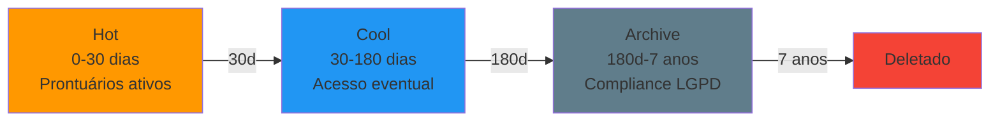
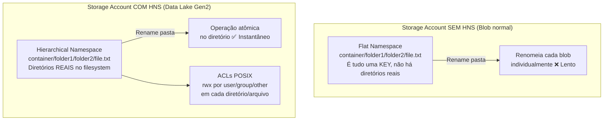

# Lab 03 — Implementar e Gerenciar Armazenamento (15-20% do exame)

> **Pré-requisito:** Lab 02 concluído, com redes virtuais, grupos de segurança de rede e service endpoints já configurados.
> **Contexto:** Este lab trata da implementação e do gerenciamento de armazenamento no Azure, incluindo contas de armazenamento, blobs, Azure Files, proteção de dados, replicação e integração segura com a rede criada anteriormente.

```mermaid
graph TB
    subgraph "rg-ch-storage"
        subgraph "sachprontuarios (East US, GRS)"
            BLOB_PRONT[Container: prontuarios<br/>Tier Hot → Cool → Archive]
            FILES_DEPT[Share: dept-clinico<br/>SMB 3.0]
            FILES_FIN[Share: dept-financeiro<br/>SMB 3.0]
        end
        subgraph "sachimagens (East US, LRS)"
            BLOB_IMG[Container: exames<br/>Archive tier]
            BLOB_RAIO[Container: raio-x<br/>Archive tier]
        end
        subgraph "sachreplica (West US, LRS)"
            BLOB_REP[Container: prontuarios-replica<br/>Object Replication]
        end
        subgraph "sachdatalake (East US, LRS + HNS)"
            DL_FS[Filesystem: dados<br/>Diretórios reais + ACLs POSIX]
            DL_CLIN[/clinico/ → grp-ch-clinico r-x]
            DL_FIN[/financeiro/ → grp-ch-financeiro rwx]
        end
    end

    BLOB_PRONT -->|Lifecycle: 30d→Cool, 90d→Archive| COOL[Cool]
    BLOB_PRONT -->|Object Replication| BLOB_REP
    BLOB_PRONT -->|Soft Delete 30d| PROTECTED[Proteção]
    BLOB_PRONT -->|Versioning| VER[Versões]

    subgraph "Acesso"
        VNET[snet-web<br/>Service Endpoint]
        PE[Private Endpoint<br/>snet-endpoints]
        SAS[SAS Token<br/>Acesso temporário]
        RBAC_BLOB[RBAC: Blob Data Reader<br/>grp-ch-clinico]
    end
    VNET --> sachprontuarios
    PE --> sachprontuarios
```

---

## Parte 1 — Criar Storage Accounts

> **Conceito:** Storage Account, ou **conta de armazenamento**, é o namespace para blobs, files, tables e queues. O nome deve ser **globalmente único**, com 3 a 24 caracteres, em minúsculas e números. Tipos principais: **StorageV2** (recomendado), **BlobStorage** (legacy), **BlockBlobStorage** (premium blob) e **FileStorage** (premium files). O tier de acesso no nível da conta, como Hot ou Cool, vira o padrão para novos blobs.
>
> **Pegadinha frequente — Data Lake Gen2 e tipos de conta:**
>
> | Tipo de conta | Suporta Data Lake Gen2 (HNS)? |
> |---|:---:|
> | **Standard GPv2** | ✅ SIM |
> | **Premium Block Blobs** | ✅ SIM |
> | Premium File Shares | ❌ NÃO (só Azure Files) |
> | **Premium Page Blobs** | ❌ NÃO (só VHDs) |
>
> Os distratores mais comuns são File Shares e Page Blobs. A resposta correta é sempre: **GPv2 Standard + Premium Block Blobs**.
> - Data Lake Gen2 = Blob Storage + **Hierarchical Namespace (HNS)**
> - Só tipos que suportam **block blobs** suportam HNS
> - Page Blobs = VHDs, File Shares = SMB → nenhum suporta HNS

### Tarefa 1.1 — sachprontuarios via Portal (exercício 1/3)

```
Portal > Storage accounts > + Create

Basics:
  - Resource group: rg-ch-storage
  - Storage account name: sachprontuarios (ou sachprontuarios01 se ocupado)
  - Region: East US
  - Performance: Standard
  - Redundancy: Geo-redundant storage (GRS)

Advanced:
  - Require secure transfer (HTTPS): ✅ Enabled
  - Allow Blob public access: ❌ Disabled
  - Minimum TLS version: TLS 1.2
  - Enable hierarchical namespace: ❌ (Data Lake)
  - Access tier: Hot

Networking:
  - Network access: Enabled from selected virtual networks and IP addresses
  - Virtual networks: + Add existing > vnet-ch-spoke-web / snet-web
  - Exceptions: ✅ Allow Azure services on the trusted services list

Data protection:
  - ✅ Enable soft delete for blobs: 30 days
  - ✅ Enable soft delete for containers: 7 days
  - ✅ Enable versioning for blobs
  - ✅ Enable blob change feed

Encryption:
  - Encryption type: Microsoft-managed keys (MMK)
  - ✅ Enable infrastructure encryption

Tags: Projeto=ContosoHealth, CostCenter=CC-CLINICO, Compliance=LGPD

> Review + Create
```

### Tarefa 1.2 — sachimagens via CLI (exercício 2/3)

```bash
# Storage para imagens de exames (archive — acesso raro, custo baixo)
az storage account create \
  --name $SA_IMAGENS \
  --resource-group $RG_STORAGE \
  --location $LOCATION \
  --sku Standard_LRS \
  --kind StorageV2 \
  --access-tier Cool \
  --min-tls-version TLS1_2 \
  --allow-blob-public-access false \
  --https-only true \
  --tags Projeto=ContosoHealth CostCenter=CC-CLINICO
# --sku Standard_LRS: redundância local (3 cópias em 1 datacenter)
# --access-tier Cool: blobs que não são acessados frequentemente
# --allow-blob-public-access false: impede acesso anônimo
# --https-only: rejeita conexões HTTP (obriga HTTPS)
# LRS é suficiente pois imagens originais estão no PACS da clínica

# Verificar
az storage account show --name $SA_IMAGENS -g $RG_STORAGE \
  --query "{Nome:name, SKU:sku.name, Tier:accessTier, TLS:minimumTlsVersion}" -o json
```

### Tarefa 1.3 — sachreplica via PowerShell (exercício 3/3)

```powershell
# Storage na região de DR para Object Replication
New-AzStorageAccount `
    -ResourceGroupName $RgStorage `
    -Name $SaReplica `
    -Location $LocationDR `
    -SkuName "Standard_LRS" `
    -Kind "StorageV2" `
    -AccessTier "Hot" `
    -MinimumTlsVersion "TLS1_2" `
    -AllowBlobPublicAccess $false `
    -EnableHttpsTrafficOnly $true `
    -Tag @{ Projeto="ContosoHealth"; CostCenter="CC-TI"; Compliance="LGPD" }
# -Location $LocationDR: West US (região diferente para DR)
# -SkuName "Standard_LRS": LRS é suficiente pois é cópia secundária
# -EnableHttpsTrafficOnly: equivalente ao --https-only do CLI

# Verificar as 3 storage accounts
Get-AzStorageAccount -ResourceGroupName $RgStorage |
    Select-Object StorageAccountName, Location,
    @{N="SKU";E={$_.Sku.Name}}, AccessTier | Format-Table
```

### Tarefa 1.4 — Storage Account via Bicep

```bash
cat > /Users/fabricio/studies/az-104/lab_novo/templates/storage-prontuarios.bicep << 'EOF'
@description('Storage Account para prontuários médicos')
param location string = resourceGroup().location
param storageName string = 'sachprontuarios'

// VNet reference para service endpoint
param vnetResourceGroup string = 'rg-ch-network'
param vnetName string = 'vnet-ch-spoke-web'
param subnetName string = 'snet-web'

// Referência a recurso EXISTENTE em outro RG (keyword "existing")
resource existingSubnet 'Microsoft.Network/virtualNetworks/subnets@2024-01-01' existing = {
  name: '${vnetName}/${subnetName}'
  scope: resourceGroup(vnetResourceGroup)
}

resource storageAccount 'Microsoft.Storage/storageAccounts@2023-05-01' = {
  name: storageName
  location: location
  tags: {
    Projeto: 'ContosoHealth'
    CostCenter: 'CC-CLINICO'
    Compliance: 'LGPD'
  }
  sku: { name: 'Standard_GRS' }
  kind: 'StorageV2'
  properties: {
    accessTier: 'Hot'
    minimumTlsVersion: 'TLS1_2'
    supportsHttpsTrafficOnly: true
    allowBlobPublicAccess: false
    // Firewall: permitir apenas da VNet
    networkAcls: {
      defaultAction: 'Deny'
      bypass: 'AzureServices'
      virtualNetworkRules: [
        { id: existingSubnet.id, action: 'Allow' }
      ]
    }
    // Criptografia com infrastructure encryption (dupla)
    encryption: {
      services: {
        blob: { enabled: true }
        file: { enabled: true }
      }
      keySource: 'Microsoft.Storage'
      requireInfrastructureEncryption: true
    }
  }
}

// Habilitar soft delete e versioning via child resource
resource blobService 'Microsoft.Storage/storageAccounts/blobServices@2023-05-01' = {
  parent: storageAccount
  name: 'default'
  properties: {
    deleteRetentionPolicy: { enabled: true, days: 30 }
    containerDeleteRetentionPolicy: { enabled: true, days: 7 }
    isVersioningEnabled: true
    changeFeed: { enabled: true }
  }
}

output storageId string = storageAccount.id
output blobEndpoint string = storageAccount.properties.primaryEndpoints.blob
EOF

# Deploy
az deployment group create \
  --resource-group $RG_STORAGE \
  --template-file /Users/fabricio/studies/az-104/lab_novo/templates/storage-prontuarios.bicep \
  --name "deploy-storage-prontuarios"
```

---

## Parte 2 — Acesso ao Armazenamento

### Tarefa 2.1 — Gerenciar Access Keys (exercício 1/3)

> **Conceito:** Cada conta de armazenamento tem 2 access keys que dão acesso **total**. A rotação correta é: usar `key1`, regenerar `key2`, migrar para `key2` e depois regenerar `key1`. Em produção, prefira Entra ID, controle de acesso baseado em função (**RBAC**) ou assinaturas de acesso compartilhado (**SAS**).

```bash
# Listar keys
az storage account keys list --account-name $SA_PRONTUARIOS -g $RG_STORAGE \
  --query "[].{Key:keyName, Value:value}" -o table

# Guardar key para uso
SA_KEY=$(az storage account keys list --account-name $SA_PRONTUARIOS -g $RG_STORAGE --query "[0].value" -o tsv)

# Rotacionar key2
az storage account keys renew --account-name $SA_PRONTUARIOS -g $RG_STORAGE --key key2
# Após rotacionar, aplicações usando key2 devem atualizar a key

# Obter connection string
az storage account show-connection-string --name $SA_PRONTUARIOS -g $RG_STORAGE -o tsv
```

```powershell
# PowerShell: rotacionar keys
New-AzStorageAccountKey -ResourceGroupName $RgStorage -Name $SaProntuarios -KeyName key1
# New-AzStorageAccountKey: regenera uma key específica
# -KeyName: key1 ou key2

# Obter context para operações de storage
$SaContext = New-AzStorageContext -StorageAccountName $SaProntuarios -StorageAccountKey (
    (Get-AzStorageAccountKey -ResourceGroupName $RgStorage -Name $SaProntuarios)[0].Value
)
# New-AzStorageContext: cria objeto de contexto para autenticar operações
```

### Tarefa 2.2 — Tokens SAS (exercício 2/3)

> **Conceito:** A assinatura de acesso compartilhado (**SAS**) dá acesso delegado com permissões granulares e tempo limitado. Tipos: **Account SAS** (toda a conta), **Service SAS** (um serviço específico) e **User Delegation SAS** (baseado em Entra ID, mais seguro e sem uso de key). Para revogar, remova a Stored Access Policy ou rotacione a key.

```bash
# Gerar Account SAS (1 hora de validade)
EXPIRY=$(date -u -v+1H '+%Y-%m-%dT%H:%MZ' 2>/dev/null || date -u -d '+1 hour' '+%Y-%m-%dT%H:%MZ')

SAS_TOKEN=$(az storage account generate-sas \
  --account-name $SA_PRONTUARIOS --account-key $SA_KEY \
  --permissions "rl" \
  --resource-types "sco" \
  --services "b" \
  --expiry $EXPIRY -o tsv)
# --permissions "rl": read + list
# --resource-types "sco": service + container + object
# --services "b": apenas blob (outros: f=file, q=queue, t=table)
# --expiry: data/hora de expiração (UTC)
echo "SAS: $SAS_TOKEN"

# Gerar Service SAS para container específico
CONTAINER_SAS=$(az storage container generate-sas \
  --name "prontuarios" \
  --account-name $SA_PRONTUARIOS --account-key $SA_KEY \
  --permissions "rl" --expiry $EXPIRY -o tsv)

# User Delegation SAS (mais seguro — usa Entra ID, não key)
USER_SAS=$(az storage container generate-sas \
  --name "prontuarios" \
  --account-name $SA_PRONTUARIOS \
  --permissions "rl" --expiry $EXPIRY \
  --as-user --auth-mode login -o tsv)
# --as-user: gera User Delegation SAS
# --auth-mode login: autentica com Entra ID (não com key)
```

### Tarefa 2.3 — Stored Access Policies (exercício 3/3)

```bash
# Criar container primeiro
az storage container create --name "prontuarios" --account-name $SA_PRONTUARIOS --account-key $SA_KEY

# Criar Stored Access Policy (permite revogar SAS depois)
az storage container policy create \
  --container-name "prontuarios" \
  --name "policy-clinico-read" \
  --account-name $SA_PRONTUARIOS --account-key $SA_KEY \
  --permissions "rl" --expiry $EXPIRY
# Stored Access Policy: define permissões no servidor
# SAS que referenciam esta policy podem ser REVOGADOS deletando a policy

# Gerar SAS baseado na policy
POLICY_SAS=$(az storage container generate-sas \
  --name "prontuarios" \
  --account-name $SA_PRONTUARIOS --account-key $SA_KEY \
  --policy-name "policy-clinico-read" -o tsv)

# Revogar: deletar a policy invalida TODOS os SAS que a usam
az storage container policy delete \
  --container-name "prontuarios" --name "policy-clinico-read" \
  --account-name $SA_PRONTUARIOS --account-key $SA_KEY
echo "Policy deletada — todos os SAS referenciando 'policy-clinico-read' foram invalidados"

# Re-criar para uso futuro
az storage container policy create \
  --container-name "prontuarios" --name "policy-clinico-read" \
  --account-name $SA_PRONTUARIOS --account-key $SA_KEY \
  --permissions "rl" --expiry "2026-12-31"
```

### Tarefa 2.4 — Firewall e Identity-based Access

```bash
# Adicionar seu IP para não perder acesso (firewall já está como Deny no Bicep)
MY_IP=$(curl -s ifconfig.me)
az storage account network-rule add \
  --account-name $SA_PRONTUARIOS -g $RG_STORAGE --ip-address $MY_IP

# Verificar regras de rede
az storage account show --name $SA_PRONTUARIOS -g $RG_STORAGE \
  --query "networkRuleSet.{Default:defaultAction, IPs:ipRules[].ipAddressOrRange, VNets:virtualNetworkRules[].virtualNetworkResourceId, Bypass:bypass}" -o json

# Identity-based access para Azure Files
# Requer Entra Domain Services ou AD DS híbrido (Kerberos)
# 3 roles específicos:
#   Storage File Data SMB Share Reader
#   Storage File Data SMB Share Contributor
#   Storage File Data SMB Share Elevated Contributor (pode alterar ACLs NTFS)

# PEGADINHA FREQUENTE:
# "Qual serviço de dados suporta acesso baseado em identidade?" → AZURE FILES
# ❌ Containers (Blobs) = acesso via RBAC/SAS, NÃO via Kerberos/identidade
# ❌ Filas = acesso via chave/SAS
# ❌ Tabelas = acesso via chave/SAS
# ✅ File Shares = podem usar Microsoft Entra Kerberos para autenticação SMB
```

---

## Parte 3 — Containers e Blobs

### Tarefa 3.1 — Criar Containers e Upload (exercício 1/3)

```bash
# Criar containers para os dados da Contoso
az storage container create --name "prontuarios" --account-name $SA_PRONTUARIOS --account-key $SA_KEY 2>/dev/null
az storage container create --name "relatorios" --account-name $SA_PRONTUARIOS --account-key $SA_KEY
az storage container create --name "logs" --account-name $SA_PRONTUARIOS --account-key $SA_KEY

# Containers na storage de imagens
SA_IMG_KEY=$(az storage account keys list --account-name $SA_IMAGENS -g $RG_STORAGE --query "[0].value" -o tsv)
az storage container create --name "exames" --account-name $SA_IMAGENS --account-key $SA_IMG_KEY
az storage container create --name "raio-x" --account-name $SA_IMAGENS --account-key $SA_IMG_KEY

# Criar arquivos de teste (simulando prontuários)
echo '{"paciente":"Maria Silva","exame":"hemograma","data":"2026-03-01"}' > /tmp/prontuario-001.json
echo '{"paciente":"João Santos","exame":"raio-x torax","data":"2026-03-05"}' > /tmp/prontuario-002.json
echo '{"paciente":"Ana Costa","exame":"ressonancia","data":"2026-03-10"}' > /tmp/prontuario-003.json

# Upload blobs organizados por ano/mês (hierarquia virtual)
for i in 001 002 003; do
  az storage blob upload \
    --container-name "prontuarios" \
    --file "/tmp/prontuario-${i}.json" \
    --name "2026/03/prontuario-${i}.json" \
    --account-name $SA_PRONTUARIOS --account-key $SA_KEY \
    --tier Hot
done
# --name "2026/03/...": cria hierarquia virtual (pastas no blob storage)
# --tier Hot: tier do blob individual (pode ser diferente do account tier)

# Listar blobs
az storage blob list --container-name "prontuarios" \
  --account-name $SA_PRONTUARIOS --account-key $SA_KEY \
  --query "[].{Nome:name, Tier:properties.blobTier, Tamanho:properties.contentLength}" -o table
```

### Tarefa 3.2 — Blob Tiers (exercício 2/3)

```bash
# Mover prontuário antigo para Cool (acesso eventual)
az storage blob set-tier \
  --container-name "prontuarios" --name "2026/03/prontuario-001.json" \
  --account-name $SA_PRONTUARIOS --account-key $SA_KEY --tier Cool

# Upload imagem diretamente no Archive (acesso raro)
echo "imagem-binaria-simulada" > /tmp/raio-x-001.dat
az storage blob upload \
  --container-name "raio-x" --file "/tmp/raio-x-001.dat" \
  --name "2026/03/raio-x-001.dat" \
  --account-name $SA_IMAGENS --account-key $SA_IMG_KEY --tier Archive

# Reidratar blob de Archive (leva horas!)
az storage blob set-tier \
  --container-name "raio-x" --name "2026/03/raio-x-001.dat" \
  --account-name $SA_IMAGENS --account-key $SA_IMG_KEY \
  --tier Hot --rehydrate-priority High
# --rehydrate-priority: High (até 1h para < 10GB) ou Standard (até 15h)

# Verificar status
az storage blob show --container-name "raio-x" --name "2026/03/raio-x-001.dat" \
  --account-name $SA_IMAGENS --account-key $SA_IMG_KEY \
  --query "{Tier:properties.blobTier, Reidratacao:properties.rehydrationStatus}" -o json
```

### Tarefa 3.3 — AzCopy (exercício 3/3)

```bash
# Copiar prontuários entre containers usando AzCopy
azcopy copy \
  "https://${SA_PRONTUARIOS}.blob.core.windows.net/prontuarios/2026/?${SAS_TOKEN}" \
  "https://${SA_PRONTUARIOS}.blob.core.windows.net/relatorios/backup-2026/?${SAS_TOKEN}" \
  --recursive
# azcopy copy: copia dados (como cp/rsync)
# --recursive: inclui subpastas

# Sync: sincronizar apenas diferenças
mkdir -p /tmp/contoso-sync
echo "dados-locais" > /tmp/contoso-sync/local-file.txt
azcopy sync "/tmp/contoso-sync/" \
  "https://${SA_PRONTUARIOS}.blob.core.windows.net/relatorios/sync/?${SAS_TOKEN}"
# azcopy sync: como rsync — só transfere o que mudou
```

### Tarefa 3.4 — Azure Storage Explorer (exercício extra)

> **Conceito:** O **Azure Storage Explorer** é a ferramenta gráfica oficial da Microsoft para navegar e administrar **Blobs, Files, Queues e Tables**. Na prova, ele costuma aparecer como a melhor opção quando o enunciado pede uma forma **visual** de inspecionar containers, gerar SAS rapidamente, verificar propriedades ou fazer upload/download sem automação.

```
Azure Storage Explorer > Sign in with Azure Account

1. Expandir:
   - Storage Accounts
   - sachprontuarios
   - Blob Containers
   - prontuarios

2. Validar operações úteis:
   - Upload > Upload Files... > enviar /tmp/test-version.json
   - Manage Access Policies no container "relatorios"
   - Properties em um blob para ver tier, metadata e versionId

3. Navegar em Azure Files:
   - File Shares > dept-financeiro
   - Criar pasta "2026/Q2"
   - Upload/download de arquivos do share
```

> **Dica de Prova:**
> - **Storage Explorer** = ferramenta gráfica/desktop para administrar dados do Storage
> - **AzCopy** = melhor para cópia em massa e automação
> - **Portal** = melhor para configuração da conta, firewall, encryption, lifecycle e endpoints
> - Se a questão pedir "navegar containers/file shares, comparar conteúdo, gerar SAS rapidamente" → **Storage Explorer**

---

## Parte 4 — Azure Files

### Tarefa 4.1 — File Shares para departamentos (exercício 1/2)

```bash
# Share para departamento clínico
az storage share-rm create \
  --storage-account $SA_PRONTUARIOS -g $RG_STORAGE \
  --name "dept-clinico" --quota 50 \
  --enabled-protocols SMB --access-tier TransactionOptimized
# --quota: tamanho máximo em GiB
# --enabled-protocols: SMB ou NFS (NFS requer premium FileStorage)
# --access-tier: TransactionOptimized (padrão), Hot, ou Cool

# Share para departamento financeiro
az storage share-rm create \
  --storage-account $SA_PRONTUARIOS -g $RG_STORAGE \
  --name "dept-financeiro" --quota 20 \
  --enabled-protocols SMB --access-tier Hot

# Upload de arquivo
echo "Relatório financeiro Q1 2026" > /tmp/relatorio-q1.txt
az storage file upload \
  --share-name "dept-financeiro" --source "/tmp/relatorio-q1.txt" \
  --account-name $SA_PRONTUARIOS --account-key $SA_KEY

# Criar diretório
az storage directory create \
  --share-name "dept-financeiro" --name "2026/Q1" \
  --account-name $SA_PRONTUARIOS --account-key $SA_KEY
```

### Tarefa 4.2 — Large File Shares (exercício 2/3)

> **Conceito:** Por padrão, um file share suporta até **5 TiB**. Para expandir até **100 TiB**, é necessário habilitar **Large File Shares** na storage account. Essa é uma propriedade da **conta** (não do share). Após habilitar, basta atualizar a **quota** do share.

> **RESTRIÇÕES de Large File Shares:**
>
> | Aspecto | Com Large File Shares |
> |---|---|
> | Quota máxima | **100 TiB** (102.400 GiB) |
> | Redundância suportada | **LRS e ZRS** apenas |
> | GRS / RA-GRS / GZRS | ❌ **NÃO** suportado |
> | Pode desabilitar depois? | ❌ **NÃO** — uma vez habilitado, é irreversível |
> | Precisa recriar o share? | ❌ **NÃO** — só atualizar a quota |
> | Precisa mudar kind da conta? | ❌ **NÃO** — funciona com StorageV2 |

> **Cenário Contoso:** O departamento de marketing (dept-clinico) armazena vídeos de campanhas de saúde. O share de 50 GiB está 99% cheio. Precisamos expandir para 100 TiB.

```bash
# Passo 1: Habilitar Large File Shares na CONTA (não no share)
az storage account update \
  --name $SA_PRONTUARIOS -g $RG_STORAGE \
  --enable-large-file-share
# --enable-large-file-share: habilita suporte a 100 TiB por share
# IRREVERSÍVEL! Uma vez habilitado, não pode desabilitar
# ATENÇÃO: se a conta for GRS/RA-GRS, precisa mudar para LRS/ZRS primeiro!

# Passo 2: Atualizar a quota do share existente
az storage share-rm update \
  --storage-account $SA_PRONTUARIOS -g $RG_STORAGE \
  --name "dept-clinico" \
  --quota 102400
# --quota 102400: 102.400 GiB = 100 TiB
# NÃO precisa recriar o share — apenas atualizar a quota
```

```powershell
# PowerShell — EXATAMENTE como aparece na prova:

# Passo 1: Habilitar Large File Shares na conta
Set-AzStorageAccount -ResourceGroupName RG1 -Name storage1 -EnableLargeFileShare
# Set-AzStorageAccount: ATUALIZA conta existente
# -EnableLargeFileShare: habilita suporte a 100 TiB
# NÃO é New-AzStorageAccount (que CRIA conta nova)
# NÃO precisa de -Type "Standard_RAGRS" (não muda redundância)

# Passo 2: Atualizar a quota do share EXISTENTE
Update-AzRmStorageShare -ResourceGroupName RG1 -StorageAccountName storage1 -Name share1 -QuotaGiB 102400
# Update-AzRmStorageShare: ATUALIZA share existente
# -QuotaGiB 102400: 100 TiB em GiB
# NÃO é New-AzRmStorageShare (que CRIA share novo — o share já existe!)
```

> **ARMADILHA DA PROVA — "Quais 2 comandos?":**
>
> | Comando | Correto? | Porquê |
> |---|---|---|
> | `Set-AzStorageAccount ... -EnableLargeFileShare` | ✅ **SIM** | Habilita large files na **conta** |
> | `Update-AzRmStorageShare ... -QuotaGiB 102400` | ✅ **SIM** | Atualiza quota do share **existente** |
> | `New-AzRmStorageShare ... -QuotaGiB 100GB` | ❌ NÃO | **Cria** share novo — o share já existe! |
> | `Set-AzStorageAccount ... -Type "Standard_RAGRS"` | ❌ NÃO | RA-GRS **não suporta** large file shares |
>
> **Palavras-chave para identificar:**
> - `Set-Az*` = **atualizar** recurso existente
> - `New-Az*` = **criar** recurso novo
> - `Update-Az*` = **atualizar** recurso existente
> - `Get-Az*` = **consultar** (não modifica)
> - `Remove-Az*` = **deletar**

### Tarefa 4.3 — Snapshots e PowerShell (exercício 3/3)

```powershell
# Criar share via PowerShell
New-AzRmStorageShare `
    -StorageAccountName $SaProntuarios `
    -ResourceGroupName $RgStorage `
    -Name "dept-rh" `
    -QuotaGiB 10 `
    -AccessTier "Hot"

# Criar snapshot (proteção point-in-time)
$SaContext = (Get-AzStorageAccount -ResourceGroupName $RgStorage -Name $SaProntuarios).Context
$Snapshot = New-AzStorageShareSnapshot -Context $SaContext -ShareName "dept-clinico"
Write-Host "Snapshot criado: $($Snapshot.SnapshotTime)"
# Snapshots são incrementais e armazenados no nível do share
```

### Tarefa 4.4 — Soft Delete e Restore de Azure Files (exercício extra)

> **Conceito:** O **soft delete de Azure Files** protege o **file share inteiro** contra exclusão acidental. Isso é diferente de snapshot: snapshot protege o conteúdo em um ponto no tempo; soft delete protege contra o ato de apagar o share. Na prova, quando pedirem "restaurar um file share deletado dentro do período de retenção", a resposta costuma envolver **share soft delete + restore**.

```bash
# Habilitar soft delete para file shares por 14 dias
az storage account file-service-properties update \
  --account-name $SA_PRONTUARIOS -g $RG_STORAGE \
  --enable-delete-retention true \
  --delete-retention-days 14
# --enable-delete-retention: ativa share soft delete
# --delete-retention-days: janela em que o share pode ser restaurado

# Verificar configuração
az storage account file-service-properties show \
  --account-name $SA_PRONTUARIOS -g $RG_STORAGE \
  --query "{Enabled:shareDeleteRetentionPolicy.enabled, Days:shareDeleteRetentionPolicy.days}" -o json

# Excluir um share de teste
az storage share-rm delete \
  --storage-account $SA_PRONTUARIOS -g $RG_STORAGE \
  --name "dept-rh"

# Listar shares deletados e identificar o campo deletedVersion
az storage share-rm list \
  --storage-account $SA_PRONTUARIOS -g $RG_STORAGE \
  --include-deleted true -o json

# Restaurar o share deletado
az storage share-rm restore \
  --storage-account $SA_PRONTUARIOS -g $RG_STORAGE \
  --name "dept-rh" \
  --deleted-version "<deletedVersion-copiado-do-list>"
# --restored-name é opcional se quiser restaurar com outro nome
```

> **Dica de Prova:**
> - **Blob soft delete** protege blobs e containers
> - **File share soft delete** protege o share inteiro em Azure Files
> - **Snapshot** não substitui soft delete; são mecanismos complementares
> - Se o enunciado falar em "share deletado ontem" e ainda dentro da retenção: **restore do share**

---

## Parte 5 — Data Protection

### Tarefa 5.1 — Soft Delete e Versioning (exercício 1/2)

```bash
# Verificar configuração (já habilitado pelo Bicep/Portal)
az storage account blob-service-properties show \
  --account-name $SA_PRONTUARIOS -g $RG_STORAGE \
  --query "{SoftDeleteBlob:deleteRetentionPolicy, SoftDeleteContainer:containerDeleteRetentionPolicy, Versioning:isVersioningEnabled}" -o json

# Testar: criar, modificar e deletar blob
echo "versao1-prontuario" > /tmp/test-version.json
az storage blob upload --container-name "prontuarios" --file /tmp/test-version.json \
  --name "test/versioning.json" --account-name $SA_PRONTUARIOS --account-key $SA_KEY --overwrite

echo "versao2-prontuario-atualizado" > /tmp/test-version.json
az storage blob upload --container-name "prontuarios" --file /tmp/test-version.json \
  --name "test/versioning.json" --account-name $SA_PRONTUARIOS --account-key $SA_KEY --overwrite

# Deletar
az storage blob delete --container-name "prontuarios" --name "test/versioning.json" \
  --account-name $SA_PRONTUARIOS --account-key $SA_KEY

# Listar incluindo deletados
az storage blob list --container-name "prontuarios" --account-name $SA_PRONTUARIOS --account-key $SA_KEY \
  --include "dv" --query "[?starts_with(name,'test/')].{Nome:name, Deleted:deleted, Version:versionId}" -o table
# --include "dv": d=deleted, v=versions

# Restaurar
az storage blob undelete --container-name "prontuarios" --name "test/versioning.json" \
  --account-name $SA_PRONTUARIOS --account-key $SA_KEY
```

### Tarefa 5.2 — Lifecycle Management (exercício 2/2)

```bash
# Política de ciclo de vida (prontuários: Hot→Cool→Archive→Delete)
cat > /tmp/lifecycle-contoso.json << 'EOF'
{
  "rules": [
    {
      "enabled": true,
      "name": "prontuarios-lifecycle",
      "type": "Lifecycle",
      "definition": {
        "actions": {
          "baseBlob": {
            "tierToCool": { "daysAfterModificationGreaterThan": 30 },
            "tierToArchive": { "daysAfterModificationGreaterThan": 180 },
            "delete": { "daysAfterModificationGreaterThan": 2555 }
          },
          "snapshot": { "delete": { "daysAfterCreationGreaterThan": 90 } },
          "version": { "delete": { "daysAfterCreationGreaterThan": 90 } }
        },
        "filters": {
          "blobTypes": ["blockBlob"],
          "prefixMatch": ["prontuarios/", "relatorios/"]
        }
      }
    },
    {
      "enabled": true,
      "name": "logs-cleanup",
      "type": "Lifecycle",
      "definition": {
        "actions": {
          "baseBlob": { "delete": { "daysAfterModificationGreaterThan": 90 } }
        },
        "filters": {
          "blobTypes": ["blockBlob"],
          "prefixMatch": ["logs/"]
        }
      }
    }
  ]
}
EOF

az storage account management-policy create \
  --account-name $SA_PRONTUARIOS -g $RG_STORAGE \
  --policy @/tmp/lifecycle-contoso.json
```



### Tarefa 5.3 — Lifecycle por Último Acesso (Access Tracking) (exercício 3/3 - NOVA)

> **Conceito:** Por padrão, lifecycle rules usam `daysAfterModificationGreaterThan` — ou seja, baseiam-se na **data de modificação** do blob. Se a prova disser "blobs não **modificados** há 30 dias", funciona direto sem config extra.
>
> Porém, se a prova disser "blobs não **acessados** há 30 dias" (last accessed), você precisa usar `daysAfterLastAccessTimeGreaterThan`. Esse filtro **REQUER** que o **access tracking** esteja habilitado na storage account **ANTES** de criar a regra. Sem isso, o Azure não rastreia quando cada blob foi lido pela última vez.
>
> **REGRA RÁPIDA PARA A PROVA:**
>
> | Enunciado diz... | Condição no JSON | Precisa de config extra? |
> |---|---|---|
> | "not **modified** for 30 days" | `daysAfterModificationGreaterThan` | ❌ NÃO — funciona por padrão |
> | "not **accessed** for 30 days" | `daysAfterLastAccessTimeGreaterThan` | ✅ SIM — habilitar **access tracking** primeiro |
>
> **Palavra-chave:** Se vir "last accessed", "não acessados", "idle" → access tracking obrigatório.

```bash
# Passo 1: Habilitar Access Tracking na storage account (PRÉ-REQUISITO)
az storage account blob-service-properties update \
  --account-name $SA_PRONTUARIOS -g $RG_STORAGE \
  --enable-last-access-tracking true
# --enable-last-access-tracking true: rastreia a última vez que cada blob foi lido
# SEM ISSO, regras com daysAfterLastAccessTimeGreaterThan NÃO funcionam!
```

```bash
# Passo 2: Criar lifecycle policy usando "último acesso" (não modificação)
cat > /tmp/lifecycle-access-tracking.json << 'EOF'
{
  "rules": [
    {
      "enabled": true,
      "name": "mover-blobs-nao-acessados",
      "type": "Lifecycle",
      "definition": {
        "actions": {
          "baseBlob": {
            "tierToCool": { "daysAfterLastAccessTimeGreaterThan": 30 },
            "tierToArchive": { "daysAfterLastAccessTimeGreaterThan": 90 },
            "delete": { "daysAfterLastAccessTimeGreaterThan": 365 }
          }
        },
        "filters": {
          "blobTypes": ["blockBlob"],
          "prefixMatch": ["prontuarios/"]
        }
      }
    }
  ]
}
EOF
# daysAfterLastAccessTimeGreaterThan: baseado no ÚLTIMO ACESSO (leitura)
# Diferente de daysAfterModificationGreaterThan que é baseado na MODIFICAÇÃO (escrita)

az storage account management-policy create \
  --account-name $SA_PRONTUARIOS -g $RG_STORAGE \
  --policy @/tmp/lifecycle-access-tracking.json
```

> **ARMADILHA DA PROVA:** A questão mostra uma lifecycle rule com `daysAfterLastAccessTimeGreaterThan` e pergunta "o que mais precisa configurar?". A resposta é **habilitar access tracking** (`--enable-last-access-tracking true`). Se a questão usar `daysAfterModificationGreaterThan`, **NÃO** precisa de access tracking — esse é o padrão.

---

## Parte 6 — Object Replication

### Tarefa 6.1 — Configurar replicação entre regiões (exercício 1/2)

> **Conceito:** Object Replication copia blobs de forma assíncrona entre contas de armazenamento. A replicação não tem SLA de tempo e não funciona com blobs em tier Archive nem com **Hierarchical Namespace (HNS)** habilitado.

> **CHECKLIST DE PRÉ-REQUISITOS — DECORE ESTA TABELA:**
>
> | Pré-requisito | Onde | Obrigatório? |
> |---|---|---|
> | **Blob Versioning habilitado** | **ORIGEM + DESTINO** | ✅ SIM — sem isso, replicação não funciona |
> | **Change Feed habilitado** | **Apenas ORIGEM** | ✅ SIM — rastreia mudanças para replicar |
> | HNS (Data Lake Gen2) desabilitado | ORIGEM + DESTINO | ✅ SIM — HNS é incompatível |
> | Blobs fora do tier Archive | ORIGEM | ✅ SIM — Archive não replica |
> | Soft Delete | Qualquer | ❌ NÃO é pré-requisito |
> | Acesso público de blob | Qualquer | ❌ NÃO é pré-requisito |
> | NFS v3 | Qualquer | ❌ NÃO é pré-requisito |
>
> **Pegadinha frequente — O que falta para Object Replication?**
> A questão mostra as configurações de uma storage account e pergunta "o que precisa mudar?". Faça assim:
> 1. Leia CADA configuração listada
> 2. Compare com a checklist acima
> 3. O que está **desabilitado** e deveria estar **habilitado** = resposta
>
> **Exemplo de cenário típico:**
> - Namespace hierárquico: Desabilitado → OK (deve ficar desabilitado)
> - Versionamento: **Desabilitado** → **ESTE é o problema!** ✅
> - Feed de alterações: habilitado → OK
> - O distrator comum é "Namespace hierárquico", mas ele já está correto (deve ficar desabilitado)
> - **Resposta correta: Controle de versão (Versionamento)**
>
> **REGRA:** Em Object Replication, o item que costuma faltar é **versioning**. HNS quase sempre aparece como distrator.

```bash
# Habilitar versioning e change feed na ORIGEM (sachprontuarios)
az storage account blob-service-properties update \
  --account-name $SA_PRONTUARIOS -g $RG_STORAGE \
  --enable-versioning true --enable-change-feed true

# Habilitar versioning no DESTINO (sachreplica)
az storage account blob-service-properties update \
  --account-name $SA_REPLICA -g $RG_STORAGE \
  --enable-versioning true

# Criar container no destino
SA_REP_KEY=$(az storage account keys list --account-name $SA_REPLICA -g $RG_STORAGE --query "[0].value" -o tsv)
az storage container create --name "prontuarios-replica" --account-name $SA_REPLICA --account-key $SA_REP_KEY
```

### Tarefa 6.2 — Exercício de Diagnóstico: "O que falta?" (exercício 2/3)

> **Simulação de questão de prova:** Antes de criar a política, verifique se os pré-requisitos estão atendidos. Esta é exatamente a habilidade cobrada na prova.

```bash
# Passo 1: Verificar configurações da ORIGEM
az storage account blob-service-properties show \
  --account-name $SA_PRONTUARIOS -g $RG_STORAGE \
  --query "{Versioning:isVersioningEnabled, ChangeFeed:changeFeed.enabled}" -o json
# AMBOS devem ser true na ORIGEM
# Se versioning=false → habilitar com --enable-versioning true
# Se changeFeed=false → habilitar com --enable-change-feed true

# Passo 2: Verificar se a conta é HNS (deve ser false para replicação)
az storage account show --name $SA_PRONTUARIOS -g $RG_STORAGE \
  --query "{HNS:isHnsEnabled}" -o json
# Se isHnsEnabled=true → Object Replication NÃO vai funcionar. Precisa de outra conta.

# Passo 3: Verificar configurações do DESTINO
az storage account blob-service-properties show \
  --account-name $SA_REPLICA -g $RG_STORAGE \
  --query "{Versioning:isVersioningEnabled}" -o json
# Versioning deve ser true no DESTINO
# Change feed NÃO é necessário no destino (apenas na origem)

az storage account show --name $SA_REPLICA -g $RG_STORAGE \
  --query "{HNS:isHnsEnabled}" -o json
# HNS deve ser false no destino também

echo "=== CHECKLIST OBJECT REPLICATION ==="
echo "ORIGEM: Versioning=true ✅, ChangeFeed=true ✅, HNS=false ✅"
echo "DESTINO: Versioning=true ✅, HNS=false ✅"
echo "Se qualquer item estiver errado, a replicação FALHA"
```

### Tarefa 6.3 — Criar política de replicação (exercício 3/3)

```bash
# Criar política de replicação
az storage account or-policy create \
  --account-name $SA_REPLICA -g $RG_STORAGE \
  --source-account $SA_PRONTUARIOS \
  --destination-account $SA_REPLICA \
  --source-container "prontuarios" \
  --destination-container "prontuarios-replica" \
  --min-creation-time "2026-01-01T00:00:00Z"

# Verificar
az storage account or-policy list --account-name $SA_REPLICA -g $RG_STORAGE -o table
```

---

## Parte 7 — Private Endpoint (conectando Lab 02 + 03)

### Tarefa 7.1 — Criar Private Endpoint para sachprontuarios (exercício 1/2)

```bash
# Obter ID da storage account
SA_PRONT_ID=$(az storage account show --name $SA_PRONTUARIOS -g $RG_STORAGE --query id -o tsv)

# Criar Private Endpoint na subnet preparada no Lab 02
az network private-endpoint create \
  --name "pe-ch-prontuarios" \
  --resource-group $RG_NETWORK \
  --location $LOCATION \
  --vnet-name $VNET_SPOKE_DATA \
  --subnet "snet-endpoints" \
  --private-connection-resource-id $SA_PRONT_ID \
  --group-id "blob" \
  --connection-name "pe-conn-prontuarios"

# Obter IP privado do endpoint
az network private-endpoint show --name "pe-ch-prontuarios" -g $RG_NETWORK \
  --query "customDnsConfigs[].{FQDN:fqdn, IP:ipAddresses}" -o json
```

### Tarefa 7.2 — DNS para Private Endpoint (exercício 2/2)

```bash
# Criar Private DNS Zone
az network private-dns zone create \
  --name "privatelink.blob.core.windows.net" -g $RG_NETWORK

# Linkar à VNet Spoke Data
az network private-dns link vnet create \
  --name "link-spoke-data-blob" -g $RG_NETWORK \
  --zone-name "privatelink.blob.core.windows.net" \
  --virtual-network $VNET_SPOKE_DATA --registration-enabled false

# Criar registro A
PE_IP=$(az network private-endpoint show --name "pe-ch-prontuarios" -g $RG_NETWORK \
  --query "customDnsConfigs[0].ipAddresses[0]" -o tsv)

az network private-dns record-set a add-record \
  --zone-name "privatelink.blob.core.windows.net" -g $RG_NETWORK \
  --record-set-name $SA_PRONTUARIOS --ipv4-address $PE_IP

echo "Agora ${SA_PRONTUARIOS}.blob.core.windows.net resolve para ${PE_IP} (IP privado)"
```

---

## Parte 8 — Criptografia

### Tarefa 8.1 — Verificar e configurar criptografia (exercício 1/2)

```bash
# Verificar criptografia (MMK por padrão)
az storage account show --name $SA_PRONTUARIOS -g $RG_STORAGE \
  --query "encryption.{KeySource:keySource, InfraEncryption:requireInfrastructureEncryption, Services:services}" -o json
# keySource: Microsoft.Storage = MMK (Microsoft-managed keys)
# Para CMK: keySource = Microsoft.Keyvault
```

### Tarefa 8.2 — Alternar redundância (exercício 2/2)

```bash
# Mudar sachimagens de LRS para GRS (para DR)
az storage account update --name $SA_IMAGENS -g $RG_STORAGE --sku Standard_GRS
# Mudança de LRS→GRS é permitida a qualquer momento
# Mudança de LRS→ZRS requer live migration (suporte) ou cópia manual

az storage account show --name $SA_IMAGENS -g $RG_STORAGE \
  --query "{SKU:sku.name, Redundancia:sku.tier}" -o json
```

---

## Parte 9 — Azure Data Lake Storage Gen2

> **Conceito:** Data Lake Storage Gen2 **não é um serviço separado**. Ele é uma conta de armazenamento **StorageV2** com **Hierarchical Namespace (HNS)** habilitado. O HNS transforma o namespace plano do Blob Storage em um sistema de arquivos real com diretórios, o que permite operações atômicas em diretórios, como rename e delete, além de **ACLs POSIX** para controle granular por pasta e arquivo.

> **Tipos de conta que suportam Data Lake Gen2 (HNS):**
>
> | Tipo de Conta | Suporta HNS? | Quando usar |
> |---|---|---|
> | **StorageV2 (General Purpose v2)** | ✅ SIM | Padrão — blobs, files, queues, tables |
> | **Premium Block Blobs (BlockBlobStorage)** | ✅ SIM | Baixa latência, alta taxa de transação |
> | BlobStorage | ❌ NÃO | Legacy — não use |
> | Premium Page Blobs | ❌ NÃO | Discos de VM (VHDs) — sem HNS |
> | Premium File Shares (FileStorage) | ❌ NÃO | Azure Files premium — sem HNS |
>
> **ARMADILHA:** Page Blobs (discos) e File Shares premium NÃO suportam HNS. Na prova, se vir "Page Blob" ou "File Share premium" como opção de Data Lake, descarte.



> **Cenário Contoso:** A equipe de dados precisa de um Data Lake para armazenar e processar dados analíticos de pacientes (anonimizados). ACLs POSIX permitem que o time clínico leia `/dados/clinico/` mas não `/dados/financeiro/`.

### Tarefa 9.1 — Criar Storage Account com HNS via Portal (exercício 1/3)

```
Portal > Storage accounts > + Create

Basics:
  - Resource group: rg-ch-storage
  - Storage account name: sachdatalake (ou sachdatalake01 se ocupado)
  - Region: East US
  - Performance: Standard
  - Redundancy: LRS

Advanced:
  - ✅ Enable hierarchical namespace  ← ISTO É O QUE ATIVA O DATA LAKE GEN2
  - Require secure transfer: ✅
  - Allow Blob public access: ❌
  - Minimum TLS: 1.2

IMPORTANTE: HNS NÃO pode ser habilitado depois da criação!
Se esquecer de marcar, precisa RECRIAR a storage account.

> Review + Create
```

### Tarefa 9.2 — Criar Data Lake via CLI (exercício 2/3)

```bash
# Criar Storage Account com HNS (Data Lake Gen2)
az storage account create \
  --name "sachdatalake" \
  --resource-group $RG_STORAGE \
  --location $LOCATION \
  --sku Standard_LRS \
  --kind StorageV2 \
  --enable-hierarchical-namespace true \
  --min-tls-version TLS1_2 \
  --allow-blob-public-access false \
  --tags Projeto=ContosoHealth CostCenter=CC-TI Tipo=DataLake
# --enable-hierarchical-namespace true: ESTE É O FLAG QUE ATIVA O DATA LAKE GEN2
# --kind StorageV2: OBRIGATÓRIO — HNS só funciona com StorageV2 (NÃO BlobStorage, NÃO FileStorage)

# Verificar que HNS está habilitado
az storage account show --name "sachdatalake" -g $RG_STORAGE \
  --query "{Nome:name, Kind:kind, HNS:isHnsEnabled, SKU:sku.name}" -o json
# isHnsEnabled: true = Data Lake Gen2 ativo

# Criar filesystem (equivalente a container, mas com hierarquia real)
az storage fs create \
  --name "dados" \
  --account-name "sachdatalake" \
  --auth-mode login
# az storage fs create: cria filesystem no Data Lake
# --auth-mode login: usa Entra ID (não access key)
# "fs" = filesystem (nomenclatura Data Lake), equivalente a "container" no Blob

# Criar diretórios (operação atômica — instantânea, diferente de Blob!)
az storage fs directory create \
  --name "clinico" \
  --file-system "dados" \
  --account-name "sachdatalake" \
  --auth-mode login

az storage fs directory create \
  --name "financeiro" \
  --file-system "dados" \
  --account-name "sachdatalake" \
  --auth-mode login

az storage fs directory create \
  --name "anonimizado" \
  --file-system "dados" \
  --account-name "sachdatalake" \
  --auth-mode login

# Upload de arquivo para diretório
echo '{"paciente_id":"hash_001","exame":"hemograma","resultado":"normal"}' > /tmp/dado-clinico.json

az storage fs file upload \
  --file-system "dados" \
  --path "clinico/2026/03/dado-clinico-001.json" \
  --source "/tmp/dado-clinico.json" \
  --account-name "sachdatalake" \
  --auth-mode login
# --path: caminho REAL no filesystem hierárquico (diretório/subdir/arquivo)

# Listar conteúdo de um diretório
az storage fs file list \
  --file-system "dados" \
  --path "clinico" \
  --account-name "sachdatalake" \
  --auth-mode login \
  --query "[].{Nome:name, Tamanho:contentLength}" -o table
```

### Tarefa 9.3 — ACLs POSIX e PowerShell (exercício 3/3)

> **Conceito — ACLs POSIX:** Data Lake Gen2 suporta ACLs no estilo Linux: `rwx` (read, write e execute) para **owner**, **owning group** e **other**. A permissão `x` em diretório significa poder navegar e listar. Elas são diferentes do Azure RBAC: ACLs POSIX atuam no **data plane**, enquanto RBAC atua no **management plane** e, em alguns casos, também no data plane.

```bash
# Configurar ACL: grp-ch-clinico pode ler /dados/clinico/
GRP_CLINICO_OID=$(az ad group show --group "grp-ch-clinico" --query id -o tsv)

# ACL no diretório /dados/
az storage fs access set \
  --acl "default:group:${GRP_CLINICO_OID}:r-x" \
  --file-system "dados" \
  --path "clinico" \
  --account-name "sachdatalake" \
  --auth-mode login
# ACL format: [default:]<scope>:<id>:<permissions>
# default: = ACL herdada por novos arquivos/subdiretórios
# group:<OID>: = grupo Entra ID
# r-x = read + execute (listar diretório), sem write
# Permissões: r=read(4), w=write(2), x=execute(1), -=nenhuma

# Verificar ACLs
az storage fs access show \
  --file-system "dados" \
  --path "clinico" \
  --account-name "sachdatalake" \
  --auth-mode login \
  --query "{Owner:owner, Group:group, ACL:acl}" -o json

# Configurar ACL: grp-ch-financeiro pode ler e escrever em /dados/financeiro/
GRP_FIN_OID=$(az ad group show --group "grp-ch-financeiro" --query id -o tsv)

az storage fs access set \
  --acl "default:group:${GRP_FIN_OID}:rwx" \
  --file-system "dados" \
  --path "financeiro" \
  --account-name "sachdatalake" \
  --auth-mode login
# rwx = read + write + execute (acesso total ao diretório)
```

```powershell
# --- Data Lake Gen2 via PowerShell ---

# Criar storage account com HNS
New-AzStorageAccount `
    -ResourceGroupName $RgStorage `
    -Name "sachdatalake" `
    -Location $Location `
    -SkuName "Standard_LRS" `
    -Kind "StorageV2" `
    -EnableHierarchicalNamespace $true `
    -MinimumTlsVersion "TLS1_2"
# -EnableHierarchicalNamespace $true: habilita HNS = Data Lake Gen2

# Obter contexto
$DLContext = (Get-AzStorageAccount -ResourceGroupName $RgStorage -Name "sachdatalake").Context

# Criar filesystem
New-AzDatalakeGen2FileSystem -Context $DLContext -Name "analytics"
# New-AzDatalakeGen2FileSystem: cria filesystem (container com HNS)

# Criar diretório
New-AzDataLakeGen2Item -Context $DLContext `
    -FileSystem "analytics" `
    -Path "raw/clinico" `
    -Directory
# New-AzDataLakeGen2Item: cria diretório ou arquivo
# -Directory: flag que indica que é diretório (sem flag = arquivo)

# Upload de arquivo
$LocalFile = "/tmp/dado-clinico.json"
New-AzDataLakeGen2Item -Context $DLContext `
    -FileSystem "analytics" `
    -Path "raw/clinico/sample.json" `
    -Source $LocalFile

# Listar
Get-AzDataLakeGen2ChildItem -Context $DLContext `
    -FileSystem "analytics" `
    -Path "raw/clinico" |
    Select-Object Name, Length, IsDirectory | Format-Table

# Configurar ACL
$ACL = New-AzDataLakeGen2ItemAclObject -AccessControlType Group `
    -EntityId $GrpFin.Id `
    -Permission "rwx"
# New-AzDataLakeGen2ItemAclObject: cria objeto ACL POSIX

Update-AzDataLakeGen2Item -Context $DLContext `
    -FileSystem "analytics" `
    -Path "raw" `
    -Acl $ACL
# Update-AzDataLakeGen2Item: aplica ACL ao item
```

> **Dica de Prova CRÍTICA — Data Lake Gen2:**
>
> | Pergunta da prova | Resposta |
> |---|---|
> | O que é Data Lake Gen2? | Storage Account **StorageV2** com **HNS habilitado** |
> | Pode habilitar HNS depois de criar? | **NÃO** — deve ser na criação |
> | Qual kind suporta HNS? | Apenas **StorageV2** (General Purpose v2) |
> | O que HNS habilita? | Diretórios reais + **ACLs POSIX** (rwx) |
> | POSIX = ? | **Hierarchical Namespace (HNS)** |
> | Object Replication funciona com HNS? | **NÃO** |
> | Blob versioning funciona com HNS? | Sim (a partir de 2023) |
> | Soft delete funciona com HNS? | Sim |
> | Diferença de ACL POSIX vs RBAC? | POSIX = por diretório/arquivo. RBAC = por container/account |
> | Execute (x) em diretório significa? | Permissão para **navegar** e **listar** conteúdo |

---

## Checklist de Verificação — Lab 03

- [ ] 3 contas de armazenamento (Storage Accounts) criadas: Portal, CLI, PowerShell e Bicep
- [ ] Data Lake Gen2 com namespace hierárquico (HNS) criado: Portal, CLI e PowerShell
- [ ] Filesystem e diretórios criados no Data Lake
- [ ] ACLs POSIX configuradas: r-x para clínico e rwx para financeiro
- [ ] Redundância: GRS (prontuarios), LRS→GRS (imagens), LRS (replica)
- [ ] Access Keys rotacionadas
- [ ] Assinaturas de acesso compartilhado (SAS) geradas: Account, Service e User Delegation
- [ ] Stored Access Policy criada, usada e revogada
- [ ] Firewall configurado com regra de rede virtual e IP permitido
- [ ] Containers criados e blobs uploaded com hierarquia virtual
- [ ] Blob tiers: Hot → Cool → Archive
- [ ] AzCopy usado (copy e sync)
- [ ] Azure Storage Explorer usado para navegar Blob e File Shares
- [ ] File Shares criados para 3 departamentos
- [ ] Large File Shares habilitado + quota atualizada para 100 TiB
- [ ] Snapshot de file share criado
- [ ] Soft Delete e restore de Azure Files entendido
- [ ] Soft Delete testado (criar, deletar, restaurar)
- [ ] Versioning testado
- [ ] Lifecycle Management configurado (2 regras)
- [ ] Object Replication configurado (prontuarios → replica)
- [ ] Private Endpoint criado com Private DNS Zone
- [ ] Criptografia verificada

**Próximo:** Lab 04 — Implantar e Gerenciar Recursos de Computação do Azure (criar VMs, containers e App Service dentro da rede e conectados ao storage)
