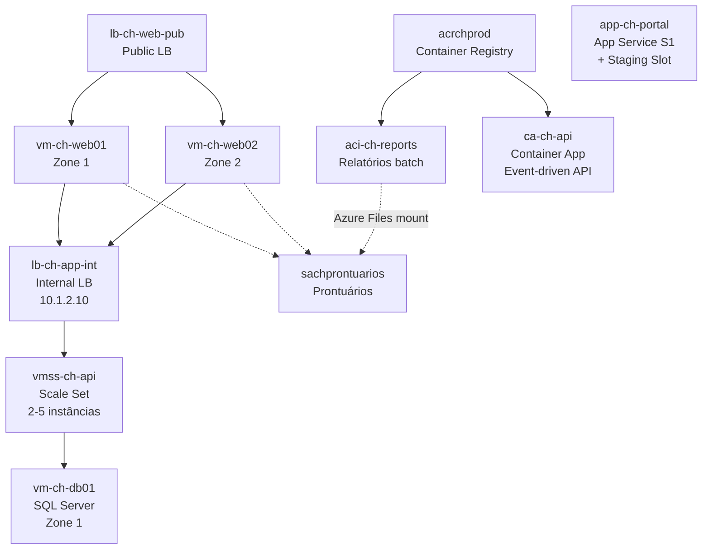

# Lab 04 — Implantar e Gerenciar Recursos de Computação do Azure (20-25% do exame)

> **Pré-requisito:** Labs 01-03 concluídos (identidade, rede e storage prontos).
> **Contexto:** Este lab trata da implantação e do gerenciamento de recursos de computação do Azure, incluindo máquinas virtuais, conjuntos de dimensionamento, containers, App Service e operações associadas de disponibilidade, escala e mobilidade.



---

## Parte 1 — ARM Templates e Bicep

### Tarefa 1.1 — Interpretar ARM Template (exercício 1/3)

> **Conceito:** ARM Template é JSON declarativo com: `$schema`, `contentVersion`, `parameters` (inputs), `variables` (valores calculados), `resources` (o que criar), `outputs` (valores de saída). Funções: `resourceGroup().location`, `uniqueString()`, `concat()`, `reference()`.

```bash
# ARM Template para criar uma VM (analise cada seção)
cat > /Users/fabricio/studies/az-104/lab_novo/templates/vm-web.json << 'ARMEOF'
{
  "$schema": "https://schema.management.azure.com/schemas/2019-04-01/deploymentTemplate.json#",
  "contentVersion": "1.0.0.0",
  "parameters": {
    "vmName": {
      "type": "string",
      "metadata": { "description": "Nome da VM" }
    },
    "adminUsername": {
      "type": "string",
      "defaultValue": "azureadmin"
    },
    "adminPassword": {
      "type": "securestring",
      "metadata": { "description": "Senha do admin" }
    },
    "subnetId": {
      "type": "string",
      "metadata": { "description": "Resource ID da subnet" }
    },
    "zone": {
      "type": "string",
      "defaultValue": "1",
      "allowedValues": ["1", "2", "3"]
    }
  },
  "variables": {
    "nicName": "[concat(parameters('vmName'), '-nic')]",
    "osDiskName": "[concat(parameters('vmName'), '-osdisk')]"
  },
  "resources": [
    {
      "type": "Microsoft.Network/networkInterfaces",
      "apiVersion": "2024-01-01",
      "name": "[variables('nicName')]",
      "location": "[resourceGroup().location]",
      "properties": {
        "ipConfigurations": [{
          "name": "ipconfig1",
          "properties": {
            "subnet": { "id": "[parameters('subnetId')]" },
            "privateIPAllocationMethod": "Dynamic"
          }
        }]
      }
    },
    {
      "type": "Microsoft.Compute/virtualMachines",
      "apiVersion": "2024-03-01",
      "name": "[parameters('vmName')]",
      "location": "[resourceGroup().location]",
      "zones": ["[parameters('zone')]"],
      "dependsOn": ["[resourceId('Microsoft.Network/networkInterfaces', variables('nicName'))]"],
      "properties": {
        "hardwareProfile": { "vmSize": "Standard_B2s" },
        "osProfile": {
          "computerName": "[parameters('vmName')]",
          "adminUsername": "[parameters('adminUsername')]",
          "adminPassword": "[parameters('adminPassword')]"
        },
        "storageProfile": {
          "imageReference": {
            "publisher": "Canonical",
            "offer": "0001-com-ubuntu-server-jammy",
            "sku": "22_04-lts",
            "version": "latest"
          },
          "osDisk": {
            "name": "[variables('osDiskName')]",
            "createOption": "FromImage",
            "managedDisk": { "storageAccountType": "Premium_LRS" }
          }
        },
        "networkProfile": {
          "networkInterfaces": [{
            "id": "[resourceId('Microsoft.Network/networkInterfaces', variables('nicName'))]"
          }]
        }
      }
    }
  ],
  "outputs": {
    "vmId": {
      "type": "string",
      "value": "[resourceId('Microsoft.Compute/virtualMachines', parameters('vmName'))]"
    }
  }
}
ARMEOF
```

> **Funções ARM para a prova:**
> - `[resourceGroup().location]` — região do grupo de recursos do deploy
> - `[concat('a', 'b')]` — concatena strings → `"ab"`
> - `[parameters('x')]` — referencia parâmetro
> - `[variables('x')]` — referencia variável
> - `[resourceId('Type', 'Name')]` — constrói Resource ID
> - `[reference('Name').prop]` — obtém propriedade após deploy
> - `[uniqueString(resourceGroup().id)]` — hash de 13 caracteres baseado no grupo de recursos
> - `dependsOn` — define ordem de criação, como interface de rede antes da máquina virtual
> - **`copy`** — cria múltiplas instâncias do mesmo recurso, por exemplo 2 máquinas virtuais a partir de uma única definição
>
> **Ponto de atenção — ARM copy element:**
> - "Implantar 2 máquinas virtuais usando 1 template com 1 definição de recurso" → adicionar o **elemento `copy`**
> - `copy` permite iteração: cria N instâncias variando parâmetros (nome, zona, etc.)
> - ❌ Versão da API = já está no template
> - ❌ ID da assinatura = não é necessário
> - ❌ Local do grupo de recursos = já fornecido por `resourceGroup().location`
>
> **Pegadinha frequente — ARM --parameters inline:**
> - "Passar array como parâmetro inline" → `--parameters arrayParam='["v1","v2"]'`
> - **Inline** = direto no comando `--parameters key=value`
> - **Arquivo** = `--parameters @params.json` (NÃO é inline)
> - `--template-file` aponta para o template, NÃO serve para parâmetros

### Tarefa 1.2 — Bicep equivalente (exercício 2/3)

```bash
cat > /Users/fabricio/studies/az-104/lab_novo/templates/vm-web.bicep << 'EOF'
@description('Nome da VM')
param vmName string

@description('Senha do admin')
@secure()                        // equivalente a "securestring" no ARM
param adminPassword string

param adminUsername string = 'azureadmin'
param location string = resourceGroup().location

@allowed(['1', '2', '3'])
param zone string = '1'

param subnetId string

// Variáveis (sem necessidade de concat - usa interpolação)
var nicName = '${vmName}-nic'
var osDiskName = '${vmName}-osdisk'

// NIC - criada primeiro (Bicep resolve dependências automaticamente)
resource nic 'Microsoft.Network/networkInterfaces@2024-01-01' = {
  name: nicName
  location: location
  properties: {
    ipConfigurations: [
      {
        name: 'ipconfig1'
        properties: {
          subnet: { id: subnetId }
          privateIPAllocationMethod: 'Dynamic'
        }
      }
    ]
  }
}

// VM - referencia nic.id (Bicep sabe que precisa esperar a NIC)
resource vm 'Microsoft.Compute/virtualMachines@2024-03-01' = {
  name: vmName
  location: location
  zones: [zone]   // Availability Zone
  properties: {
    hardwareProfile: { vmSize: 'Standard_B2s' }
    osProfile: {
      computerName: vmName
      adminUsername: adminUsername
      adminPassword: adminPassword
    }
    storageProfile: {
      imageReference: {
        publisher: 'Canonical'
        offer: '0001-com-ubuntu-server-jammy'
        sku: '22_04-lts'
        version: 'latest'
      }
      osDisk: {
        name: osDiskName
        createOption: 'FromImage'
        managedDisk: { storageAccountType: 'Premium_LRS' }
      }
    }
    networkProfile: {
      networkInterfaces: [{ id: nic.id }]  // referência direta, sem dependsOn
    }
  }
}

output vmId string = vm.id
EOF
```

### Tarefa 1.3 — Deploy, Export e Conversão (exercício 3/3)

```bash
# Obter subnet ID para o deploy
SUBNET_WEB_ID=$(az network vnet subnet show --name "snet-web" -g $RG_NETWORK --vnet-name $VNET_SPOKE_WEB --query id -o tsv)

# Deploy ARM Template
az deployment group create \
  --resource-group $RG_COMPUTE \
  --template-file /Users/fabricio/studies/az-104/lab_novo/templates/vm-web.json \
  --parameters vmName=$VM_WEB01 adminPassword=$ADMIN_PASS subnetId=$SUBNET_WEB_ID zone="1" \
  --name "deploy-vm-web01-arm"
# --parameters: aceita inline key=value OU arquivo @params.json

# Deploy Bicep
az deployment group create \
  --resource-group $RG_COMPUTE \
  --template-file /Users/fabricio/studies/az-104/lab_novo/templates/vm-web.bicep \
  --parameters vmName=$VM_WEB02 adminPassword=$ADMIN_PASS subnetId=$SUBNET_WEB_ID zone="2" \
  --name "deploy-vm-web02-bicep"

# Exportar deployment como ARM template
az group export --name $RG_COMPUTE > /tmp/exported-rg.json

# Converter ARM → Bicep
az bicep decompile --file /tmp/exported-rg.json
# Gera /tmp/exported-rg.bicep

# Converter Bicep → ARM
az bicep build --file /Users/fabricio/studies/az-104/lab_novo/templates/vm-web.bicep
# Gera vm-web.json no mesmo diretório

# What-If (preview de mudanças sem aplicar)
az deployment group what-if \
  --resource-group $RG_COMPUTE \
  --template-file /Users/fabricio/studies/az-104/lab_novo/templates/vm-web.bicep \
  --parameters vmName="vm-ch-test" adminPassword=$ADMIN_PASS subnetId=$SUBNET_WEB_ID
# Mostra o que SERIA criado/modificado/deletado — sem executar
```

---

## Parte 2 — Virtual Machines

### Tarefa 2.1 — Criar VM Web via CLI (já feito via template, agora DB)

```bash
# Criar VM de banco de dados na Spoke Data
SUBNET_DB_ID=$(az network vnet subnet show --name "snet-db" -g $RG_NETWORK --vnet-name $VNET_SPOKE_DATA --query id -o tsv)

az vm create \
  --name $VM_DB01 \
  --resource-group $RG_COMPUTE \
  --location $LOCATION \
  --image "MicrosoftSQLServer:sql2022-ws2022:sqldev-gen2:latest" \
  --size "Standard_B2s" \
  --admin-username $ADMIN_USER \
  --admin-password $ADMIN_PASS \
  --vnet-name $VNET_SPOKE_DATA \
  --subnet "snet-db" \
  --public-ip-address "" \
  --zone 1 \
  --nsg "" \
  --tags Projeto=ContosoHealth Role=Database CostCenter=CC-TI
# --public-ip-address "": NÃO cria IP público (DB não deve ser acessível da internet)
# --nsg "": não cria NSG na NIC (já tem na subnet pelo Lab 02)
# --zone 1: coloca na Availability Zone 1
```

### Tarefa 2.2 — Criar VM via PowerShell (exercício 2/3)

```powershell
# VM adicional (demonstração PowerShell)
$SubnetWeb = (Get-AzVirtualNetwork -Name $VnetSpokeWeb -ResourceGroupName $RgNetwork).Subnets |
    Where-Object { $_.Name -eq "snet-web" }

$NIC = New-AzNetworkInterface `
    -Name "vm-ch-web02-nic" `
    -ResourceGroupName $RgCompute `
    -Location $Location `
    -SubnetId $SubnetWeb.Id
# Cria NIC separadamente para maior controle

$VMConfig = New-AzVMConfig -VMName $VmWeb02 -VMSize "Standard_B2s" -Zone "2"
# New-AzVMConfig: cria objeto de configuração de VM em memória

$VMConfig = Set-AzVMOperatingSystem -VM $VMConfig `
    -Linux -ComputerName $VmWeb02 `
    -Credential $Credential
# Set-AzVMOperatingSystem: define SO e credenciais

$VMConfig = Set-AzVMSourceImage -VM $VMConfig `
    -PublisherName "Canonical" `
    -Offer "0001-com-ubuntu-server-jammy" `
    -Skus "22_04-lts" -Version "latest"

$VMConfig = Add-AzVMNetworkInterface -VM $VMConfig -Id $NIC.Id

# Criar VM
New-AzVM -ResourceGroupName $RgCompute -Location $Location -VM $VMConfig
# PowerShell: config incremental → deploy final com New-AzVM
```

### Tarefa 2.3 — Gerenciar tamanhos (exercício 3/3)

```bash
# Listar tamanhos disponíveis
az vm list-sizes --location $LOCATION \
  --query "[?starts_with(name,'Standard_B')].{Nome:name, CPUs:numberOfCores, RAM_MB:memoryInMB}" -o table | head -10

# Redimensionar VM (pode requerer restart)
az vm resize --name $VM_WEB01 -g $RG_COMPUTE --size "Standard_B2s"

# Tamanhos disponíveis PARA esta VM (sem mover de cluster)
az vm list-vm-resize-options --name $VM_WEB01 -g $RG_COMPUTE --query "[?starts_with(name,'Standard_B')].name" -o tsv | head -5
```

---

### Tarefa 3.1 — Managed Disks (exercício 1/3)

```bash
# Criar disco de dados para DB (Premium SSD, 64GB)
az disk create \
  --name "disk-ch-db01-data" -g $RG_COMPUTE \
  --location $LOCATION --size-gb 64 --sku Premium_LRS --zone 1

# Anexar à VM DB
az vm disk attach --vm-name $VM_DB01 -g $RG_COMPUTE \
  --name "disk-ch-db01-data" --lun 0

# Verificar discos
az vm show --name $VM_DB01 -g $RG_COMPUTE \
  --query "storageProfile.dataDisks[].{Nome:name, LUN:lun, Tamanho:diskSizeGb, Tipo:managedDisk.storageAccountType}" -o table
```

### Tarefa 3.2 — Azure Disk Encryption (exercício 2/3)

```bash
# Criar Key Vault para disk encryption (compliance LGPD)
az keyvault create \
  --name "kv-ch-encryption" -g $RG_COMPUTE --location $LOCATION \
  --enabled-for-disk-encryption true \
  --enable-soft-delete true \
  --enable-purge-protection true

# Habilitar disk encryption na VM DB
az vm encryption enable \
  --name $VM_DB01 -g $RG_COMPUTE \
  --disk-encryption-keyvault "kv-ch-encryption" \
  --volume-type All

# Verificar status
az vm encryption show --name $VM_DB01 -g $RG_COMPUTE -o table
```

### Tarefa 3.3 — Snapshot e mover máquina virtual (exercício 3/3)

```bash
# Snapshot do OS disk
DISK_ID=$(az vm show --name $VM_DB01 -g $RG_COMPUTE --query "storageProfile.osDisk.managedDisk.id" -o tsv)
az snapshot create --name "snap-ch-db01-os" -g $RG_COMPUTE --source $DISK_ID

# Mover VM entre RGs
VM_DB_ID=$(az vm show --name $VM_DB01 -g $RG_COMPUTE --query id -o tsv)
echo "Para mover VM entre RGs: az resource move --destination-group rg-destino --ids $VM_DB_ID"
echo "Mover entre RGs NÃO causa downtime"
echo "Mover entre regiões requer Azure Resource Mover ou snapshot + recriação"
```

### Tarefa 3.4 — Mover recursos entre grupo de recursos, subscription e região (exercício extra)

> **Conceito:** O comando `az resource move` move recursos entre **grupos de recursos** e, quando suportado, também entre **subscriptions**. Ele **não** move recursos entre regiões. Para trocar de região, o caminho típico é **redeploy**, cópia ou uso de um serviço específico de mobilidade. Na prova, essa distinção aparece com frequência.

```bash
# Mover VM + recursos dependentes para outro RG da MESMA subscription
VM_DB_ID=$(az vm show --name $VM_DB01 -g $RG_COMPUTE --query id -o tsv)
NIC_DB_ID=$(az vm show --name $VM_DB01 -g $RG_COMPUTE --query "networkProfile.networkInterfaces[0].id" -o tsv)
OSDISK_ID=$(az vm show --name $VM_DB01 -g $RG_COMPUTE --query "storageProfile.osDisk.managedDisk.id" -o tsv)

echo az resource move \
  --destination-group "rg-ch-compute-move" \
  --ids $VM_DB_ID $NIC_DB_ID $OSDISK_ID

# Mesmo conceito para outra subscription (mesmo tenant), se o tipo do recurso suportar
echo az resource move \
  --destination-group "rg-destino" \
  --destination-subscription-id "<subscription-id-destino>" \
  --ids $VM_DB_ID $NIC_DB_ID $OSDISK_ID
```

> **Tabela de Decisão para a Prova:**
>
> | Cenário | Ferramenta/Resposta |
> |---|---|
> | Mover recurso para outro **grupo de recursos (RG)** | `az resource move` |
> | Mover recurso para outra **subscription** | `az resource move --destination-subscription-id` |
> | Mover recurso para outra **região** | **não** é `az resource move`; usar redeploy/cópia/serviço específico |
> | Máquina virtual depende de NIC, disco e IP | mover o **conjunto compatível** de recursos |
>
> **Pegadinha clássica:** "move across regions" **não** é o mesmo que "move across subscriptions". Região geralmente exige recriação.

---

### Tarefa 4.1 — Availability Zones vs Sets (exercício 1/2)

```bash
# VMs web01 e web02 já estão em Zones 1 e 2 (criadas pelo template)
az vm list -g $RG_COMPUTE \
  --query "[].{Nome:name, Zone:zones[0], Tamanho:hardwareProfile.vmSize}" -o table

# Criar Availability Set (cenário alternativo)
az vm availability-set create \
  --name "avset-ch-legacy" -g $RG_COMPUTE -l $LOCATION \
  --platform-fault-domain-count 2 \
  --platform-update-domain-count 5
# Fault Domains: racks físicos separados (máx 3)
# Update Domains: grupos atualizados sequencialmente durante manutenção (máx 20)
# Fórmula: ceil(VMs / UDs) = VMs offline por vez. 10 VMs/5 UDs = 2 offline/vez
```

> **CÁLCULO DE INDISPONIBILIDADE — CAI NA PROVA:**
>
> | Cenário | Fórmula | Exemplo: 18 máquinas virtuais, 2 fault domains, 10 update domains |
> |---|---|---|
> | **Manutenção planejada** | ceil(VMs ÷ Update Domains) | ceil(18 ÷ 10) = **2 máquinas virtuais offline** |
> | **Falha de hardware** | ceil(VMs ÷ Fault Domains) | ceil(18 ÷ 2) = **9 máquinas virtuais offline** |
>
> **Pegadinha frequente — Confusão entre Update Domain e Fault Domain:**
> - Palavra "manutenção" / "planned maintenance" → **Update Domains** → ceil(18÷10) = **2**
> - Palavra "falha de hardware" / "hardware failure" → **Fault Domains** → ceil(18÷2) = **9**
> - O erro mais comum é usar Fault Domain quando a questão fala em manutenção planejada
> - **DECORE:** manutenção = update domain. A Microsoft reinicia **1 update domain por vez**. Máximo offline = `ceil(VMs/UDs)`
> - A Microsoft atualiza **1 UD por vez** durante manutenção

> **Spot VMs — Fatores de eviction (remoção):**
> - ✅ Azure precisa da capacidade de volta
> - ✅ Preço spot excede o máximo definido
> - ❌ CPU da máquina virtual (não é fator)
> - ❌ Hora do dia (NÃO é fator)
> - Spot VMs não têm SLA e podem ser removidas a qualquer momento. São ideais para dev/test e cargas batch.

### Tarefa 4.2 — VMSS com Autoscale (exercício 2/2)

```bash
SUBNET_APP_ID=$(az network vnet subnet show --name "snet-app" -g $RG_NETWORK --vnet-name $VNET_SPOKE_WEB --query id -o tsv)

# Criar Scale Set para API
az vmss create \
  --name "vmss-ch-api" -g $RG_COMPUTE -l $LOCATION \
  --image "Ubuntu2204" --vm-sku "Standard_B1s" \
  --admin-username $ADMIN_USER --generate-ssh-keys \
  --instance-count 2 \
  --vnet-name $VNET_SPOKE_WEB --subnet "snet-app" \
  --upgrade-policy-mode Automatic \
  --lb "lb-ch-app-int" \
  --zones 1 2
# --instance-count 2: começa com 2 instâncias
# --upgrade-policy-mode Automatic: atualiza instâncias automaticamente
# --lb: conecta ao LB interno criado no Lab 02

# Configurar autoscale
az monitor autoscale create \
  --name "autoscale-vmss-api" -g $RG_COMPUTE \
  --resource "vmss-ch-api" --resource-type Microsoft.Compute/virtualMachineScaleSets \
  --min-count 2 --max-count 5 --count 2

az monitor autoscale rule create \
  --autoscale-name "autoscale-vmss-api" -g $RG_COMPUTE \
  --condition "Percentage CPU > 70 avg 5m" --scale out 1

az monitor autoscale rule create \
  --autoscale-name "autoscale-vmss-api" -g $RG_COMPUTE \
  --condition "Percentage CPU < 30 avg 5m" --scale in 1
```

---

## Parte 3 — Containers

### Tarefa 5.1 — Azure Container Registry via CLI (exercício 1/3)

```bash
ACR_NAME="acrchprod"
az acr create --name $ACR_NAME -g $RG_COMPUTE -l $LOCATION --sku Basic --admin-enabled true
# --sku: Basic (dev), Standard (prod), Premium (geo-rep, private link)

# Build imagem no ACR (sem Docker local!)
az acr build --registry $ACR_NAME \
  --image "contoso-reports:v1" \
  --file - . << 'DOCKERFILE'
FROM python:3.12-alpine
RUN pip install azure-storage-blob
COPY . /app/ 2>/dev/null || true
RUN echo 'print("Contoso Reports Generator v1")' > /app/main.py
CMD ["python", "/app/main.py"]
DOCKERFILE
# az acr build: build + push em um comando (usa ACR Tasks)

# Listar imagens
az acr repository list --name $ACR_NAME -o table
```

### Tarefa 5.2 — Azure Container Instances (exercício 2/3)

> **Conceito:** Azure Container Instances (**ACI**) executa contêineres sem exigir gerenciamento de máquinas virtuais. **ACI usa Azure Files para volumes, não Blob Storage.** É ideal para batch jobs e tarefas de curta duração. Não suporta autoscaling.

```bash
# ACI para relatórios batch (imagem do ACR)
ACR_SERVER="${ACR_NAME}.azurecr.io"
ACR_USER=$(az acr credential show --name $ACR_NAME --query username -o tsv)
ACR_PASS=$(az acr credential show --name $ACR_NAME --query "passwords[0].value" -o tsv)

az container create \
  --name "aci-ch-reports" -g $RG_COMPUTE \
  --image "${ACR_SERVER}/contoso-reports:v1" \
  --cpu 1 --memory 1.5 \
  --restart-policy OnFailure \
  --registry-login-server $ACR_SERVER \
  --registry-username $ACR_USER \
  --registry-password $ACR_PASS \
  --location $LOCATION
# --restart-policy: Always (default), OnFailure, Never
# OnFailure: reinicia se container falhar (ideal para batch)

# ACI com Azure Files mount (prontuários como volume)
SA_PRONT_KEY=$(az storage account keys list --account-name $SA_PRONTUARIOS -g $RG_STORAGE --query "[0].value" -o tsv)

az container create \
  --name "aci-ch-exporter" -g $RG_COMPUTE \
  --image "nginx:alpine" \
  --cpu 1 --memory 1 \
  --ports 80 --ip-address Public \
  --azure-file-volume-share-name "dept-clinico" \
  --azure-file-volume-account-name $SA_PRONTUARIOS \
  --azure-file-volume-account-key $SA_PRONT_KEY \
  --azure-file-volume-mount-path "/mnt/prontuarios" \
  --location $LOCATION
# Monte Azure Files (NÃO Blob!) como volume no container
```

### Tarefa 5.3 — Azure Container Apps (exercício 3/3)

```bash
# Criar Container Apps Environment
az containerapp env create \
  --name "cae-ch-prod" -g $RG_COMPUTE -l $LOCATION

# Criar Container App (API event-driven)
az containerapp create \
  --name "ca-ch-api" -g $RG_COMPUTE \
  --environment "cae-ch-prod" \
  --image "nginx:alpine" \
  --target-port 80 --ingress external \
  --min-replicas 0 --max-replicas 5 \
  --scale-rule-name "http-rule" \
  --scale-rule-type "http" \
  --scale-rule-http-concurrency 50
# --min-replicas 0: scale-to-zero (sem custo quando ocioso)
# --scale-rule-http-concurrency 50: escala quando > 50 requests concorrentes

# Verificar URL
az containerapp show --name "ca-ch-api" -g $RG_COMPUTE \
  --query "properties.configuration.ingress.fqdn" -o tsv
```

> **Comparação para a prova:**
> | | ACI | Container Apps | AKS |
> |---|---|---|---|
> | **Gerenciamento** | Serverless | Serverless | Gerenciado (K8s) |
> | **Autoscale** | ❌ | ✅ (scale-to-zero) | ✅ |
> | **Volume** | Azure Files | Azure Files | Discos + Files |
> | **Sidecars** | Container Group | ✅ Dapr | ✅ |
> | **Cenário** | Batch/tarefas | Microservices | Workloads complexos |
>
> **Ponto de atenção — Container Apps e Scaling Triggers:**
> | Fonte do evento | Trigger correto | Trigger ERRADO |
> |---|---|---|
> | Requisições HTTP | `http` | — |
> | Azure Service Bus / Queue / Kafka | `custom` (KEDA event-driven) | ❌ `http` |
> | Azure Storage Queue | `custom` (KEDA) | ❌ `http` |
> | Cron/Schedule | `custom` (KEDA) | ❌ `http` |
>
> **Regra:** HTTP trigger = apenas para requisições HTTP diretas. Para filas/mensagens/eventos = **KEDA event-driven**.
>
> **Ponto de atenção — Container Apps: Sidecar vs Init vs Privileged:**
> | Tipo | Quando roda | Uso |
> |---|---|---|
> | **Sidecar** | Continuamente, ao lado do app principal | Cache, logging, proxy |
> | **Init container** | Antes do app, termina e morre | Setup, migrations |
> | Privileged | NÃO é um tipo de container | Conceito de segurança (root) |
>
> **Regra:** "Container que roda junto e atualiza cache" = **Sidecar**. "Roda antes e inicializa" = **Init**.

---

## Parte 4 — App Service

### Tarefa 6.1 — App Service Plan + Web App via Portal (exercício 1/3)

```
Portal > App Services > + Create

Basics:
  - Resource group: rg-ch-compute
  - Name: app-ch-portal (globalmente único)
  - Publish: Code
  - Runtime stack: Node 18 LTS
  - Operating System: Linux
  - Region: East US

Pricing:
  - Plan: plan-ch-portal
  - Pricing tier: Standard S1 (slots + backup + autoscale)

Networking:
  - Enable public access: On
  - Enable network injection: Off (configuraremos VNet Integration depois)

> Review + Create
```

### Tarefa 6.2 — App Service via CLI (exercício 2/3)

```bash
# Criar plan
az appservice plan create \
  --name "plan-ch-portal" -g $RG_COMPUTE -l $LOCATION \
  --sku S1 --is-linux
# --sku S1: Standard tier (suporta slots, backup, custom domains)
# --is-linux: plano Linux

# Criar web app
WEBAPP="app-ch-portal"
az webapp create \
  --name $WEBAPP -g $RG_COMPUTE --plan "plan-ch-portal" \
  --runtime "NODE:18-lts"

# HTTPS obrigatório
az webapp update --name $WEBAPP -g $RG_COMPUTE --https-only true

# TLS mínimo 1.2
az webapp config set --name $WEBAPP -g $RG_COMPUTE --min-tls-version "1.2"
```

### Tarefa 6.3 — Slots, Backup, Scaling e VNet (exercício 3/3)

```bash
# --- Deployment Slot ---
az webapp deployment slot create --name $WEBAPP -g $RG_COMPUTE --slot staging
# Slots são "cópias" da app com configuração própria
# Permitem testar antes de ir para produção

# Swap staging → production (zero-downtime)
az webapp deployment slot swap --name $WEBAPP -g $RG_COMPUTE \
  --slot staging --target-slot production

# --- Scale ---
# Scale UP
az appservice plan update --name "plan-ch-portal" -g $RG_COMPUTE --sku S2
# Scale OUT
az appservice plan update --name "plan-ch-portal" -g $RG_COMPUTE --number-of-workers 3
# Voltar
az appservice plan update --name "plan-ch-portal" -g $RG_COMPUTE --sku S1 --number-of-workers 1

# --- Backup ---
BACKUP_SAS=$(az storage container generate-sas --name "relatorios" \
  --account-name $SA_PRONTUARIOS --account-key $SA_PRONT_KEY \
  --permissions rwdl --expiry "2027-01-01" -o tsv)

az webapp config backup create \
  --webapp-name $WEBAPP -g $RG_COMPUTE \
  --container-url "https://${SA_PRONTUARIOS}.blob.core.windows.net/relatorios?${BACKUP_SAS}" \
  --backup-name "backup-portal-manual"

# --- VNet Integration ---
az webapp vnet-integration add \
  --name $WEBAPP -g $RG_COMPUTE \
  --vnet $VNET_SPOKE_WEB --subnet "snet-app"
# VNet Integration permite que o App Service acesse recursos na VNet
# (ex: acessar o LB interno, storage via private endpoint)

# --- Custom DNS (conceitual — requer domínio real) ---
# az webapp config hostname add --webapp-name $WEBAPP -g $RG_COMPUTE \
#   --hostname "portal.contoso-health.com.br"
# Depois: CNAME portal → app-ch-portal.azurewebsites.net
```

```powershell
# --- App Service via PowerShell ---
# Verificar
Get-AzWebApp -ResourceGroupName $RgCompute |
    Select-Object Name, DefaultHostName, State, @{N="Plan";E={$_.AppServicePlan}} |
    Format-Table

# Scale via PowerShell
Set-AzAppServicePlan -Name "plan-ch-portal" -ResourceGroupName $RgCompute `
    -Tier "Standard" -NumberofWorkers 2
```

> **Dica de Prova:**
> - **Deployment Slots** requerem Standard (S1)+
> - Slot swap é **instantâneo** (troca de ponteiro)
> - **Auto-swap**: deploy no slot → swap automático para production
> - **Custom domain**: CNAME para subdomínio, A record para apex
> - **VNet Integration**: o App Service acessa a rede virtual no tráfego de saída; isso não substitui Private Endpoint para tráfego de entrada
> - Backup requer **Standard+** e uma storage account com container

> **ARMADILHA DA PROVA — Autoscale por tier:**
> | Tier | Suporta Autoscale? | Ação necessária |
> |---|---|---|
> | Free (F1) / Shared (D1) | ❌ NÃO | Scale Up para Basic+ |
> | Basic (B1-B3) | ❌ NÃO | Scale Up para Standard+ |
> | **Standard (S1-S3)** | ✅ SIM | Configurar regra de autoscale |
> | Premium (P1-P3) | ✅ SIM | Configurar regra de autoscale |
>
> Se a questão pedir autoscale em plano Basic: 2 passos = 1) Scale Up para Standard, 2) Configurar regra de autoscale.
>
> **Pegadinha frequente — Mover App Service entre grupos de recursos:**
> - Certificado SSL **NÃO pode ser movido** junto com o App Service
> - Para mover: 1) **excluir o certificado SSL** do grupo de recursos de origem, 2) **mover todos os recursos** para o grupo de destino, 3) fazer o upload do certificado novamente no destino
> - ❌ Criar novo plano ou novo app no grupo de destino é desnecessário
> - O certificado deve ser excluído e reimportado no novo grupo de recursos

### Tarefa 6.4 — Custom Domain e Certificado SSL (exercício extra)

> **Conceito:** Configurar **custom domain** e **SSL** no App Service são passos diferentes. Primeiro você prova a posse do domínio, depois faz o **bind** do certificado ao hostname. Na prova, muita gente erra porque tenta pular direto para o SSL sem antes associar o hostname.

```
Portal > App Service > app-ch-portal > Custom domains

1. Add custom domain
   - Domain provider: All other domain services
   - Hostname: portal.contoso-health.com.br
   - Validar registro CNAME ou TXT no provedor DNS

2. Depois de validar:
   - TLS/SSL settings > Private Key Certificates (.pfx) > Upload Certificate
   - Ou usar App Service Managed Certificate, quando aplicável

3. Bind SSL
   - Hostname: portal.contoso-health.com.br
   - Certificate: selecionar o certificado valido
   - SSL Type: SNI SSL
```

```bash
# Associar hostname customizado
az webapp config hostname add \
  --webapp-name $WEBAPP -g $RG_COMPUTE \
  --hostname "portal.contoso-health.com.br"

# Upload de certificado PFX (opcional, se voce tiver um certificado proprio)
az webapp config ssl upload \
  --name $WEBAPP -g $RG_COMPUTE \
  --certificate-file "/caminho/portal-contoso.pfx" \
  --certificate-password "<senha-do-pfx>"

# Bind do certificado ao hostname
az webapp config ssl bind \
  --name $WEBAPP -g $RG_COMPUTE \
  --certificate-thumbprint "<thumbprint>" \
  --ssl-type SNI \
  --hostname "portal.contoso-health.com.br"
```

> **Dica de Prova:**
> - **CNAME** costuma ser usado para subdominio (`portal.contoso...`)
> - **A/ALIAS** costuma aparecer para dominio raiz/apex
> - **SNI SSL** e o tipo mais comum
> - **Hostname validation** vem antes do **SSL binding**
> - "Adicionar dominio customizado" e "habilitar HTTPS com certificado" sao duas etapas separadas

---

## Parte 5 — Adicionar VMs ao Load Balancer (conectando Lab 02 + 04)

### Tarefa 7.1 — Associar VMs Web ao LB Público

```bash
# Obter NIC IDs das VMs web
NIC_WEB01_ID=$(az vm show --name $VM_WEB01 -g $RG_COMPUTE --query "networkProfile.networkInterfaces[0].id" -o tsv)
NIC_WEB02_ID=$(az vm show --name $VM_WEB02 -g $RG_COMPUTE --query "networkProfile.networkInterfaces[0].id" -o tsv)

# Obter backend pool ID
POOL_ID=$(az network lb show --name "lb-ch-web-pub" -g $RG_NETWORK --query "backendAddressPools[0].id" -o tsv)

# Associar NICs ao backend pool
az network nic ip-config update \
  --nic-name "$(basename $NIC_WEB01_ID)" -g $RG_COMPUTE \
  --name "ipconfig1" \
  --lb-address-pools $POOL_ID

az network nic ip-config update \
  --nic-name "$(basename $NIC_WEB02_ID)" -g $RG_COMPUTE \
  --name "ipconfig1" \
  --lb-address-pools $POOL_ID

# Verificar
az network lb show --name "lb-ch-web-pub" -g $RG_NETWORK \
  --query "backendAddressPools[0].backendIpConfigurations[].id" -o tsv
```

---

## Parte 6 — Network Troubleshooting (conectando Lab 02 + 04)

### Tarefa 8.1 — Testar conectividade com Network Watcher

```bash
# IP Flow Verify: testar se NSG permite HTTP na VM web
az network watcher test-ip-flow \
  --direction Inbound --protocol TCP \
  --local "10.1.1.4:80" --remote "0.0.0.0:12345" \
  --vm $VM_WEB01 -g $RG_COMPUTE \
  --query "{Access:access, Rule:ruleName}" -o json

# Next Hop: verificar rota de web01 → db01
az network watcher show-next-hop \
  --vm $VM_WEB01 -g $RG_COMPUTE \
  --source-ip "10.1.1.4" --dest-ip "10.2.1.4" \
  --query "{NextHop:nextHopType, IP:nextHopIpAddress, RouteTable:routeTableId}" -o json

# Effective routes na NIC
az network nic show-effective-route-table \
  --name "${VM_WEB01}-nic" -g $RG_COMPUTE -o table
```

---

## Checklist de Verificação — Lab 04

- [ ] ARM Template interpretado e usado para deploy
- [ ] Bicep equivalente criado e usado para deploy
- [ ] Conversão ARM↔Bicep executada
- [ ] What-If testado
- [ ] Export de template executado
- [ ] 3 máquinas virtuais (VMs) criadas: 2 web + 1 banco de dados, em Availability Zones, via ARM, Bicep, CLI e PowerShell
- [ ] VMs sem IP público (DB) configuradas
- [ ] VM redimensionada
- [ ] Disco de dados criado e anexado
- [ ] Azure Disk Encryption configurado (Key Vault + VM)
- [ ] Snapshot de disco criado
- [ ] Conceito de mover recursos entre grupos de recursos, assinaturas e regiões entendido
- [ ] Availability Set criado
- [ ] Conjunto de dimensionamento de máquinas virtuais (VMSS) criado com autoscale: 2 a 5 instâncias
- [ ] Azure Container Registry (ACR) criado e imagem construída com `az acr build`
- [ ] Azure Container Instances (ACI) criado com imagem do ACR
- [ ] Azure Container Instances (ACI) criado com montagem de Azure Files
- [ ] Container App criado com scale-to-zero
- [ ] App Service Plan + Web App criados (Portal + CLI)
- [ ] Deployment Slot criado e swap executado
- [ ] Backup do App Service configurado
- [ ] Integração com rede virtual (VNet Integration) configurada
- [ ] TLS 1.2 e HTTPS-only configurados
- [ ] Custom domain e bind de certificado SSL entendidos
- [ ] VMs associadas ao Load Balancer público
- [ ] Network Watcher: IP Flow Verify e Next Hop testados

**Próximo:** Lab 05 — Monitorar e Manter Recursos do Azure (monitorar tudo e proteger com backup/DR)
