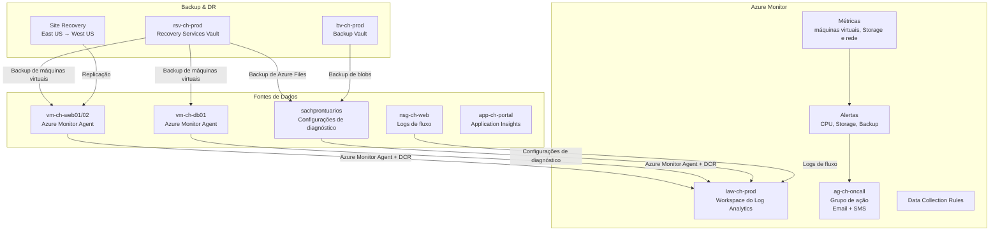
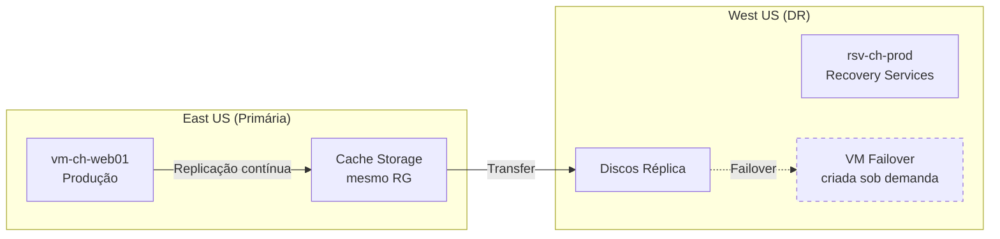

# Lab 05 — Monitorar e Manter Recursos do Azure (10-15% do exame)

> **Pré-requisito:** Labs 01-04 concluídos, com identidade, rede, armazenamento e computação já implantados.
> **Contexto:** Este lab trata do monitoramento e da manutenção de recursos do Azure, abrangendo métricas, logs, alertas, insights, backup, recuperação e continuidade operacional no ambiente da Contoso Healthcare.



---

## Parte 1 — Azure Monitor: Métricas

> **Conceito:** Métricas são dados numéricos coletados automaticamente (1 min por padrão), armazenados por **93 dias**. Gratuitas (platform metrics). Cada recurso emite métricas específicas. Ideais para dashboards e alertas em tempo real.

### Tarefa 1.1 — Consultar métricas de VM via CLI (exercício 1/3)

```bash
# Definir ID da VM
VM_WEB01_ID=$(az vm show --name $VM_WEB01 -g $RG_COMPUTE --query id -o tsv)

# CPU das últimas 4 horas
az monitor metrics list \
  --resource $VM_WEB01_ID \
  --metric "Percentage CPU" \
  --interval PT1H \
  --aggregation Average Maximum \
  --start-time "$(date -u -v-4H '+%Y-%m-%dT%H:%M:%SZ' 2>/dev/null || date -u -d '-4 hours' '+%Y-%m-%dT%H:%M:%SZ')" \
  --query "value[0].timeseries[0].data[].{Hora:timeStamp, Media:average, Max:maximum}" -o table
# --interval PT1H: granularidade de 1 hora (ISO 8601 duration)
# --aggregation: como agregar (Average, Maximum, Minimum, Total, Count)
```

### Tarefa 1.2 — Métricas de Storage (exercício 2/3)

```bash
SA_PRONT_ID=$(az storage account show --name $SA_PRONTUARIOS -g $RG_STORAGE --query id -o tsv)

az monitor metrics list --resource $SA_PRONT_ID \
  --metric "Transactions" --interval PT1H --aggregation Total \
  --query "value[0].timeseries[0].data[-3:].{Hora:timeStamp, Total:total}" -o table

az monitor metrics list --resource $SA_PRONT_ID \
  --metric "UsedCapacity" --interval PT1H --aggregation Average \
  --query "value[0].timeseries[0].data[-1].{Bytes:average}" -o json
```

### Tarefa 1.3 — Métricas via PowerShell (exercício 3/3)

```powershell
$VM = Get-AzVM -ResourceGroupName $RgCompute -Name $VmWeb01
Get-AzMetric -ResourceId $VM.Id `
    -MetricName "Percentage CPU" `
    -TimeGrain 01:00:00 `
    -StartTime (Get-Date).AddHours(-4) `
    -EndTime (Get-Date) `
    -AggregationType Average |
    Select-Object -ExpandProperty Data |
    Select-Object TimeStamp, Average | Format-Table
# Get-AzMetric: consulta métricas de um recurso
# -TimeGrain: intervalo de agregação (1 hora)
# -ExpandProperty Data: expande o array de data points
```

---

## Parte 2 — Azure Monitor: Logs

### Tarefa 2.1 — Criar Log Analytics Workspace via Portal (exercício 1/3)

```
Portal > Monitor > Log Analytics workspaces > + Create

- Resource group: rg-ch-monitor
- Name: law-ch-prod
- Region: East US
- Pricing tier: Pay-per-GB (default)
- Retention: 30 days (padrão, configurável até 730)

> Review + Create
```

### Tarefa 2.2 — Workspace do Log Analytics via CLI + Diagnostic Settings (exercício 2/3)

```bash
# Criar LAW
az monitor log-analytics workspace create \
  --workspace-name "law-ch-prod" -g $RG_MONITOR -l $LOCATION \
  --retention-time 30 --sku PerGB2018
# --retention-time 30: dados ficam 30 dias (mín 30, máx 730)
# --sku PerGB2018: modelo de preço por GB ingerido

LAW_ID=$(az monitor log-analytics workspace show --workspace-name "law-ch-prod" -g $RG_MONITOR --query id -o tsv)
LAW_CUST_ID=$(az monitor log-analytics workspace show --workspace-name "law-ch-prod" -g $RG_MONITOR --query customerId -o tsv)

# Diagnostic Settings: enviar logs do Storage para LAW
SA_PRONT_ID=$(az storage account show --name $SA_PRONTUARIOS -g $RG_STORAGE --query id -o tsv)

az monitor diagnostic-settings create \
  --name "diag-ch-prontuarios" \
  --resource "${SA_PRONT_ID}/blobServices/default" \
  --workspace $LAW_ID \
  --metrics '[{"category":"Transaction","enabled":true}]' \
  --logs '[{"category":"StorageRead","enabled":true},{"category":"StorageWrite","enabled":true},{"category":"StorageDelete","enabled":true}]'
# Cada recurso precisa de sua própria diagnostic setting
# --resource: o recurso sendo monitorado
# --workspace: para onde enviar (LAW, Storage Account, Event Hub, ou Partner)

# Diagnostic Settings do NSG
NSG_WEB_ID=$(az network nsg show --name "nsg-ch-web" -g $RG_NETWORK --query id -o tsv)

az monitor diagnostic-settings create \
  --name "diag-ch-nsg-web" \
  --resource $NSG_WEB_ID --workspace $LAW_ID \
  --logs '[{"category":"NetworkSecurityGroupEvent","enabled":true},{"category":"NetworkSecurityGroupRuleCounter","enabled":true}]'
```

### Tarefa 2.3 — KQL Queries (exercício 3/3)

> **Conceito:** KQL (Kusto Query Language) é a linguagem de consulta do Log Analytics. Estrutura: `Tabela | operador | operador`. Operadores principais: `where` (filtro), `project` (select), `summarize` (aggregate), `extend` (coluna calculada), `sort by`, `top`, `render`.

```bash
# Executar query KQL via CLI
az monitor log-analytics query \
  --workspace $LAW_CUST_ID \
  --analytics-query "Heartbeat | summarize count() by Computer | sort by count_ desc" \
  --timespan PT4H -o table

# === Exemplos de KQL para a prova ===

# 1. VMs com CPU alta (últimas 24h)
# Perf
# | where ObjectName == "Processor" and CounterName == "% Processor Time"
# | where TimeGenerated > ago(24h)
# | summarize AvgCPU=avg(CounterValue) by Computer, bin(TimeGenerated, 1h)
# | where AvgCPU > 80
# | sort by AvgCPU desc

# 2. Operações de Storage (quem está acessando prontuários)
# StorageBlobLogs
# | where TimeGenerated > ago(1h)
# | where AccountName == "sachprontuarios"
# | summarize count() by OperationName, CallerIpAddress
# | sort by count_ desc

# 3. Heartbeats - VMs que pararam de reportar
# Heartbeat
# | summarize LastBeat=max(TimeGenerated) by Computer
# | where LastBeat < ago(5m)

# 4. Eventos de segurança NSG
# AzureNetworkAnalytics_CL
# | where FlowStatus_s == "D"  // Denied
# | summarize count() by NSGRule_s, DestPort_d
# | sort by count_ desc
```

> **KQL para a prova:**
> - `ago(1h)` = 1 hora atrás | `ago(7d)` = 7 dias
> - `bin(TimeGenerated, 5m)` = agrupa em intervalos de 5 min
> - `summarize count() by X` = COUNT GROUP BY X
> - `project Campo1, Campo2` = SELECT Campo1, Campo2
> - `extend NovoCampo = expressão` = adiciona coluna calculada
> - `render timechart` = gráfico de série temporal
> - `top 10 by count_ desc` = TOP 10

---

## Parte 3 — Alertas

### Tarefa 3.1 — Action Group (exercício 1/3)

> **Conceito:** Action Group define O QUE acontece quando alerta dispara. Ações: Email, SMS, Push, Voice, Webhook, Azure Function, Logic App, ITSM, Automation Runbook.

```bash
# Criar Action Group para equipe de plantão
az monitor action-group create \
  --name "ag-ch-oncall" -g $RG_MONITOR \
  --short-name "CHOncall" \
  --action email ti-email "ti@contoso-health.com"
# --short-name: máx 12 chars (aparece no SMS)
# --action: tipo + nome + valor. Pode ter múltiplas ações
```

### Tarefa 3.2 — Alertas de Métrica (exercício 2/3)

```bash
AG_ID=$(az monitor action-group show --name "ag-ch-oncall" -g $RG_MONITOR --query id -o tsv)
VM_WEB01_ID=$(az vm show --name $VM_WEB01 -g $RG_COMPUTE --query id -o tsv)

# Alerta: CPU > 80% por 5 minutos (vm-ch-web01)
az monitor metrics alert create \
  --name "alert-ch-high-cpu-web01" -g $RG_MONITOR \
  --scopes $VM_WEB01_ID \
  --condition "avg Percentage CPU > 80" \
  --window-size 5m --evaluation-frequency 1m \
  --severity 2 --action $AG_ID \
  --description "CPU acima de 80% no web server - possível sobrecarga"
# --window-size: janela de avaliação (olha 5 min de dados)
# --evaluation-frequency: com que frequência avalia (a cada 1 min)
# --severity: 0=Critical, 1=Error, 2=Warning, 3=Informational, 4=Verbose

# Alerta: Transações anômalas no Storage
SA_PRONT_ID=$(az storage account show --name $SA_PRONTUARIOS -g $RG_STORAGE --query id -o tsv)

az monitor metrics alert create \
  --name "alert-ch-storage-anomaly" -g $RG_MONITOR \
  --scopes $SA_PRONT_ID \
  --condition "total Transactions > 1000" \
  --window-size 15m --evaluation-frequency 5m \
  --severity 3 --action $AG_ID \
  --description "Volume anômalo de transações no storage de prontuários"

# Listar alertas
az monitor metrics alert list -g $RG_MONITOR \
  --query "[].{Nome:name, Severity:severity, Habilitado:enabled}" -o table
```

### Tarefa 3.3 — Alert Processing Rules via PowerShell (exercício 3/3)

```powershell
# Alert Processing Rules: suprimem alertas durante manutenção
# Via Portal: Monitor > Alerts > Alert processing rules > Create

# Verificar alertas ativos
Get-AzMetricAlertRuleV2 -ResourceGroupName $RgMonitor |
    Select-Object Name, Severity, Enabled | Format-Table
```

> **Dica de Prova:**
> - Alert states: **New** → **Acknowledged** → **Closed** (manual)
> - Monitor condition: **Fired** vs **Resolved** (automático)
> - **Stateful alerts** de métrica se resolvem automaticamente quando a condição normaliza
> - **Stateless alerts** de Activity Log geram um novo alerta a cada ocorrência
> - Alert Processing Rules podem **suprimir** alertas em manutenção ou **adicionar grupos de ação**

> **Pegadinha frequente — Alert Rule vs Alert Processing Rule:**
> - **Alert Rule** define **quando** alertar, combinando condição e grupo de ação
> - **Alert Processing Rule** define **o que fazer** com alertas já disparados, como suprimir, adicionar grupo de ação ou filtrar
> - Se a questão pedir "configurar notificação quando CPU > 80%" → **Alert Rule**
> - Se a questão pedir "suprimir alertas durante janela de manutenção" → **Alert Processing Rule**
>
> **Ponto de atenção — "Notificar admin quando uma máquina virtual se conectar à rede virtual":**
> - Precisa de **2 coisas**: **Action Group** para definir o destinatário e **Alert Rule** para detectar o evento
> - ❌ Alert Processing Rule = pós-processamento de alertas já disparados
> - ❌ Microsoft 365 Group = grupo de colaboração, não monitora eventos
> - **Regra:** "detectar evento + notificar" = sempre **Alert Rule + Action Group**

> **Dashboard pinned data retention:**
> - Dashboard **privado**: dados fixados por **14 dias**
> - Dashboard **compartilhado**: dados fixados por **30 dias**
> - Para mais tempo: use **Azure Monitor Workbooks**

---

## Parte 4 — VM Insights e Azure Monitor Agent (AMA)

### Tarefa 4.1 — Instalar Azure Monitor Agent (exercício 1/2)

> **Conceito:** Azure Monitor Agent (**AMA**) substitui o antigo MMA. Ele usa **Data Collection Rules (DCRs)** para definir o que coletar e para onde enviar. Suporta Linux e Windows.

```bash
# Instalar AMA na VM web01
az vm extension set \
  --name "AzureMonitorLinuxAgent" \
  --publisher "Microsoft.Azure.Monitor" \
  --vm-name $VM_WEB01 -g $RG_COMPUTE \
  --enable-auto-upgrade true
# AzureMonitorLinuxAgent para Linux
# AzureMonitorWindowsAgent para Windows

# Instalar na VM DB
az vm extension set \
  --name "AzureMonitorLinuxAgent" \
  --publisher "Microsoft.Azure.Monitor" \
  --vm-name $VM_DB01 -g $RG_COMPUTE \
  --enable-auto-upgrade true
```

### Tarefa 4.2 — Data Collection Rule (exercício 2/2)

```bash
LAW_ID=$(az monitor log-analytics workspace show --workspace-name "law-ch-prod" -g $RG_MONITOR --query id -o tsv)

# Criar DCR
az monitor data-collection rule create \
  --name "dcr-ch-vm-perf" -g $RG_MONITOR -l $LOCATION \
  --data-flows '[{"destinations":["law-dest"],"streams":["Microsoft-Perf","Microsoft-Syslog"]}]' \
  --destinations "{\"logAnalytics\":[{\"name\":\"law-dest\",\"workspaceResourceId\":\"${LAW_ID}\"}]}" \
  --performance-counters '[{"name":"perfCounters","counterSpecifiers":["\\Processor(_Total)\\% Processor Time","\\Memory\\% Used Memory","\\LogicalDisk(_Total)\\% Free Space"],"samplingFrequencyInSeconds":60,"streams":["Microsoft-Perf"]}]' \
  --syslog '[{"name":"syslog","facilityNames":["auth","authpriv","daemon","kern"],"logLevels":["Warning","Error","Critical"],"streams":["Microsoft-Syslog"]}]'
# DCR define: O QUE coletar (performance counters, syslog) e PARA ONDE enviar (LAW)

# Associar DCR às VMs
DCR_ID=$(az monitor data-collection rule show --name "dcr-ch-vm-perf" -g $RG_MONITOR --query id -o tsv)

for VM in $VM_WEB01 $VM_DB01; do
  VM_ID=$(az vm show --name $VM -g $RG_COMPUTE --query id -o tsv)
  az monitor data-collection rule association create \
    --name "assoc-${VM}" \
    --resource $VM_ID \
    --data-collection-rule-id $DCR_ID
  echo "DCR associada a: $VM"
done
```

### Tarefa 4.3 — Application Insights e Workbooks (exercício extra)

> **Conceito:** **Application Insights** monitora a aplicação em si: requests, falhas, dependências, tempo de resposta e disponibilidade. **Log Analytics** é o repositório e mecanismo de consulta. **Workbooks** organizam visualizações interativas usando métricas e logs. Na prova:
> - **VM Insights** = foco em desempenho de máquina virtual e sistema operacional convidado
> - **Application Insights** = foco em App Service e código da aplicação
> - **Workbooks** = painéis analíticos e troubleshooting

```
Portal > Application Insights > + Create

- Resource group: rg-ch-monitor
- Name: appi-ch-portal
- Region: East US
- Workspace-based: usar law-ch-prod

Depois:
Portal > App Service > app-ch-portal > Application Insights
- Turn on Application Insights
- Selecionar appi-ch-portal

Validacoes:
- Live Metrics
- Failures
- Performance
- Application Map
```

```
Portal > Monitor > Workbooks > + New

Adicionar visualizacoes:
- CPU media de vm-ch-web01/vm-ch-db01
- Transactions da sachprontuarios
- Failed requests do app-ch-portal
- Heartbeat das VMs
Salvar como: wb-ch-ops-overview
```

> **Dica de Prova:**
> - **Application Insights** = telemetria da aplicação
> - **Log Analytics** = consultas KQL centralizadas
> - **Workbooks** = visualização e correlação de dados
> - **Insights hubs** de VM, Storage, Network e App dependem de métricas, logs e diagnostic settings bem configurados
> - Se a questão pedir "analisar latência, exceptions, dependencies e request rate" → **Application Insights**

---

## Parte 5 — Network Watcher

### Tarefa 5.1 — Logs de fluxo de NSG (exercício 1/2)

```bash
# Criar storage para flow logs
az storage account create \
  --name "sachflowlogs" -g $RG_MONITOR -l $LOCATION --sku Standard_LRS

NSG_WEB_ID=$(az network nsg show --name "nsg-ch-web" -g $RG_NETWORK --query id -o tsv)

az network watcher flow-log create \
  --name "flowlog-ch-nsg-web" \
  --nsg $NSG_WEB_ID \
  --storage-account "sachflowlogs" \
  -g $RG_MONITOR -l $LOCATION \
  --enabled true --retention 7 \
  --workspace $LAW_ID \
  --traffic-analytics true --interval 10
# --traffic-analytics: analisa flow logs no LAW
# --interval 10: intervalo de processamento em minutos
# Flow logs mostram tráfego permitido/negado por regra NSG
```

### Tarefa 5.2 — Connection Monitor (exercício 2/2)

```bash
# Connection Monitor: monitoramento contínuo de conectividade
# Melhor configurar via Portal:
# Network Watcher > Connection Monitor > + Create
# Source: vm-ch-web01 (requer AMA ou Network Watcher extension)
# Destination: vm-ch-db01 (10.2.1.4, port 1433)
# Test config: TCP, port 1433, every 30s
echo "Connection Monitor: configurar via Portal"
echo "Network Watcher > Connection Monitor > Create"
```

---

## Parte 6 — Backup

### Tarefa 6.1 — Recovery Services Vault via Portal (exercício 1/3)

```
Portal > Recovery Services vaults > + Create

- Resource group: rg-ch-monitor
- Vault name: rsv-ch-prod
- Region: East US

Após criar > Properties > Backup Configuration:
- Storage replication type: Geo-redundant (GRS)
- Cross Region Restore: Enable
```

### Tarefa 6.2 — Recovery Services Vault e política de backup via CLI (exercício 2/3)

```bash
# Criar RSV
az backup vault create --name "rsv-ch-prod" -g $RG_MONITOR -l $LOCATION

# Configurar redundância GRS (antes de qualquer backup!)
az backup vault backup-properties set \
  --name "rsv-ch-prod" -g $RG_MONITOR \
  --backup-storage-redundancy GeoRedundant

# Criar policy customizada para VMs (diário 2h, retenção 30d + 12 semanas)
az backup policy set --vault-name "rsv-ch-prod" -g $RG_MONITOR \
  --name "policy-ch-vm-lgpd" \
  --policy '{
    "eTag": null,
    "properties": {
      "backupManagementType": "AzureIaasVM",
      "instantRpRetentionRangeInDays": 2,
      "schedulePolicy": {
        "schedulePolicyType": "SimpleSchedulePolicy",
        "scheduleRunFrequency": "Daily",
        "scheduleRunTimes": ["2026-01-01T02:00:00Z"]
      },
      "retentionPolicy": {
        "retentionPolicyType": "LongTermRetentionPolicy",
        "dailySchedule": {
          "retentionTimes": ["2026-01-01T02:00:00Z"],
          "retentionDuration": { "count": 30, "durationType": "Days" }
        },
        "weeklySchedule": {
          "daysOfTheWeek": ["Sunday"],
          "retentionTimes": ["2026-01-01T02:00:00Z"],
          "retentionDuration": { "count": 12, "durationType": "Weeks" }
        }
      },
      "timeZone": "E. South America Standard Time"
    }
  }'
# instantRpRetentionRangeInDays: dias que snapshot fica disponível (instant restore)
# dailySchedule: retenção de backups diários
# weeklySchedule: retenção de backups semanais (domingos)
```

### Tarefa 6.3 — Backup Vault via PowerShell (exercício 3/3)

```powershell
# Backup Vault (para blobs e discos)
# Install-Module Az.DataProtection -Force  # se necessário

$StorageSetting = New-AzDataProtectionBackupVaultStorageSettingObject `
    -Type "LocallyRedundant" -DataStoreType "VaultStore"

New-AzDataProtectionBackupVault `
    -VaultName "bv-ch-prod" `
    -ResourceGroupName $RgMonitor `
    -Location $Location `
    -StorageSetting $StorageSetting
# Backup Vault: para Blobs, Managed Disks, PostgreSQL
# Recovery Services Vault: para VMs, Azure Files, SQL em VM
```

> **Recovery Services Vault vs Backup Vault (para a prova):**
> | | Recovery Services Vault | Backup Vault |
> |---|---|---|
> | VMs Azure | ✅ | ❌ |
> | Azure Files | ✅ | ❌ |
> | Blobs | ❌ | ✅ |
> | Managed Disks | ❌ | ✅ |
> | SQL em VM | ✅ | ❌ |
> | Site Recovery | ✅ | ❌ |

---

### Tarefa 7.1 — Backup de máquinas virtuais (exercício 1/3)

```bash
# Habilitar backup para vm-ch-web01
az backup protection enable-for-vm \
  --vault-name "rsv-ch-prod" -g $RG_MONITOR \
  --vm $VM_WEB01 \
  --policy-name "policy-ch-vm-lgpd"
# Associa a VM à policy — backups iniciam automaticamente no horário definido

# Habilitar backup para vm-ch-db01
az backup protection enable-for-vm \
  --vault-name "rsv-ch-prod" -g $RG_MONITOR \
  --vm $VM_DB01 \
  --policy-name "policy-ch-vm-lgpd"

# Executar backup manual (on-demand)
CONTAINER=$(az backup container list --vault-name "rsv-ch-prod" -g $RG_MONITOR \
  --backup-management-type AzureIaasVM --query '[0].name' -o tsv)
ITEM=$(az backup item list --vault-name "rsv-ch-prod" -g $RG_MONITOR --query '[0].name' -o tsv)

az backup protection backup-now \
  --vault-name "rsv-ch-prod" -g $RG_MONITOR \
  --container-name $CONTAINER --item-name $ITEM \
  --retain-until "2026-06-30"

# Listar recovery points
az backup recoverypoint list \
  --vault-name "rsv-ch-prod" -g $RG_MONITOR \
  --container-name $CONTAINER --item-name $ITEM \
  --query "[].{Nome:name, Tipo:properties.recoveryPointType, Data:properties.recoveryPointTime}" -o table
```

### Tarefa 7.2 — Backup de Azure Files (exercício 2/3)

```bash
# Registrar storage account no vault
SA_PRONT_ID=$(az storage account show --name $SA_PRONTUARIOS -g $RG_STORAGE --query id -o tsv)

az backup container register \
  --vault-name "rsv-ch-prod" -g $RG_MONITOR \
  --resource-id $SA_PRONT_ID \
  --backup-management-type AzureStorage

# Habilitar backup do file share de prontuários
az backup protection enable-for-azurefileshare \
  --vault-name "rsv-ch-prod" -g $RG_MONITOR \
  --storage-account $SA_PRONTUARIOS \
  --azure-file-share "dept-clinico" \
  --policy-name "DefaultPolicy"

# Verificar itens protegidos
az backup item list --vault-name "rsv-ch-prod" -g $RG_MONITOR \
  --query "[].{Nome:name, Tipo:properties.workloadType, Status:properties.protectionStatus}" -o table
```

### Tarefa 7.3 — Restaurar backup (exercício 3/3)

```bash
# Opções de restore para VMs:
# 1. Create new VM (cria VM nova a partir do backup)
# 2. Replace existing (substitui discos da VM existente)
# 3. Restore disks (restaura discos para storage account)
# 4. Cross-region restore (restaura na região secundária - requer GRS)

# Exemplo conceitual:
# az backup restore restore-disks \
#   --vault-name "rsv-ch-prod" -g $RG_MONITOR \
#   --container-name $CONTAINER --item-name $ITEM \
#   --rp-name "$(az backup recoverypoint list ...)" \
#   --storage-account $SA_PRONTUARIOS \
#   --target-resource-group $RG_COMPUTE

echo "Restore de VM: 4 opções — Create new, Replace existing, Restore disks, Cross-region"
```

> **Dica de Prova — Backup:**
> - Backup de máquina virtual: **snapshot** primeiro (instant restore de 1 a 5 dias) → **vault tier** depois
> - Snapshots são **incrementais** (apenas delta)
> - Azure Files backup usa **snapshots** (recuperação instantânea)
> - **Cross-region restore** requer vault com **GRS** e permite restaurar na região secundária
> - **Soft delete** para backups: mantém dados **14 dias extra** após deletar o backup item
> - Vault **não pode ser deletado** se tiver itens de backup (deve desabilitar proteção primeiro)
>
> **Ponto de atenção — Mover máquinas virtuais entre vaults:**
> - Para migrar máquinas virtuais de Vault1 para Vault2, com a mesma policy, há **2 passos em ordem**
>   1. **Desabilitar soft delete** no vault E **excluir todos os dados** de backup (status exclusão reversível)
>   2. **Remover permanentemente** todos os itens em estado de exclusão temporária
> - Só depois o vault fica "vazio" e você pode reconfigurar no novo vault
> - ❌ Backup de VM1 e VM2 direto em Vault2 = não pode, já estão protegidas em Vault1
> - ❌ Modificar configurações de segurança = não permite mover backups

---

## Parte 7 — Azure Site Recovery

### Tarefa 8.1 — Configurar recuperação de desastre para máquinas virtuais (exercício 1/2)

> **Conceito:** Azure Site Recovery (**ASR**) replica máquinas virtuais continuamente de uma região para outra. O failover pode ser planejado, sem perda, ou não planejado, com perda mínima. O vault pode ficar na região primária ou secundária. O RPO mínimo é de 30 segundos.



```bash
# Site Recovery é melhor configurado via Portal:
# rsv-ch-prod > Site Recovery > + Replicate > Azure virtual machines

# Configuração:
# Source: East US, rg-ch-compute
# VMs: vm-ch-web01, vm-ch-web02
# Target region: West US
# Target RG: auto-criado (rg-ch-compute-asr)
# Target VNet: auto-criado (vnet-ch-spoke-web-asr)
# Cache storage: auto-criado
# Replication policy: default (RPO 15min, retention 24h, app-consistent snapshot 4h)

echo "Configurar Site Recovery via Portal para exercício completo"
echo "RSV > Site Recovery > Replicate > Azure to Azure"
```

### Tarefa 8.2 — Failover e Failback (exercício 2/2)

```bash
# Fluxo de DR completo:
# 1. Test Failover → valida na região DR (VNet isolada, sem impacto)
# 2. Cleanup Test Failover → remove VMs de teste
# 3. Failover (real) → ativa VMs na região DR
# 4. Commit → confirma (não pode mais voltar para recovery point anterior)
# 5. Re-protect → inverte replicação (DR → Primary)
# 6. Failback → retorna para região primária

echo "=== Fluxo de DR ==="
echo "1. Test Failover: valida sem impactar produção"
echo "2. Cleanup: remove recursos de teste"
echo "3. Failover: ativa na região DR (West US)"
echo "4. Commit: confirma o failover"
echo "5. Re-protect: inverte replicação (West→East)"
echo "6. Failback: volta para a região primária"
```

> **Dica de Prova — Site Recovery:**
> - **RPO** (Recovery Point Objective): máx dados que pode perder = tempo entre pontos
> - **RTO** (Recovery Time Objective): tempo para recuperar
> - Test Failover **NÃO interrompe** replicação
> - Failover **interrompe** replicação — precisa Re-protect depois
> - Recovery Plans: sequência de failover com scripts e ações manuais

> **Ponto de atenção — Estados de Failover:**
> - Após executar failover e validar: status = **Failover confirmado (Committed)**
> - "Concluir failover" / "Complete failover" NÃO é um estado válido
> - Sequência: Pending → In Progress → **Committed** (após Commit)

---

## Parte 8 — Relatórios de Backup

### Tarefa 9.1 — Diagnostic Settings do Vault (exercício 1/2)

```bash
RSV_ID=$(az backup vault show --name "rsv-ch-prod" -g $RG_MONITOR --query id -o tsv)
LAW_ID=$(az monitor log-analytics workspace show --workspace-name "law-ch-prod" -g $RG_MONITOR --query id -o tsv)

az monitor diagnostic-settings create \
  --name "diag-ch-rsv" --resource $RSV_ID --workspace $LAW_ID \
  --logs '[
    {"category":"CoreAzureBackup","enabled":true},
    {"category":"AddonAzureBackupJobs","enabled":true},
    {"category":"AddonAzureBackupAlerts","enabled":true},
    {"category":"AddonAzureBackupPolicy","enabled":true},
    {"category":"AddonAzureBackupStorage","enabled":true},
    {"category":"AddonAzureBackupProtectedInstance","enabled":true}
  ]'
# Envia dados do vault para LAW — alimenta Backup Reports
# Dados levam até 24h para aparecer nos relatórios
```

### Tarefa 9.2 — Alertas de Backup (exercício 2/2)

```bash
# Verificar alertas do vault
az backup alert list --vault-name "rsv-ch-prod" -g $RG_MONITOR -o table 2>/dev/null || echo "Sem alertas"

echo "=== Alertas de Backup ==="
echo "Built-in: RSV > Backup Alerts (falhas, expiração, etc.)"
echo "Custom: Azure Monitor + Diagnostic Settings do vault"
echo "Backup Reports: RSV > Backup Reports (requer LAW com dados - leva 24h)"
```

---

## Parte 9 — Azure Advisor

### Tarefa 10.1 — Revisar recomendacoes do Advisor (exercicio extra)

> **Conceito:** O **Azure Advisor** reune recomendacoes acionaveis para melhorar **custo**, **alta disponibilidade**, **performance** e **seguranca**. Na prova, ele aparece como o servico que aponta otimizacoes e riscos operacionais sem alterar recursos automaticamente.

```bash
# Listar recomendacoes do Advisor
az advisor recommendation list -o table

# Filtrar por alta disponibilidade
az advisor recommendation list \
  --category HighAvailability \
  --query "[].{Recurso:resourceMetadata.resourceId, Impacto:impact, Problema:shortDescription.problem}" -o table

# Filtrar por seguranca
az advisor recommendation list \
  --category Security \
  --query "[].{Recurso:resourceMetadata.resourceId, Problema:shortDescription.problem, Solucao:shortDescription.solution}" -o table

# Atualizar recomendacoes antes de revisar
az advisor recommendation list --refresh -o table
```

> **Dica de Prova:**
> - **Advisor recomenda**; ele nao corrige automaticamente
> - **Cost** = rightsizing, recursos ociosos, savings
> - **HighAvailability** = resiliencia, redundancia, backup
> - **Performance** = gargalos e sizing
> - **Security** = postura de seguranca e hardening
> - Se o enunciado pedir "qual servico sugere melhorias operacionais no ambiente?" → **Azure Advisor**

---

## Resumo da Infraestrutura Completa da Contoso Healthcare

```mermaid
graph TB
    subgraph "Gerenciar Identidades e Governança (Lab 01)"
        ENTRA[8 Usuários<br/>4 Grupos<br/>1 Guest]
        RBAC_S[Controle de acesso<br/>em 4 escopos]
        POLICY_S[3 Azure Policies]
        LOCKS_S[2 bloqueios de recurso]
    end

    subgraph "Configurar e Gerenciar Redes Virtuais (Lab 02)"
        VNETS[3 redes virtuais hub-spoke<br/>peering bidirecional]
        NSGS[3 grupos de segurança de rede<br/>+ 3 grupos de segurança de aplicativo]
        BAST[Bastion no Hub]
        DNS_S[DNS Público + Privado]
        LBS[Balanceador público<br/>+ balanceador interno]
        UDRS[2 tabelas de rotas]
    end

    subgraph "Implementar e Gerenciar Armazenamento (Lab 03)"
        SAS[3 contas de armazenamento<br/>GRS + LRS]
        BLOBS[Containers + Lifecycle]
        FILES[3 compartilhamentos de arquivos]
        REPL[Object Replication<br/>East→West]
        PES[Endpoint privado<br/>+ zona DNS]
    end

    subgraph "Implantar e Gerenciar Computação (Lab 04)"
        VMS[3 máquinas virtuais em zonas<br/>+ conjunto de dimensionamento (2-5)]
        CONT[Registro de contêineres, ACI<br/>e Container App]
        APPS[App Service S1<br/>+ Staging Slot]
        TEMP[ARM + Bicep Templates]
    end

    subgraph "Monitorar e Manter Recursos (Lab 05)"
        MON[Log Analytics + agente AMA<br/>+ DCR + alertas]
        BACK[Recovery Services Vault + Backup Vault<br/>backup de máquinas virtuais e Azure Files]
        DR[Site Recovery<br/>East→West]
    end

    ENTRA --> VNETS --> SAS --> VMS --> MON
```

---

## Checklist de Verificação — Lab 05

- [ ] Métricas consultadas (VM CPU, Storage Transactions) via CLI e PowerShell
- [ ] Workspace do Log Analytics criado: Portal + CLI
- [ ] Configurações de diagnóstico (Diagnostic Settings) configuradas para Storage, grupo de segurança de rede e Recovery Services Vault
- [ ] Consultas KQL executadas: Heartbeat, Perf e StorageBlobLogs
- [ ] Grupo de ação (Action Group) criado
- [ ] 2 alertas de métrica criados (CPU, Storage Transactions)
- [ ] Alert Processing Rules entendido (conceitual)
- [ ] Azure Monitor Agent (AMA) instalado em 2 ou mais máquinas virtuais
- [ ] Data Collection Rule criada e associada às máquinas virtuais
- [ ] Application Insights e Workbook entendidos
- [ ] Logs de fluxo de NSG habilitados com Traffic Analytics
- [ ] Connection Monitor entendido
- [ ] Recovery Services Vault criado com redundância GRS
- [ ] Backup Vault criado
- [ ] Backup Policy customizada (diário + semanal)
- [ ] Backup de máquinas virtuais habilitado e executado: 2 máquinas virtuais
- [ ] Azure Files backup configurado
- [ ] Conceitos de restore entendidos (4 opções)
- [ ] Site Recovery configurado (conceitual ou Portal)
- [ ] Fluxo de failover/failback entendido
- [ ] Diagnostic Settings do vault configurados
- [ ] Backup Reports entendido
- [ ] Azure Advisor revisado por categoria

---

## Parabéns! Infraestrutura Completa

Você construiu uma infraestrutura Azure completa para a Contoso Healthcare, cobrindo as **skills medidas do AZ-104** e incluindo tópicos complementares que costumam cair fora do fluxo principal dos labs:
- **Gerenciar identidades e governança do Azure** (20-25%): usuários, grupos, controle de acesso baseado em função, Azure Policy, bloqueios e tags
- **Implementar e gerenciar armazenamento** (15-20%): contas, blobs, Azure Files, assinaturas de acesso compartilhado, replicação, lifecycle e Storage Explorer
- **Implantar e gerenciar recursos de computação do Azure** (20-25%): ARM/Bicep, máquinas virtuais, conjunto de dimensionamento, Azure Container Instances, Container Apps, App Service e SSL
- **Configurar e gerenciar redes virtuais** (15-20%): redes virtuais, peering, grupos de segurança de rede, Bastion, tabelas de rotas, DNS e balanceadores
- **Monitorar e manter recursos do Azure** (10-15%): métricas, logs, alertas, insights, Azure Advisor, backup e Site Recovery
