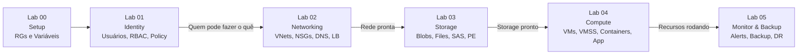

# Laboratório Prático AZ-104 — Contoso Healthcare

## Cenário Unificado

Você é o **Administrador Azure** da **Contoso Healthcare**, uma rede de clínicas médicas migrando para a nuvem. Todos os 6 labs seguem uma **sequência lógica única** — cada lab constrói sobre o anterior, criando uma implantação realista completa.

## Estrutura dos Labs

| # | Arquivo | Domínio | Peso | Exercícios | Métodos |
|---|---------|---------|------|------------|---------|
| 00 | [00-cenario-e-setup.md](00-cenario-e-setup.md) | Setup | — | 4 | Portal, CLI, PS, Bicep, ARM |
| 01 | [01-identity-governance.md](01-identity-governance.md) | Identidade & Governança | 20-25% | 24 | Portal, CLI, PowerShell |
| 02 | [02-networking.md](02-networking.md) | Redes Virtuais | 15-20% | 22 | Portal, CLI, PS, Bicep |
| 03 | [03-storage.md](03-storage.md) | Armazenamento | 15-20% | 22 | Portal, CLI, PS, Bicep |
| 04 | [04-compute.md](04-compute.md) | Computação | 20-25% | 26 | Portal, CLI, PS, Bicep, ARM |
| 05 | [05-monitor-backup.md](05-monitor-backup.md) | Monitor & Backup | 10-15% | 22 | Portal, CLI, PowerShell |
| **Total** | | **100%** | | **120** | |

## Templates IaC

A pasta `templates/` contém:
- `resource-groups.bicep` — Resource Groups (Bicep, subscription-level)
- `resource-groups.json` — Resource Groups (ARM, subscription-level)
- `vnet-hub.bicep` — VNet Hub com subnets
- `storage-prontuarios.bicep` — Storage Account com firewall e data protection
- `vm-web.bicep` — VM Linux com NIC e zona
- `vm-web.json` — VM Linux (ARM equivalente)

## Dependências entre Labs

| Lab | Cria | Usado por |
|-----|------|-----------|
| 00 | Resource Groups, Tags | Todos |
| 01 | Usuários, Grupos, RBAC, Policy, Locks | 02-05 (RBAC testado) |
| 02 | VNets, Peering, NSGs, Bastion, DNS, LBs | 03 (PE, service endpoint), 04 (VMs na rede) |
| 03 | Storage Accounts, Blobs, Files, PE | 04 (ACI mount, App backup), 05 (backup) |
| 04 | VMs, VMSS, ACR, ACI, ACA, App Service | 05 (monitor e backup) |
| 05 | LAW, Alerts, RSV, BV, ASR | — (final) |

## Recursos Criados (Naming Convention)

Todos seguem o prefixo `ch` (Contoso Healthcare):

| Recurso | Nome | Lab |
|---------|------|-----|
| Resource Groups | `rg-ch-{identity,network,storage,compute,monitor}` | 00 |
| VNets | `vnet-ch-{hub,spoke-web,spoke-data}` | 02 |
| NSGs | `nsg-ch-{web,app,db}` | 02 |
| Storage | `sach{prontuarios,imagens,replica}` | 03 |
| VMs | `vm-ch-{web01,web02,db01}` | 04 |
| Scale Set | `vmss-ch-api` | 04 |
| ACR | `acrchprod` | 04 |
| App Service | `app-ch-portal` | 04 |
| Log Analytics | `law-ch-prod` | 05 |
| Recovery Vault | `rsv-ch-prod` | 05 |

## Cada recurso é criado de 3-4 formas diferentes

1. **Portal Azure** — instruções passo-a-passo
2. **Azure CLI** (`az`) — com explicação de cada flag
3. **PowerShell** (`New-Az*`) — com explicação de cada cmdlet
4. **Bicep/ARM** — templates declarativos para recursos-chave

## Como Usar

1. Carregue as **variáveis** do Lab 00 no início de cada sessão
2. Execute os labs em **ordem** (00 → 05)
3. Cada tarefa tem: **conceito** → **exercício** → **dica de prova**
4. Marque o **checklist** no final de cada lab
5. Execute a **limpeza** do Lab 00 somente ao finalizar tudo

## Tempo Estimado

| Lab | Tempo |
|-----|-------|
| 00 - Setup | 20 min |
| 01 - Identity & Governance | 2-3h |
| 02 - Networking | 3-4h |
| 03 - Storage | 2-3h |
| 04 - Compute | 3-4h |
| 05 - Monitor & Backup | 2-3h |
| **Total** | **~13-18h** |
