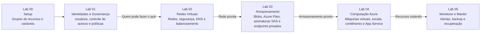

# Laboratório Prático AZ-104 — Contoso Healthcare

## Cenário Unificado

Você é o **Administrador Azure** da **Contoso Healthcare**, uma rede de clínicas médicas migrando para a nuvem. Todos os 6 labs seguem uma **sequência lógica única** — cada lab constrói sobre o anterior, criando uma implantação realista completa.

## Estrutura dos Labs

| # | Arquivo | Domínio | Peso | Exercícios | Métodos |
|---|---------|---------|------|------------|---------|
| 00 | [00-cenario-e-setup.md](00-cenario-e-setup.md) | Setup | — | 4 | Portal, CLI, PS, Bicep, ARM |
| 01 | [01-identity-governance.md](01-identity-governance.md) | Gerenciar identidades e governança do Azure | 20-25% | 24 | Portal, CLI, PowerShell |
| 02 | [02-networking.md](02-networking.md) | Configurar e gerenciar redes virtuais | 15-20% | 22 | Portal, CLI, PS, Bicep |
| 03 | [03-storage.md](03-storage.md) | Implementar e gerenciar armazenamento | 15-20% | 24 | Portal, CLI, PS, Bicep |
| 04 | [04-compute.md](04-compute.md) | Implantar e gerenciar recursos de computação do Azure | 20-25% | 28 | Portal, CLI, PS, Bicep, ARM |
| 05 | [05-monitor-backup.md](05-monitor-backup.md) | Monitorar e manter recursos do Azure | 10-15% | 24 | Portal, CLI, PowerShell |
| **Total** | | **100%** | | **126** | |

## Cobertura Complementar do Guia Oficial da Prova

Além do fluxo principal, os labs agora incluem exercícios extras para tópicos que aparecem no guia oficial e costumam faltar em trilhas práticas:

- **Lab 03**: Azure Storage Explorer e soft delete/restore de Azure Files
- **Lab 04**: movimentos entre grupos de recursos, assinaturas e regiões, além de domínio personalizado e certificado SSL no App Service
- **Lab 05**: Application Insights, Workbooks e Azure Advisor

## Templates IaC

A pasta `templates/` contém:
- `resource-groups.bicep` — grupos de recursos (Bicep, subscription-level)
- `resource-groups.json` — grupos de recursos (ARM, subscription-level)
- `vnet-hub.bicep` — rede virtual hub com sub-redes
- `storage-prontuarios.bicep` — conta de armazenamento com firewall e proteção de dados
- `vm-web.bicep` — máquina virtual Linux com interface de rede e zona
- `vm-web.json` — máquina virtual Linux (ARM equivalente)

## Dependências entre Labs

| Lab | Cria | Usado por |
|-----|------|-----------|
| 00 | grupos de recursos e tags | Todos |
| 01 | Usuários, grupos, RBAC, Policy e bloqueios | 02-05 (controle de acesso testado) |
| 02 | Redes virtuais, peering, grupos de segurança de rede, Bastion, DNS e balanceadores | 03 (endpoints privados e service endpoints), 04 (máquinas virtuais na rede) |
| 03 | Contas de armazenamento, blobs, Azure Files e endpoints privados | 04 (montagem do Azure Files em ACI e backup do App Service), 05 (backup) |
| 04 | Máquinas virtuais, conjunto de dimensionamento, registro de contêineres, ACI, Container Apps e App Service | 05 (monitoramento e backup) |
| 05 | Workspace do Log Analytics, alertas, Recovery Services Vault, Backup Vault e Site Recovery | — (final) |

## Recursos Criados (Naming Convention)

Todos seguem o prefixo `ch` (Contoso Healthcare):

| Recurso | Nome | Lab |
|---------|------|-----|
| Grupos de recursos | `rg-ch-{identity,network,storage,compute,monitor}` | 00 |
| Redes virtuais | `vnet-ch-{hub,spoke-web,spoke-data}` | 02 |
| Grupos de segurança de rede | `nsg-ch-{web,app,db}` | 02 |
| Contas de armazenamento | `sach{prontuarios,imagens,replica}` | 03 |
| Máquinas virtuais | `vm-ch-{web01,web02,db01}` | 04 |
| Conjunto de dimensionamento | `vmss-ch-api` | 04 |
| Azure Container Registry | `acrchprod` | 04 |
| App Service | `app-ch-portal` | 04 |
| Workspace do Log Analytics | `law-ch-prod` | 05 |
| Recovery Services Vault | `rsv-ch-prod` | 05 |

## Cada recurso é criado de 3-4 formas diferentes

1. **Portal Azure** — instruções passo-a-passo
2. **Azure CLI** (`az`) — com explicação de cada flag
3. **PowerShell** (`New-Az*`) — com explicação de cada cmdlet
4. **Bicep/ARM** — templates declarativos para recursos-chave

## Como Usar

1. Carregue as **variáveis** do Lab 00 no início de cada sessão
2. Execute os labs em **ordem** (00 → 05)
3. Cada tarefa tem: **conceito** → **exercício** → **dica de prova**
4. Marque o **checklist de verificação** no final de cada lab
5. Execute a **limpeza** do Lab 00 somente ao finalizar tudo

## Tempo Estimado

| Lab | Tempo |
|-----|-------|
| 00 - Setup | 20 min |
| 01 - Gerenciar identidades e governança | 2-3h |
| 02 - Configurar e gerenciar redes virtuais | 3-4h |
| 03 - Implementar e gerenciar armazenamento | 2-3h |
| 04 - Implantar e gerenciar computação | 3-4h |
| 05 - Monitorar e manter recursos | 2-3h |
| **Total** | **~13-18h** |
